---
export_on_save:
 html: true
---

# 用Scikit-Learn和TensorFlow实践机器学习
@(Python)[python库, 机器学习, Scikit-learn, TensorFlow]

> 观点、工具和技术，建立一个智能系统

**译者所用的Python版本号为3.6.2，原书中的很多代码已经在该版本的Python下不能正常运行，故在翻译的同时做了少量修改**

[TOC]

## 前言

### 机器学习的海啸

2006年，Geoffrey Hinton 等人发表了一篇文章，说明了如何通过训练一个深度神经网络的能力来识别手写数字，正确率达到了惊人的98% 。他们称这种技术为 **深度学习**。在当时，训练一个深度神经网络被广泛认为是不可能的，因此，大多数人从19世纪90年代就放弃了这种想法。这篇论文重新勾起了科学社区对深度学习的兴趣。新论文的不断涌现，展示了深度学习不仅可能用于应用，而且其令人兴奋的成绩是其他的机器学习(ML)技术所不能比拟的（主要得益于现今海量的数据的超大的计算能力）。这种热情很快扩展到机器学习的其他领域。

10年时间匆匆而逝，机器学习也已经征服了很多的产业：现在很多的高科技产品的核心就是机器学习，比如网络搜索结果的排序，智能手机的语音识别、电影的推荐系统、alpha狗的围棋大战，还有汽车的无人驾驶领域。

### 你项目中的机器学习

我想，你应该会对机器学习感兴趣，并且会享受加入到这场盛宴的过程中！

也许你希望赋予自己DIY的机器人一个大脑，使它能够识别人脸，或者学着在四周走来走去。

或者，也许你的公司有着海量的数据（用户的日志，财务数据，生产数据，机器传感器的数据，热线统计数据，HR的报表等等），只要你知道如何去找，你就能从这一大堆的数据中挖掘出隐藏的 “宝石”，比如：
- 将所有消费者划分成多个组，对每个组制定最佳的营销策略
- 根据消费者的消费记录，推荐其相似类型的产品
- 自动检测存在欺诈行为的交易
- 预测下一年的收入
- ... ...

不管你是基于以上的什么原因，你都应该已经决定去学机器学习，并且在你的项目中实现它了。

嗯，很好的想法！

### 目标和方法

该书假定你几乎对机器学习一无所知，它的目标是为你 *从数据中学习* 的编程中提供必需的概念、直觉和工具。

我们将涉及大量的技术，从最简单、最常用的技术（比如线性回归）到一些经常能赢得比赛的深度学习技术。

与其自己通过动手实现一个简陋的机器学习模型，我们更多的是使用现成的Python框架：

- `Scikit-Learn` 非常容易使用，而且它非常高效地实现了许多的机器学习算法，可以说该库大大降低了机器学习的准入门槛。

- `TensorFlow` 是一个更加复杂的库，该库通过数据流图的方式实现分布式数值计算。它通过分布式计算将计算量分配到成千上万的多GPU服务端，使得高效地训练非常大型的神经网络成为了可能。TensorFlow由Google公司创建，并且支持他们的很多大规模机器学习的应用。该库于2015年11月开源。

本书采用实践的方式，通过具体的可以工作的例子和少量的理论来使读者对机器学习产生直觉上的理解。如果你在阅读该书时没有带上你的笔记本电脑，我们强烈建议通过在线的 Jupyter notebooks （网址为：https://github.com/ageron/handson-ml ）上实验例子中的代码。

### 前提

本书假定你有一些 Python 的编程经验，并且也熟悉 Python 中的一些主要的科学库 `NumPy`，`Pandas` 和 `Matplotlib` 。

另外，你也需要一些大学级别的数学知识，比如微积分、线性代数、概率论和统计学。

如果你现在还不知道Python，http://learnpython.org 是一个不错的学习网站。官方教程 https://www.python.org 也是一个非常好的选择。

如果你从来没有用过 Jupyter， 第二章将会引导你安装和基本的使用方法，这是一个你值得拥有的工具。

如果你不熟悉 Python 的科学库，在 Jupyter notebooks 中包含了一些教程，是一些关于线性代数的快速教程。

### 路标

该书组织成两个部分。

第一部分：**机器学习的基础**，包括以下内容：

- 什么是机器学习？它解决的是什么问题？机器学习系统分为哪些类？有哪些基本的概念？
- 一个经典的机器学习项目需要哪些主要的步骤？
- 学习如何让模型逼近数据
- 最优化损失函数
- 处理、清洗和预处理数据
- 选择和设计特征
- 选择一个训练模型，通过交叉验证来调节超参数
- 机器学习的主要挑战，特别是欠拟合和过拟合（偏差和方差的权衡）
- 对训练数据进行降维，尽量减少维度灾难的风险
- 最常用的学习算法：多项式线性回归模型、逻辑回归模型、k近邻模型、支持向量机模型、决策树模型、随机森林和集成方法

第二部分：**神经网络和深度学习**，包括如下主题：

- 什么是神经网络？它们有什么优点？
- 用TensorFlow建立并训练神经网络
- 最重要的神经网络结构：前馈神经网络（FNN）、卷积神经网络（CNN）、循环神经网络（RNN）、长短期记忆网络（LSTM）和 自编码（auto-encoders）
- 训练深度神经网络的技术
- 大数据集的大规模神经网络
- 增强学习

第一部分更多的使用Scikit-Learn库，第二部分主要使用Tensor-Flow。

**注意：** 各位同志不要着急入坑：深度学习毫无疑问是在所有的机器学习方法中最令人兴奋的，但首先你应该掌握基础的原理。而且，多数的问题能够通过使用更简单的技术，例如：随机森林、集成方法（将会在第一部分进行讨论）进行很好的解决。深度学习更适合于复杂的问题，例如图像识别、语音识别或者是自然语言处理，对于这些问题，你必须提供足够的数据、计算能力以及耐心。

### 其他资源

学习机器学习的资源有很多，例如吴恩达教授在[Coursera 上的机器学习课程](https://www.coursera.org/learn/machine-learning/)，Geoffrey Hinton 等人的[神经网络与机器学习](https://www.coursera.org/learn/neural-networks)都非常棒，尽管这些课程都需要投入大量的时间去消化（大概够你想几个月吧）。

关于机器学习，还有许多有趣的网站，包括Scikit-Learn官网上的[用户指南](http://scikit-learn.org/stable/user_guide.html)。你也许还会喜欢 [Dataquest](https://www.dataquest.io/) 网站，它提供了优雅的交互式教程，想看更多关于机器学习的博客的话，可以查看[Quora](https://www.quora.com/What-are-the-best-regularly-updated-machine-learning-blogs-or-resources-available)上的这个列表。最后，[Deep Learning website](http://deeplearning.net/)列出了很多优质的资源供你更深入地学习。

当然，还有许多介绍机器学习的书籍，特别需要列出的有：

- Joel Grus, [Data Science from Scratch](http://shop.oreilly.com/product/0636920033400.do)，O'Reilly出版社出版，中文名为《数据科学入门》，该书介绍了机器学习的基本原理，**并用纯Python语言实现了其中主要的算法**（正如书名所说的，从零开始）
- Stephen Marsland, [Machine Learning: An Algorithmic Perspective](https://book.douban.com/subject/3887824/)，英国的CRC（Chapman and Hall）出版社出版。该书对机器学习的介绍还是很有深度的，也提供了Python 的代码实现（也是从零开始，不过是用Numpy库）
- Sebastian Raschka，[Python Machine Learning](https://book.douban.com/subject/26629312/)，Packt出版社出版，该书对机器学习的介绍也非常棒，其中的代码实现主要借助了开源的库：Pylearn 2 和 Theano
- Yaser S. Abu-Mostafa, Malik Magdon-Ismail, 和 Hsuan-Tien Lin，[Learning from Data](https://book.douban.com/subject/11026330/)  AMLBook 出版社出版。该书是对机器学习进行了理论化的介绍，具有非常深刻的见解，特别是第四章的*偏差-方差权衡*
- Stuart Russell, Peter Norvig, [Artificial Intelligence: A Modern Approach, 3rd Edition](https://book.douban.com/subject/5378558/)。该书真的是一本关于人工智能的大部头的书，而且其中涉及的论题数量也非常惊人，其中包括了机器学习，它能带你从整个人工智能的角度来审视机器学习所处的位置

最后，一种 "速成" 的方式是注册一个机器学习比赛网站的账号，比如 [Kaggle.com](https://www.kaggle.com/)，它将为你提供解决一个真实世界问题的实践平台，同时也可以得到很多机器学习顶级专家的帮助。

### 本书中使用的惯例

以下是本书中的使用的印刷规范：

斜体（*Italic*）
&nbsp; &nbsp; &nbsp; &nbsp; 表示新的术语、URLs、email地址、文件名和文件扩展。

等宽 （`Constant width`）
&nbsp; &nbsp; &nbsp; &nbsp;用于程序列表的现实，也可能是出现在段落内的程序元素，比如变量、函数名、数据库、数据类型、环境变量、声明及关键字。

等宽加粗（**`Constant width`**）
&nbsp; &nbsp; &nbsp; &nbsp; 用于显示命令或者是其他的用户需要手动逐字输入的文本。

等宽斜体（*`Content width`*）
&nbsp; &nbsp; &nbsp; &nbsp;用于显示可替换的文本，这些文本需要用户提供或者是需要根据具体的语境生成。

 该图案表示 **提示** 或 **建议**


 该图案表示通常的 **注释**


 该图案表示一个 **警告** 或 **注意点**


### 使用代码示例

本书所提供所有材料（包括代码示例、练习等），都可从 https://github.com/ageron/handson-ml 下载下来。

本书是为了帮助你刚好地完成工作。所以，如果你需要在你的代码或文档中使用本书提供的案例代码，通常不需要联系我们以获取许可。除非你需要非常大量的代码。例如，如果你仅仅是需要使用几个代码块，自然不需要获取许可。回答问题时引用了示例代码也不需要获得许可。但是，如果需要将大量的实例代码组织起来合并到你的产品文件中，就需要获得我们的许可了。

在使用代码时，我们感激但并不强制注明出处。出处通常应该包括书名，作者，出版社和 ISBN。例如：“*Hands-on Machine Learning with Scikit-Learn and TensorFlow* by Aurelien Geron (O'Reilly)，Copyright 2017, Aurelien Geron, 978-1-491-96229-9”

如果你感觉自己将其中的代码超过了合理利用的范围，或者是超过了上述的使用权限，敬请联系我们：[*permissions@oreilly.com*](permissions@oreilly.com)

### O'Reilly Safari


[Safari](http://oreilly.com/safari)（原先是Safari Books Online）是一个针对企业、政府机关、教育机构以及个人的基于会员制的培训和参考平台。

会员能够获得上千的书籍、培训视频、学习途径、交互教程以及超过250家出版社的出版清单，包括 O'Reilly Media, Harvard Business Review, Prentice Hall Professional, Addison-Wesley Profes‐ sional, Microsoft Press, Sams, Que, Peachpit Press, Adobe, Focal Press, Cisco Press,ohn Wiley & Sons, Syngress, Morgan Kaufmann, IBM Redbooks, Packt, Adobe Press, FT Press, Apress, Manning, New Riders, McGraw-Hill, Jones & Bartlett 和 Course Technology 等等。

详情请访问：http://oreilly.com/safari。

### 如何联系我们

请将关于本书的评论和问题发送到出版社，地址为：

&nbsp; &nbsp; &nbsp; &nbsp; O’Reilly Media, Inc.
&nbsp; &nbsp; &nbsp; &nbsp; 1005 Gravenstein Highway North
&nbsp; &nbsp; &nbsp; &nbsp; Sebastopol, CA 95472
&nbsp; &nbsp; &nbsp; &nbsp; 800-998-9938 (in the United States or Canada)
&nbsp; &nbsp; &nbsp; &nbsp; 707-829-0515 (international or local)
&nbsp; &nbsp; &nbsp; &nbsp; 707-829-0104 (fax)

关于本书的勘误表、例子以及如何附加的信息都会放在我们的网站上，地址为：https://bit.ly/hands-on-machine-learning-with-scikit-learn-and-tensorow。

如果想咨询关于本书的技术问题，请发邮件至： [bookques‐tions@oreilly.com](bookques‐tions@oreilly.com)。

更多的有关我们的出版物、课程、讨论会、新闻的内容，请访问我们的网站：http://www.oreilly.com。

在facebook上找到我们：http://facebook.com/oreilly

订阅我们的Twitter：http://twitter.com/oreillymedia

在YouTube上找到我们：http://www.youtube.com/oreillymedia

### 鸣谢

我要感谢我在Google公司的同事，特别是YouTube视频分类小组的小伙伴们，你们教会了我那么多关于机器学习的知识，如果没有你们，我将不可能写成这本书。特别的感谢留给我的机器学习导师：Clement Courbet，Julien Dubois，Mathias Kende，Daniel Kitachewsky，James Pack，Alexander Pak，Anosh Raj，Vitor Sessak，Wiktor Tomczak，Ingrid von Glehn，Rich Washington	在 YouTube Pairs 中的每一位。

我也非常感激所有能够在百忙之中抽出时间仔细校对这本书的人。感谢 Pete Warden ，他作为 TensorFlow团队中的核心成员，回答了我所有关于TensorFlow的问题，校对了第二部分，并提供了许多有趣的想法。你一定得去访问一下他的[博客](https://petewarden.com/)。感谢Lukas Biewald，他非常彻底的校对了第二部分：测试了所有的代码，提出了许多的建议，他的热情深深感染了我。你应该访问他的[博客](https://lukasbiewald.com/) 和他[库库的机器人](https://www.oreilly.com/learning/how-to-build-a-robot-that-sees-with-100-and-tensorflow)。感谢 Justin Francis，他完全地校对了第二部分，找出了许多的错误并提供了许多想法，特别是在16章中，可以查看他关于TensorFlow的[博文](https://www.oreilly.com/people/justin-francis)。

非常感谢 David Andrzejewski，他校对了第一部分，并提供了大量有用反馈，指出了其中写得含糊不清的部分，并建议如何进行改进，欢迎查看他的[网站](http://www.david-andrzejewski.com/)。感谢 Gregoire Mesnil，校对了第二部分，在关于训练神经网络方面贡献了非常有趣和实用的建议。也感谢Eddy Hung，Salim Semaoune，Karim Matrah，Ingrid von Glehn，Iain Smears 和 Vincent Guilbeau，他们校对了第一部分，并提出了许多有用的建议。我也必须感谢我的岳父 Michel Tessier，以及之前是我数学老师现在是优秀的翻译者的 Anton Chekhov，帮助我解决了许多数学以及符号方面的问题，并校验了关于Jupyter notebook线性代数部分的内容。

当然，万分感谢我亲爱的兄弟Sylvain，他校对了每一个章节，并测试了其中的每一行代码，并几乎在每个章节都提供了反馈，并从写书之初到之后都一直支持我。爱你，哥！

非常感谢 O'Reilly 非常棒的工作人员，特别是Nicole Tache，给了我许多富有洞察力的反馈。同时也感谢Marie Beaugureau，Bea Lorica，Mike Loukides 和 Laurel Ruma，一直相信这个项目，并未为本书明确了着眼点。感谢 Matt Hacker 和所有 Atlas 组的成员，回答了我关于格式、asciidoc 和 LaTeX 的问题。感谢Rachel Monaghan，Nick Adams 和所有产品组的成员，帮我完成了最终的审稿并做了许多的改正。

最后但同样重要的，我非常非常感谢我亲爱的妻子，Emmanuelle 和我们3个可爱的孩子，Alexandre，Aemi 和 Gabrielle，鼓励我努力完成这本书，问了我许多的问题（谁说不能教7岁小孩学习神经网络），为我提供饼干和咖啡，有此待遇，夫复何求？

# 第一部分 机器学习基础

## <h2 id="20180213142735">第一章 机器学习概览</h2>

大多数人听到 “机器学习” 时，大脑中应该会浮现出一个机器人：可信赖的管家或者是致命的终结者，随你怎么称呼吧。但是机器学习并非仅仅是未来的一个奇迹。事实上，它已经在某些特殊的应用场景中存在了几十年，例如光学字符识别（Optical Character Recognition, OCR）。但是机器学习的应用第一次成为主流，改善千万人的生活需要追溯到上世纪的90年代：垃圾邮件过滤器。它并不是一个有自我意识的天网，但是在技术层面的确是一个合格的机器学习应用（它实际上已经几乎不需要你辅助标出垃圾邮件了）。它被许多的机器学习应用所效仿，并默默影响着从更好的推荐系统到语义检索等成百上千的你所经常使用的功能。

机器学习从何而来，又将归于何处？机器学习到底学的是什么东西？如果我把维基百科下载下来，那是不是我的电脑就称为学到了一些东西？它是突变的智能吗？在本章，我们将阐明什么是机器学习以及为什么你要学习它？

在我们开始探索机器学习这块未知的大陆之前，我们先了解一下它主要的划分和最显著的“路标”：监督学习 vs 非监督学习，在线学习 vs 批量学习。之后，我们将会看到一个典型的机器学习项目的工作流程，讨论你可能需要面对的主要挑战，包括如何去评价和微调一个机器学习系统。

本章将介绍每个数据科学家需要真正理解的许多基本概念（和行话），本章只是一个高度概述（不涉及很多代码），所有的内容都非常简单，但是你应当确保在阅读其他章节之前，对本章的所有内容都非常明白。来杯咖啡，让我们开干吧！

> 如果你已经对机器学习的基本概念都了解清楚了，你可以跳到第二章继续阅读。如果你不是非常确定，就在跳转之前先尝试回答在本章最后所列出的所有问题。


### 什么是机器学习？

机器学习是计算机编程的科学（和艺术），程序能从数据中进行学习。

以下是一个常见的定义：

> 机器学习是不通过显式地编程而让计算机获得某种能力的领域。
> ------ Arthur Samuel，1959

而更加工程化的描述为：

> 对于某类任务T和性能度量P，如果一个计算机程序在T上以P衡量的性能随着经验E而自我完善，那么我们称这个计算机程序在从经验E学习
> ------ Tom Mitchell，1997

比如说，你的垃圾邮件过滤器就是一个机器学习的程序，它能够学着去标记一封邮件是不是垃圾邮件，而最初由用户给这些邮件打上标记供机器学习。供系统使用的所有训练案例称为训练集，每个单独的训练案例称为训练实例（或称为采样）。在这个例子中，任务T就是为一封新邮件打上标记，经验E是训练集中的数据，性能衡量P需要被定义；比如，你可以用邮件分类正确的比率来作为P，这种特殊的性能衡量指标称为正确率，它常常被用于分类的任务中。

如果你只是将维基百科的一个拷贝下载下来，虽然你的电脑有了很多的数据，但是它不会立即具备测试某个实例的能力。因此，这种行为并不是机器学习。

### 为什么要用机器学习

想象一下，如何用传统的方法来编写邮件过滤器（如图1-1所示）：

1. 第一步，你需要确定垃圾邮件的典型特征。你也许会注意到垃圾邮件中经常会出现一些特定的单词或短语（例如 “4U”，“信用卡”，“免费”，“惊人的”），也许你也会注意到垃圾邮件的发送人名字、邮件格式存在一定的规律。我们把这些规律称为模式。
2. 你需要为你所留意到的每一种模式写检测代码，之后你的程序根据检测到这些模式的数量来决策该邮件是否是垃圾邮件。
3. 你需要测试你的程序，然后重复1~2步骤直到结果足够好。


*图1-1. 传统的方法*

可能找到的模式非常多，因此你的程序看起来就像一张有许多复杂规则的长表——非常难以维护。

相反的，基于机器学习的垃圾邮件分类器能够通过检测垃圾邮件中经常出现而正常邮件中不常见的单词模式，自动地学会什么单词和短语能很好地用于垃圾邮件的预测（图1-2所示）。这个程序更加简短，也更容易维护，而且很有可能预测结果更加准确。


*图1-2 机器学习的方式*

此外，如果垃圾邮件发送者如果发现所有含 “4U” 的邮件都被拦截了，他们可能会开始用“For U” 来替代。用传统方法构建的邮件过滤器将不得不添加一条规则来过滤含 “For U” 的email。如果垃圾邮件发送者针对你的邮件过滤器继续修改，你也必须保证能随之添加新的过滤规则。

相反的，基于机器学习的邮件过滤器自动探测出含 “For U” 的邮件被用户标记为垃圾邮件的频率特别高，之后该过滤器不需要人工介入，就能开始对 “For U” 进行标记（图 1-3）。


*图 1-3 自适应变化*

另一个机器学习能够“发光发热”的领域是某些问题对于传统编程来说太过复杂或者根本没有已知的算法。比如说，语音识别：你要写一个简单的程序，能够根据你说的 “One” 或 “Two” 来将他们区分开来。你也许注意到单词 “Two” 是以高音开头（“T”），因此你可以写一个算法用于测试高音的强度，用这种方法来“One” 和 “Two” 。显然，这种方法并不能推广到成千上万的单词中，而每个人说话的口音也不一样，人们说话的时的环境可能有很多噪音，这些都使得用传统方式做语音识别变得不可能。最好的解决方案（就当前而言）是写一个能自我学习的算法，并提供大量的单词录音供其学习。

最后要说，其实机器学习还能够辅助人类进行学习（图 1-4）：我们可以检查机器学习算法来观察它们到底学到了什么（虽然对于有的算法来说不是很容易）。比如说，邮件分类器在训练了足够多的垃圾邮件之后，能够简单地获取它所认为的有利于预测垃圾邮件的单词列表。有时候，它能够揭示出未知的关联或者新趋势，由此更好地对问题进行理解。


*图 1-4 机器学习能够辅助学习某些规律*

总结来说，机器学习能够用于以下场景：

- 解决某一问题需要花大量时间手动调整代码，或者是该问题有大量的规则：机器学习算法通常代码更简单，效果更好
- 某些复杂的问题如果使用传统编程方式的话，根本没有好的解决方案：最好的机器学习技术能够找到解决方案
- 变动的环境：机器学习系统需要能够根据新采集的数据进行自我调整
- 某个复杂的问题有大量的数据，我们需要找到其中的某些规律


### 机器学习系统的种类

机器学习系统的种类非常多，我们需要根据以下的几点将它们分成几个大类：

- 它们是不是在有人监督的情况下进行学习（分为监督学习、非监督学习、半监督学习、增强学习）
- 它们是不是能够在增量式渐进地优化自身（分为在线学习和批量学习）
- 它们是简单地将新数据和原有数据进行比较来预测，还是像科学家一样从原有数据中发现某些特定的模式，并通过构建一个预测模型来对新数据进行预测（分为基于实例和基于模型）

这些分类标准并不是绝对的，你可以用如何你喜欢的方式来对它们进行组合。比如说，一个最先进的邮件分类器也许能够在应用的同时，将新的标有垃圾邮件或普通邮件的案例输入到一个神经网络模型中进行训练；这个系统就称为在线的、基于模型的监督学习系统。

让我们具体看看这些分类标准是什么。

### 监督/非监督学习

机器学习系统能够根据在训练的过程中是否需要监督进行分类。主要可以分为4个类：监督学习，非监督学习，半监督学习和增强学习。

#### 监督学习

在监督学习中，你 “喂” 给机器学习算法的训练数据中包括了你希望得到的结果，称为标记（图 1-5）


*图 1-5 监督学习的带标签训练集*

一种典型的监督学习任务是 *分类*。邮件分类器就是分类的一个很好的例子：它通过很多带有类型信息（垃圾或者普通）的邮件来学习，之后用于新邮件的分类。

另一种典型的监督学习任务是预测一个数值，比如说一辆车的价格，提供的是大量的特征向量（将里程数、车龄、品牌等不同属性组合在一起成为一个特征向量），这种任务称为 *回归*（图 1-6）。在训练时，你需要给算法提供很多同时包含特征向量和标记（车价格）的例子。


*图 1-6 回归*


> 一个有趣事实是，*回归* 这个奇怪的名字原本是统计学的一个术语，最开始是Francis Galton 在研究孩子身高时引入，他发现如果一个孩子的父母都是高个子，孩子趋向于比他的父母都要矮，所以他称这种现象为 *回归于平均水平*。这个名词后来被他用于分析两个相关变量关系的方法中。

在机器学习中，一个 *属性* 通常是指一种类型的数据（例如里程数），而 *特征* 需要根据上下文来确定其具体的含义，但通常来说是指一个属性和它的值（例如：“里程数=15,000”）。也有很多人将 *属性* 和 *特征* 混用。


**注意：**有的回归算法也会被用于分类，反之亦然。比如说，逻辑回归算法就是一种常见的将回归应用于分类的算法，其输出值为属于相应类的概率大小（例如：20%的可能是垃圾邮件）。

下面是一些最重要的监督学习算法（本书中涵盖的）：

- k-近邻
- 线性回归
- 逻辑回归
- 支持向量机
- 决策树和随机森林
- 神经网络

> 注意：有的神经网络可能是非监督学习，比如说自编码 (autoencoders)和 受限玻尔兹曼机。有的神经网络也可能是半监督的，比如 深度信念网络（Deep Belief Networks）和 非监督预训练（unsupervised pre-training）

#### 非监督学习

正如你所料，非监督学习的训练数据不提供标记（图 1-7）。系统在没有 “老师” 的情况下进行学习。

*图 1-7 一个用于非监督学习的无标记训练集*

下面是一些最重要的非监督学习算法（在第8章，我们将会讲解数据降维）：

- 聚类
	- k-均值（k-Means）
	- 层次聚类分析（Hierarchical Cluster Analysis，HCA）
	- 最大期望算法（Expectation Maximization）
- 数据降维和可视化
	- 主成分分析（Principle Component Analysis，PCA）
	- 核主成分分析（Kernel PCA）
	- 局部线性嵌入（Locally-Linear Embedding，LLE）
	- t分布随机近邻嵌入（t-distribution stochastic neighbor embedding，t-SNE）
- 关联规则学习
	- Apriori算法
	- Eclat算法

比如说，你有很多浏览你博客的访问者的数据，你可能希望运行一个聚类算法将相似的访问者划分为同一个组（图 1-8）。你没有对算法说明某个访问者应该属于哪个类，它完全自动地找到他们之间的关联。再比如，你发现访问者中40%是喜欢看连环画的男性，他们通常在晚上读你的博客，而20%是喜欢读科幻小说的年轻人，他们通常在周末浏览你的博客，等等。如果你使用层次聚类算法，还可能将每个组再细分为更小的组。这些信息可以帮助你针对每一个组推送他们喜欢的博文。


*图 1-8 聚类*

可视化算法也是非监督学习算法的一个很好的例子：你提供了大量复杂且无标记的数据，算法输出能够在2维或3维图像中非常容易显示的数据（图1-9）。这些算法尽可能多地保留数据原有的结构关系（例如：试图在可视化操作中保持分离的集群尽可能不重叠），让你能理解数据是如何组织的，并发现其中潜在的规律。

*图 1-9 t-SNE 语义集群的高亮可视化显示*

> 从图中你可以看到，动物和交通工具有非常明显的分界，而 “horse” 与 “deer” 的距离要比其与 “bird” 的距离近，等等信息。
> 图片来自于 Socher，Ganjoo，Manning 和 Ng (2013), "T-SNE visualization of the semantic word space"，已通过授权。

与聚类相关的一个任务是 *数据降维*，目的是在简化数据的同时尽可能减少信息量的损失。一种实现方式是将多个相关的特征合并为一个特征。比如，车的里程数和车龄非常相关，因此可以把这两个特征合并成一个特征，表示车的磨损程度。这就称为 *特征提取* 。

**通常来说，在将数据交个某个机器学习算法（比如监督学习算法）进行训练之前，先用数据降维算法减小原始数据的维度是一个很好的想法。而且也能让训练的时间更短，数据占用的磁盘和内存资源更少，而且有时候能够获得更好的训练结果**

还有一个非监督学习的任务是 *异态检测*，例如：发现信用卡的非正常交易以预防诈骗，发现生产中的次品，在将数据集交个学习算法进行训练之前先删除其中的异常值。这个系统使用正常的实例进行训练，当一个新的实例到来，它能判断该实例是正常的还是异常的（见图 1-10）。

*图 1-10 异态检测*

最后一个常见的非监督学习任务是 *关联规则学习*，主要用于挖掘数据，发现各属性之间的有价值的关系。比如说，假设你开了一家超市，将你每一天的销售记录交给关联规则学习算法处理，可能会发现买了烧烤调料和薯片的人很可能同时买牛排。因此，你可以将这些商品放在一起，可能就会提高营业收入。

#### 半监督学习

有的算法能够处理部分标记的训练数据，通常是大多数未标记，只有少量做了标记。这总算法就是半监督算法（图 1-11）。


*图 1-11 半监督学习*

某些图片托管服务，如 Google Photos，就是这种算法的一个例子。如果你向服务器上传了一张你的全家福照片，它就能自动识别其中的人，并指出某人A出现在第1、5、11张图片中，另一个人B出现在第2、5、7张图片中。这部分工作属于非监督学习算法（聚类）。现在，这个系统的工作是，在这张全家福的照片中指出他们分别是谁，即仅仅是对一个样本打上标签，它就能说出每一张照片上每个人的名字，这对照片的检索非常有用。

> 注：上述情况只有在系统工作得非常完美时才会出现。但实际情况是，系统经常会给同一个人创建多个类别，或者有的时候在同一个类别中会有两个或多个看起来长得像的人，所以，你需要一些个人单独的照片，并且手动清除一些类别。

大多数的半监督学习算法同时结合了非监督学习和监督学习算法。比如 *深度信念网络 (DBNS)* 就是在非监督算法 *受限玻尔兹曼机(RBMs)* 的基础上再加一层或多层的 RBMs，以非监督的方式按顺序用RBMs进行训练，之后，整个系统使用监督学习的方法进行调优。

####增强学习

和之前的机器学习算法相比，增强学习绝对是一个异类。在该学习系统中，有一个称为 *代理* 的模块，能够对当前的环境进行 “观察”，选择并执行某个动作，并返回一个奖励（或者是返回一个惩罚作为消极的反馈，如图 1-12）。系统必须能够自动地学会什么是最佳的动作，称为策略，即获得奖励最多的那个动作。一个策略指定了在某种给定的情形下，代理应该如何选择。


*图 1-12 增强学习*

举例来说，许多的机器人都实现了增强学习算法用于学习走路。DeepMind项目的AlphaGo程序就是增强学习的一个很好的例子：它在2016年3月的时候，凭借着战胜世界围棋冠军的李世石而一举成名。它通过分析上百万的围棋对弈过程，学到了赢棋的策略，之后开始与自身进行对弈。在真正的对弈开始时，系统并不进行学习，而是将其已经学到的策略进行应用。

### 批量学习和在线学习

另一种用于对机器学习进行分类的标准是：随着在数据流的不断到来，系统能否循序渐进地改善自身的性能。

#### 批量学习

*批量学习* 并不具备循序渐进改善自身的能力：它在训练时，必须一次性输入所有当前可得到的数据。通常来说，这需要花费大量的时间和计算资源，因此它通常是离线进行的。首先，完成对系统的训练，接下来讲系统安装到生产环境中，并且在应用的过程中不再进行学习；它只是简单地将学到的 “知识” 进行应用，这也叫做 *离线学习*。

如果你希望批量学习系统能够正确处理 “变种” 的数据（比如出现了新的垃圾邮件模式），你需要从头开始用所有的数据重新训练一个新版本的系统（不仅仅是新的数据，而且也要包括原有数据），之后，用新训练的系统替换掉老系统。

幸运的是，整个过程包括训练、性能评估、系统的更换都能非常简单地自动化进行（如图 1-3 所示），所以批量学习也能够适应不断变化的数据。只要根据需求，定期地更新训练数据并从头开始训练一个新版本的系统即可。

这种解决方案通常来说简单并且有效，但是用所有的数据进行训练很可能需要花费数个小时，所以你通常只是每24小时或者是每个星期训练一个新的系统。如果你的系统需要快速适应不断变化的数据（比如预测股票价格），那你就需要一个使系统进化更快的解决方案。

另外，训练所有的数据需要大量的计算资源（CPU、内存空间、磁盘空间、网络资源等等）。如果训练集中的数据量非常大，而你的系统需要每天都从头开始进行自动训练，它最终将消耗你大量的资金。如果数据的量超级巨大，那使用批量学习根本就是不现实的。

最后，如果你的批量学习系统安装在一个资源有限的设备上（如智能手机或火星探测器），每天带着大量的训练数据，占用大量资源训练多个小时，那么这个设备估计其他什么事情都干不了了。

幸运的是，在上述那些尴尬的情况下，我们可以使用接下来介绍的算法实现循环渐进的学习。

#### 在线学习

在线学习系统中，你可以将数据一个一个，或者一小组一小组地 “喂” 给你的系统（每一小组称为 *小批* ），你系统的性能也在你喂食的过程中渐渐得到优化。这样学习的每一步都非常快速，代价也小，因此系统能够在运行的同时，对新来的数据进行学习（见图 1-13）。


*图 1-13 在线学习*

在线学习算法非常适合于数据以流的方式连续不断到来的系统（如股票的价格）和需要快速适应改变的系统。当然，如果你只有为数不多的计算资源，那么在线学习也是一个很好的选择：一旦在线学习系统学过了新的实例，它就不需要再次学习该实例，你可以直接将该实例丢弃（除非你想要将系统回退到之前的某个状态，并对数据进行重现）。这将节约大量的系统空间。

当训练数据量非常大时，也许我们设备的存储空间不能容纳下全部的训练数据，那么我们也可以使用在线学习算法（这也称为 *核外学习*）。算法只将部分的数据进行加载，先针对这些数据进行训练，之后重复这一过程，直到所有的数据都被训练过（见图 1-14）。


*图 1-14 以在线学习的方式处理超大的数据集*

**特别注意：上述的所有过程通常是离线进行的（系统并不处于运行状态），所以 *在线学习* 这个名字总感觉令人困惑，你就认为它是 *增量式学习* 好了。**

在线学习系统中一个重要的参数是，在线学习应该以多快来适应新数据：这称为学习速率。如果你设置了一个高学习率，你的系统将能够快速适应新数据，但它也将很快 “忘记” 旧数据（你应该不会想要一个只能将与最新接收到的邮件类型相同的邮件标注出来的系统吧）。相反地，如果你设置了一个低学习率，系统将有更大的惯性，也就是说：它学得更慢，但同时对新数据中的噪声、非典型的数据点序列不敏感。

在线学习的一大挑战是：如果坏的数据被输入到系统中，系统的性能将会渐渐地下降。如果是在线运行的系统，这种变化将会被你的客户注意到。坏的数据可能来自于机器人上出故障的传感器，或者是某人对搜索引擎进行狂轰滥炸地输入某个搜索词以提高该词在搜索结果中的排名。为了减少这些风险，你需要密切监视你的系统，在你发现系统的性能下降时及时停止学习（如果可能的话，最好将系统回退到之前的某个工作状态）。你最好也能够对输入数据进行监视，剔除其中的异常数据（例如使用异常检测算法）。

### 基于实例 VS 基于模型

另一种区分机器学习系统的标准是根据问题——**它们是怎么被构建起来的** 确定的。绝大多数的机器学习任务都是关于预测的，这就意味着在给了一些训练数据进行训练之后，系统能够对它之前从未见过的实例进行归纳。对训练数据表现出不错的性能是很好，但这还不够，我们真正的目标是对新到来的实例能够有好的性能。

归纳的方式主要有两种：基于实例学习 和 基于模型学习。

#### 基于实例学习

也许，最常见的学习方式是仅仅通过 “死记硬背” 的方式来学习。如果你构建的是这样的一个邮件过滤器，它将只能标记出那些与被用户标记过的邮件相同的邮件，不是最坏的模型，但绝对不会是最好的模型。

除了能够标记出与已知的垃圾文件完全相同的邮件外，你的邮件分类器还应该能够标记出与已知垃圾邮件非常相似的邮件。这就要求系统能够测试出两封邮件之间的相似度。一种非常基本的测试方案是计算两封邮件之间相同的单词的数量。如果新邮件中有大量的单词与已知垃圾邮件中的单词相同，就可以将该新邮件打上标记。

这就是 *基于实例的学习* ：系统记下所有的实例，之后用相似度对新的实例进行归纳（图 1-15）


*图1-15 基于实例的学习*

#### 基于模型学习

另一种方式是，从一个实例集中归纳出一般的规律，针对这些实例构建出一个模型，之后用这个模型进行预测，这就称为 *基于模型的学习*（图 1-16）

*图 1-16 基于模型的学习*

比方说你想要知道是否金钱真的能够使人开心，你可以从 [OECD's website](https://goo.gl/0Eht9W) 上面下载 *生活幸福指数*，同时从 [IMF's websit](http://goo.gl/j1MSKe) 下载对应国家的 *国内人均 GDP*。之后，你将这两个数据合并到同一个表中，并以人均GDP从高到底进行排列，表1-1 摘录了你所得到的表的一部分：

*表 1-1 金钱真的使人更快乐吗？*


让我们随机地取一部分数据以散点图的形式进行显示（图 1-17）：

*图 1-17 你看到某种趋势了吗？*

上图看起来确实有某种趋势。虽然数据有一些噪声（比如局部数据是随机分布的），不过整体上看，似乎人们的生活满意度随着各自国家人均GDP的上升而线性增长。所以，你决定建立一个生活满意度和人均GDP间呈线性函数关系的模型，这一步就成为 *模型选择*：你只选择人均GDP这一属性为生活满意度建立线性模型（等式 1-1）

&nbsp; &nbsp; &nbsp; &nbsp; *等式 1-1. 一个简单的线性模型*

&nbsp; &nbsp; &nbsp; &nbsp; $life\_satisfacation=\theta_0+\theta_1\times GDP\_per\_capita$

这个模型有两个模型参数，$\theta_0$ 和 $\theta_1$。通过调整这些参数，你可以得到任何你想表示的线性函数，如图 1-18 所示。

*图 1-18 若干可能的线性模型*

在你使用你的模型前，必须先确定参数 $\theta_0$ 和 $\theta_1$ 的值。那你确定你所取得参数值能够使模型的性能最好呢？为了回答这个问题，你需要先明确性能测量的方式。你既可以定义一个 *效用函数*（或称为 *适配函数*）来测量你的模型有多好，也可以定义一个 *代价函数* 来测量你的模型有差。就线性回归问题而言，通常使用线性模型的预测值和训练样本的实际值之间的欧式距离作为代价函数。训练的目标就是最小化这个距离。

线性回归算法的工作原理是：你将训练数据交给它，它负责找出一组模型的参数，这组参数能够使你的线性模型与数据吻合得最好，这个过程就称为 *训练*模型。在我们这个例子中，算法发现最佳的参数值是 $\theta_0=4.85$，$\theta_1=4.91\times10^{-5}$。

现在，这个模型与训练数据吻合得最好（对线性模型而言），如图 1-19所示：

*图 1-19 与给定数据最吻合的线性模型*

你可以使用该模型进行数据预测了：你想要知道塞浦路斯人的幸福指数，但在 OECD网站上并没有给出答案。幸运的是，你可以使用你训练好的模型进行预测：先获取塞浦路斯的人均GDP，为 22587美元 ，将这个值代入你的模型就可以得到他们的生活满意度应该大致为 $4.85+22587\times4.91\times10^{-5}=5.96$ 。

为了满足你的好奇心，例1-1 中的Python代码实现了数据的加载，预处理，将数据以散点图的形式进行可视化，之后进行线性模型的训练，最后将完成训练的模型用于预测。

> 注：如果你不理解其中的代码也没有关系，在接下来的章节我们就会介绍Scikit-Learn库。

*例 1-1. 用Scikit-Learn训练并运行一个线性模型*

``` python
import matplotlib
import matplotlib.pyplot as plt
import numpy as np
import pandas as pd
from sklearn import linear_model
from sklearn import neighbors

# 数据加载
oecd_bli = pd.read_csv("oecd_bli_2015.csv", thousands=",")
gdp_per_capita = pd.read_csv("gdp_per_capita.csv", thousands=",",
    delimiter="\t", encoding='latin1', na_values="n/a")
# 数据的预处理 假定函数 perpare_country_stats已经完成定义
# 用于将 GDP和生活满意度合并到同一个Pandas dataframe
country_stats = prepare_country_stats(oecd_bli, gdp_per_capita)
X = np.c_[country_stats["GDP per capita"]]
y = np.c_[country_stats["Life satisfaction"]]

# 数据的可视化
country_stats.plot(kind="scatter", x="GDP per capita",
    y="Life satisfaction")
plt.show()

# 选择一个线性模型
clf = linear_model.LinearRegression()

# 训练模型
clf.fit(X, y)

# 对塞浦路斯进行预测
X_new = [[22587]] # 塞浦路斯的人均GDP
print(clf.predict(X_new)) # 输出为 [[ 5.96242338]]
```

如果你使用基于实例的学习算法就会发现，斯洛文尼亚和塞浦路斯的人均GDP最接近，而斯洛文尼亚在OECD上显示的生活幸福指数是5.7，因此，你的算法也许会预测塞浦路斯的生活幸福指数也是5.7。如果你把观察的范围扩大到最接近的3个国家，你将发现葡萄牙和西班牙的幸福指数分别为5.1 和 6.5。求这3个国家的幸福指数的平均值，可以得到5.77，已经非常接近使用基于模型算法得到的预测值。这种简单的算法被称为 *k-近邻* 回归（在这个例子中，k=3）。
如果用k-近邻实现代码也非常简单，只需要将之前的代码：
`clf = linear_model.LinearRegression()`
替换为：
`clf = neighbors.KNeighborsRegressor(n_neighbors=3)`
即可。

如果顺利的话，你的模型可以做出很好的预测。否则，你可能需要更多的属性（如就业率、健康、空气污染等），也可以是选择更多或质量更好的训练数据，或者是更加强大的模型（比如说是多项式回归模型）。

总结来说：
- 你需要数据进行分析
- 你需要选择一个学习模型
- 你需要使用训练数据对其进行训练（比如说，学习算法需要找到使代价函数最小的一组模型参数）
- 最后，你将这个训练好的模型应用到对新实例的预测中（这个过程称为推断），并期望得到好的结果

这就是典型的基于模型学习算法的工作流程。在第二章中，通过实践一个端到端的项目，你将会有更加直接的体验。

到目前为止，我们介绍了很多的机器学习分类，你应该找到了：机器学习到底是什么？它为什么非常有用？机器学习系统最常见的分类有哪些？典型的项目工作流程是怎样的？那么，让我们看看哪些因素会导致训练失败，预测结果不准确。

### 机器学习的主要挑战

简而言之，你的主要工作是选择一个学习算法和将数据给这个算法训练，因此训练失败的元素也分为两类：“选了不合适的算法” 和 “数据不好”。让我们先来看看坏数据的一个例子。

#### 训练数据不充足

对于一个三岁小孩来说，要让他认识什么是苹果，只需要手指指着一个苹果说 “苹果” 就可以了（也许需要多次重复这个过程）。之后，小孩就能分辨出任何颜色、任何形状的苹果了。真是天才！

机器学习就不是这样了，几乎所有的机器学习要能正常工作都需要大量的数据。即使是非常简单的问题，你也需要提供上千个实例，而对于复杂的问题，如图像或语音识别，你可能需要上百万个实例（除非你能找到一个已经存在的，和你问题相似的模型）。

##### 数据不可思议的能力

2001年，微软的研究员Michele Banko 和 Eric Brill 发表了一篇著名的论文，在这篇论文中展示了一些非比寻常的机器学习算法，其中包括一个非常简单，只需要足够的数据量，就能解决复杂的自然语言歧义问题（例如：是单词“to”，还是“two”，还是“too” 需要根据上下文确定），如图 1-20所示：

*图 1-20 数据和算法的重要性*

作者提出：这些结果让我们重新思考，是应该花大量的时间和金钱来改进发展算法还是将这些时间和金钱用于语料库的开发。

2009年，Peter Norvig 等人发表了一篇标题为 《数据不可思议的有效性》的论文，他们都认为对于复杂的问题而言，数据远比算法来的重要。但需要注意的是，小型或者中型的数据集仍然非常普遍，而且并不总是能够简单地获得额外的训练数据，所以，抛弃算法还为时过早。

#### 非典型训练数据

为了得到较好的泛化性能（预测结果），你的训练数据对你想要预测的实例具有代表性就显得非常重要，这不管是对基于模型的训练还是基于实例的训练都成立。

比如说之前预测满意度的那个例子，如果我们使用的数据集并不是具有代表性的（之前我们把一些国家的数据去掉了，现在把它们补回来），散点图如 1-21：

*图 1-21 一个更具有代表性的训练数据样本*

如果你使用这些数据进行训练，你将得到一个如实线所示的函数模型。如果你用先前的数据进行训练，得到的模型如图中虚线所示。正如你所见，，增加几个点不仅仅是改变了训练模型，而且也意味着这种简单的线性模型可能改变就不适合用于解决该问题。可以看到，非常富裕国家的人民不会比中等富裕国家的人民更快乐（实际上看起来更不快乐），相反的，一些贫穷国家的人民看起来比富裕国家的人民更快乐。

通过使用一组非典型的训练集，我们所训练的模型不太可能在应用时做出准确的预测，特别是当我们的训练集是非常穷或非常富的国家时。

选取的训练集相对于你要预测的实例来说是典型的，这一点非常重要。但真正做到这一点并没有它听起来的那么简单，如果采样的样本太小，你的采样中会存在大量的噪声（例如：非典型样本就是一种可能），但即使是非常大的样本，如果采样方式存在缺陷，也会导致采集到的数据是非典型的，这称为采样偏差。

#### 一个著名的采样偏差的例子

也许，最著名的采样偏差的例子发生在1936年美国总统的竞选期间，竞选双方分别是罗斯福和兰登，*文学文摘* 做了一个非常大型的民意调查，它发送了大约1000万份的问卷调查，其中收到240万份回答，之后，它高度自信的预测兰登将会得到57%的选票。但事实是，罗斯福得到62%的选票。问题出在 *文学文摘* 的采样方式上：

- 首先，为了发送问卷调查，他们从杂志订阅名单、俱乐部成员名单和其他相似的途径获得通信地址。这些名单上面的通常是较为富裕的人，他们更倾向于把选票投给共和党（也就是兰登）
- 其次，收到的回复少于25%，这也是一种采样偏差，排除了那些不关心政治、或者不喜欢 *文学文摘*，以及其他的一些人。这种特别的采样偏差也称为 *无回复偏差*。

还有一个例子，比如你打算建立一个系统来识别 *放克音乐*。一种建立训练集的方式是：在YouTube上搜索 “放克音乐” 关键字，并将搜索结果作为训练集。但是，这种方式的一个前提假定是，YouTube搜索引擎所列出的音乐都是典型的放克音乐。实际上，搜索结果是偏向于流行音乐的类型的（如果你生活在巴西，你会听到很多 “funk carioca” 的音乐，这些听起来与 布朗.詹姆斯 的完全不同）。那么，我们应该如何获取大量的训练数据集呢？

### 低质量的数据

显然，如果你的训练数据中充满了错误的、异常的、有噪声的（比如说测量水平低），那对系统来说发现其中潜在的规律/模式就非常困难，那也就不要指望你的系统能够有好的性能，因此，花时间和精力来进行数据清理通常都是非常必要的。实际情况就是：大多数的数据科学家将他们大部分的时间花费在数据清理上面，比如说：

- 如果在训练集中存在明显的异常值，只需要简单地忽略它们或者是手动修改它们的值。
- 如果某些实例缺少一个或多个属性（例如：5% 的顾客没有提供他们的年龄信息），你要么选择忽略这些属性，要么选择忽略这些实例，或者是将这些缺失的属性补上（比如可以用平均年龄来替代），或者是一个模型使用这些属性，而另一个模型不使用这些属性，等等。

### 无关特征

正所谓，废料进，废品出（garbage in,garbage out）。只有在你的训练数据中有足够的相关特征和不是太多的无关特征，你的系统才能被训练。成功实现机器学习项目的关键要素之一是提取出好的特征进行训练。这个过程我们称之为 *特征工程*，包括：
- 特征选择：从现有的所有特征中选择最有用的特征用于训练
- 特征提取：将多个特征组合在一起形成一个更有用的特征（例如之前所说的数据降维）
- 通过收集新数据，创建新特征

到目前为止，我们见识了很多“坏数据”的例子，接下来让我们看看什么是“坏算法”。

### 训练数据的过拟合

如果你去国外的某个国家旅游，不幸地被出租车司机打劫。你也许会说这个国家的所有出租车司机都是强盗。偏激地妄下结论是我们人类经常干的事，而一不小心，机器学习也会掉入这个陷阱中，称为 *过拟合*，表示模型在训练数据集上表现得很好，但它对于新数据不具备好的性能。

图 1-22 展示了一个高次多项式模型对训练数据的过拟合。即使它对训练数据的性能表现得比简单线性模型要好，，但你是否真的相信它对新数据的预测结果？


*图 1-22. 对训练数据的过拟合*

像深度神经网络这种复杂的模型能够发现数据中微小的规律(模式)，但如果训练数据中有很多的噪声，或者数据规模太小（这也就引入了采样噪声），那么模型就会把噪声也当做一种“规律”。当然，这些 “规律” 不会有助于对新实例的预测。比如说，你给预测生活满意度的那个模型提供了更多的属性，也包括对训练来说无意义的属性，例如国家的名称，在这种情况下，一个复杂的模型可能会得出下列荒诞的结论：所有名字中有 'w' 的国家，幸福指数都大于7，比如说新西兰(New Zealand)的7.3，挪威(Norway)的7.4，瑞典(Sweden)的7.2，瑞士(Switzerland)的7.5。那你有多少信心说这个 “W-满意理论” 同样适用于卢旺达(Rwanda) 和 津巴布韦(Zimbabwe)？显然，在训练数据中这种所谓的规律纯属巧合，但是模型不能分辨出哪些规律是真实存在的，哪些仅仅是巧合。

过拟合主要发生在相对于训练数据量和噪声，模型太过复杂的情况下。解决方案可以是：

- 通过选择参数更少的模型来对训练模型进行简化（比如选择一个线性模型而不是高次多项式模型），减少特征属性的数量或者对模型进行约束
- 获取更多的训练数据
- 减少训练数据中的噪声（修正错误的数据，删除异常数据）

约束模型的复杂度以避免过拟合称为 **正规化**。比如说，之前的线性模型中我们定义了两个参数 $\theta_0$ 和 $\theta_1$。这使得学习算法有两个自由度来调节模型逼近训练数据：它能够调整直线的高度($\theta_0$) 或者是斜率($\theta_1$)。如果我们强制$\theta_1=0$,学习算法可调节的自由度只有1，这使得要让模型匹配训练数据变得非常困难：它只能将直线进行上下移动，尽量使之靠近训练数据，最终的结果是直线停在训练数据的均值附近。确实是非常简单的模型！而如果我们允许学习算法调节$\theta_1$，要求是$\theta_1$必须取较小，则实际上，学习算法的自由度在1~2之间，它将产生一个比2自由度更简单的，但比1自由度更复杂的模型。你需要在保持对训练数据匹配的同时，使训练模型足够简单，以确保其具有较好的泛化能力。

图 1-23 展示了3种模型：虚线表示只使用部分国家进行训练的第一个的模型，短画线表示用所有国家进行训练的第二个模型，实线表示使用与第一个模型相同的训练数据，但是有正规化约束所训练出来的模型。从图中可以看出，常用正规化约束得到的模型具有较小的斜率，虽然对训练数据(蓝色点)的匹配程度不如普通模型(虚线)，但是对新案例(红色点)的预测效果更好。


*图 1-23 正规化降低了过拟合的风险*

这些在训练过程中的应用的正规化行为，可以通过一个 *超参数* 进行控制。一个超参数是学习算法的一个参数(注意：不是模型的参数)，因此，学习算法训练的过程中并不会改变这个超参数的值，它必须在训练开始前就设置好。如果你将超参数设置得非常大，你得到的将是“平”的一条线（斜率几乎等于0）；学习算法几乎可以肯定不会发生过拟合现象，但也绝不会是一个好的模型。调节超参数是建立机器学习系统中非常重要的部分（你将会在下一章中看到具体的例子）。

### 训练数据的欠拟合

如你所料，*欠拟合* 正好与过拟合相反：当你的模型太过简单，没有能力表现数据中潜在的规律，欠拟合就发生了。比如说，生活幸福指数的线性模型就有些欠拟合，实际上，只需要模型复杂一点，它在训练集和预测上的结果就会更加精确。

解决欠拟合问题的思路：

- 选择一个有更多参数的更强大的模型
- 选择更好的特征用于学习算法（特征工程）
- 降低对模型的约束（例如减小正规化的超参数）

### 回顾

到目前为止，你已经对机器学习有了一些了解。其中的概念有很多，其中一些你可能有点忘记了，让我们对之前的内容来一个整体的回归：

- 机器学习是通过对数据的学习使得机器(也可以是一个程序)对某些任务来说有更好的性能，而不是对这些任务进行手动地编码。
- 存在很多种机器学习系统：监督的和非监督的，批量的和在线的，基于实例的和基于模型的 等等。
- 在机器学习项目中，你将数据组成一个训练集，并将训练集提供给学习算法。如果算法是基于模型的，学习算法就会通过调节模型中的参数使模型逼近于训练数据（例如，对训练集自身能够有好的预测结果），那么这个模型很可能对新实例也有好的预测结果。如果算法是基于实例的，学习算法只是将所有训练集中的数据记录下来，当新数据到来时，通过相似度测量的方法对其进行预测。
- 如果你的训练集太小，或者训练数据不具有代表性，或者包含很多噪声，或者被非相关的特征所污染(废料进、废品出)，你的系统将不会得到好的性能。最后，你的模型及不能太简单(会引起欠拟合)，也不能太复杂(会引起过拟合)。

还有最后一个重要的话题：如果你完成了一个模型的训练，你不会只是希望将它应用于对新数据的预测中。你想要评估这个模型的好坏，如果必要的话，对它进行调整。让我们看看这一步怎么完成。

### 测试和验证

想要知道一个模型好坏的唯一方式是用它对新实例进行测试。一种方式是将你的模型放在生产环境中，观察它表现的如何。这种方式能过对模型进行评估，但是如果你的模型非常糟糕，用户将会抱怨--不是最好的途径。

一个更好的选择是：将你的数据分成两个部分，*训练集* 和 *测试集*，顾名思义，你使用训练集对你的模型进行训练，用测试集测试训练后模型的好坏。在新数据上的错误率称为*泛化误差*（或者称为*样本外误差*），将测试集用于对模型的评估，你可以估计泛化误差。这个值告诉你，对于一个从来没有见过的实例，你的模型会表现得怎么样。

如果训练误差小（比如说，你的模型对训练数据很少产生错误），但是泛化误差很大，这表示你的模型已经过拟合了。

通常来说，取 “训练数据 : 测试数据 = 8 : 2”

对模型的评估也就变得足够简单：一个测试集就够了。假如你正在纠结于两个模型之间（比如说一个是线性模型，另一个是多项式模型），你该如何做决定？一种方法是对这两个模型都进行训练，最后通过测试集评估它们的泛化能力。

假设线性模型的泛化性能更好，而你想要设置某些正规化规则以避免过拟合。问题是：你应该如何选择用于正规化的超参数？一种方法是你用100个不同的值作为超参数，训练出100个不同的模型，假定你找到的最好的超参数能够使模型的泛化误差只有5%，你将这个模型应用到生产中，但不幸地是，在生产中你模型的泛化误差可能达到了15%，这又是为什么呢？

问题在于，你测量泛化误差时使用的都是同一个测试集，因此，你所选出来的最好的模型、超参数都是针对测试集而言最好的，这也就意味着，针对新数据而言，模型不会表现得同样好。

一个常用的解决方案是，再从数据中划分出一部分数据，作为 *确认集*。你用很多的超参数训练出很多模型，之后选出一个在确认集上泛化性能最好的模型及其超参数，最后将这个模型通过测试集进行一次测试，如果得到了令人满意的泛化误差，训练才算完成。

为了避免 “浪费” 过多的训练数据用于确认集，一种通用的技术是 *交叉验证*：将训练集分成互斥的多个子集，通过随机选择部分子集进行组合对不同模型进行训练，通过用剩余部分子集对模型进行确认。在模型类型和超参数确定以后，最终的模型使用使用这些超参数以及整个训练集进行训练，而泛化误差通过测试集进行测算。

#### 没有免费午餐理论

一个模型是观测结果一个简化版本。简化版本就意味着忽略那些对在新实例上泛化没有帮助的多余细节。但是，要决定什么数据需要保持，什么数据需要忽略，你必须先做出一个假定。比如说，选择一个线性模型就表示做了一个假定：数据基本上是线性的，而实例与实线的距离是由噪声引起的，这些距离可以忽略。

在1996年一篇著名的论文中（“The Lack of A Priori Distinctions Between Learning Algorithm”），David Wolpert证明了，在对数据没有任何假定的情况下，没有理由认为某个模型好于另一个,这一理论称为 *没有免费午餐*(No Free Lunch,NFL)理论。对于某些数据集而言，线性模型最合适，而对于另一些数据集，可能神经网络更合适。谁也不能预测哪个模型可以工作得更好，确定哪个模型最好的唯一方式是对所有模型都进行评估，显然这是不可能的，在实际中，你会对给定的数据做出一些合理的假设，然后选出你认为合理的模型。比如说，对于一个简单的任务，你可能会选择线性模型和多种方式的正规化，而对于一个复杂问题，你也许会选择多种神经网络模型。

### 练习

在本章中，我们介绍了机器学习中一些最重要的概念。下一章节，我们将会更深入，编写更多的代码。但在开始之前，你先确定下面的问题你都能回答了：

1. 你怎么定义机器学习？
1. 你能说出可以运用机器学习解决的4种问题吗？
1. 被标记了的训练集是什么意思？
1. 两种最常见的监督学习任务是什么？
1. 你能说出哪些最常见的非监督学习的算法？
1. 使用哪种机器学习算法能够让一个机器人在复杂的环境中行走？
1. 什么算法能将你的顾客分成多个组？
1. 你能将垃圾邮件检测问题构造成一个监督学习问题或非监督学习问题吗？
1. 什么是在线学习系统？
1. 什么是核外学习？
1. 哪种类型的学习算法基于相似度测量来做出预测？
1. 请说出模型参数和学习算法超参数的区别？
1. 在基于模型的学习算法中，训练过程中求的是什么？求解这些量通常使用什么方法？训练出的模型如何做预测？
1. 你能说出机器学习所面临的4种主要挑战吗？
1. 如果你的模型在训练集上有很好的性能，而在新实例上的预测效果却不理想，为什么会出现这种情况？你能说出3中可能的解决方案吗？
1. 什么是测试集？为什么你要使用它？
1. 确认集干什么用的？
1. 如果你用测试集调整超参数会有什么问题？
1. 什么是交叉验证？为什么要将用它创建确认集？

答案见[附录A](#Chapter1Answer)。

## <h2 id="20180213143142">第二章 从头到尾实践机器学习项目</h2>

在这一章中，假设你被一个房地产公司录用当一名数据科学家，你将完成一个完整的机器学习项目。下面是你将要做的主要内容：

1. 观察大局
1. 获得数据
1. 将数据可视化，并获得某些直觉上的认识
1. 为机器学习算法准备数据
1. 选择一个模型进行训练
1. 对你的模型进行调优
1. 给出你的解决方案
1. 载入，监视和维护你的系统

> 注：这个例子完全是虚构的，只是为了向你讲解机器学习项目所需要的主要步骤，而不是学习什么关于房地产交易。

### 工作在真实的数据之上

当你在学机器学习时，最好是拿真实世界的数据进行试验，而不是人为制造的。幸运的是，有包含各个领域的上千个开放数据集可供选择。下面是一些你可以获得数据资源的地方：

- 流行的开放数据仓库
  - [UC Irvine Machine Learning Repository](http://archive.ics.uci.edu/ml/index.php)
  - [Kaggle datasets](https://www.kaggle.com/datasets)
  - [Amazon's AWS datasets](https://aws.amazon.com/fr/datasets/)
- 元门户网站（它们给出了开放数据仓库列表）
  - http://dataportals.org
  - http://opendatamonitor.eu/
  - http://quandl.com/
- 其他的列出很多流行、开放数据仓库的网站
  - [Wikipedia's list of Machine Learning datasets](https://en.wikipedia.org/wiki/List_of_datasets_for_machine_learning_research)
  - [Quora.com question](https://www.quora.com/Where-can-I-find-large-datasets-open-to-the-public)
  - [Datasets subreddit](https://www.reddit.com/r/datasets/)

在本章中，我们选择从StatLib仓库获取的加利福尼亚州的房子价格作为数据集（见图 2-1）。这个数据集基于1990年的统计。这些数据不适用于现在（那时候你还是能够在那里买套海景房的），但还是适合与机器学习的，因此我们将假定这些是最近的数据。为了更便于后续的学习，我们会增加一些类别属性，也会删除一些属性。


### 观察大局

欢迎来到机器学习房地产公司！你的第一个任务是利用加利福尼亚房屋价格的统计数据建立一个适用于加利福尼亚的房屋价格模型。信息来自于美国统计局所公布的数据，包括加利福尼亚每个街区组的人口、中位收入、中位房价格等（通常来说，一个街区组有600~3000的人口）。之后我们把街区组简称为区。

你的模型应当能够从这些数据中进行学习，并最终能够通过给定的测量值预测任何一个地区中位房的价格。

作为一个有职业素养的数据科学家，你首先要给出机器学习项目的[工作清单](#201801261106)。依据这个清单，绝大多数的机器学习项目应该能够完成的比较理想，但要注意一定要根据你的实际情况进行。在本章，我们将完成多个清单中的项目，但我们也会跳过一些，有的是因为它们的结论不证自明，有的是留到之后的章节进行讨论。

#### 构造问题

首先，你需要咨询你的老板准确的商业目的；建立一个模型可能并非是终止的目标。公司打算如何从这个模型中获利？这一点非常重要，因为它决定了你应该如何够着问题，你应该选择什么算法，你应该用什么方法进行性能评估，你需要花多少努力来调整它？

你的老板回答：你的模型的输出（对某个区中等价位房子的一个价格预测）将和其他的一些信息一起被输入到另一个系统中（见图 2-2）。下游的系统将会确定给定地区的房子是否值得投资。把这件事情做好非常重要，因为它直接影响到公司的收入。

*图 2-2 真实房地产投资的机器学习流水线步骤*

---
**流水线**

一组数据处理过程有顺序的组合在一起称为数据处理流水线。流水线在机器学习系统中非常常见，因为有大量的数据需要去操作，也有大量的数据需要进行转换和应用。

流水线上的各个部件通常是异步工作的。大量的数据被部件读取，部件进行处理后将结果输出到另一个数据存储器中，之后，流水线上的下一个部件再将这些数据读取，输出处理后的结果，这样继续下去。每一个部件都是独立的：两个部件之间的接口只是一个简单的数据存储器。这使得系统非常容易理解（通过数据流图的帮助），不同的团队可以专注于不同的部件。除此之外，如果其中一个部件不能正常工作，下游的部件通常能够利用故障部件在故障发生前所产生的数据正常运行（至少一段时间）。这使得整个架构具有鲁棒性。

另一方面，有时候如果没有实现合适的监视器，一个故障部件可能不会被发现。随着系统开始使用故障部件产生的数据，整个系统的性能都将下降。

---

之后需要询问的问题是：当前所使用的解决方案是什么（如果有的话）。这经常能作为你的一个参考，也能对如何解决这个问题有一定的启示。你的老板说，目前各个区的房价主要通过几个专家人工计算：这个专家组获得关于一个区的最新信息（不包括中位房价），之后，他们通过复杂的公式得到一个估算结果。这个过程非常昂贵，也很费时，他们的估算结果并不是很理想；他们的错误率在15%左右。

好了，有了这些信息，你就可以准备开始设计你的系统了。首先，你需要构造这个问题：是监督学习，非监督学习，还是增强学习？是分类问题，回归问题，还是其他的？使用批量学习还是在线学习？在你继续往下看之前，先暂停下来好好想一想。

你有答案了吗？让我们看一看你的答案是否正确：它显然是典型的监督学习任务，因为给了你训练标记（每个实例有一个期望的输出，比如：区的中位房价）。它也是一个典型的回归任务，因为需要你回答的是一个数值，更进一步，这是一个多变量的回归问题，因为系统使用了多个特征来做预测（它将使用区的人口，中等收入等特征）。在第一章中，你预测生活幸福指数时，只使用了一个变量——人均GDP，所以它是一个单变量回归问题。最后，该问题不会有源源不断的数据流到来，所以没必要快速适应变化的数据，并且数据量也非常小，内存能够全部加载，所以使用简单的批量学习算法就可以了。

如果数据量非常大，你既可以将批量学习任务分割到多个服务器上进行（使用MapReduce技术，我们之后会看到），也可以使用在线学习技术进行替代。

#### 选择一个性能测量

你接下来的任务是选择一个性能测量。对于回归问题，最典型的性能测量方式是 **均方根差(Root Mean Square Error, RMSE)**。它计算的是系统预测值与实际值之差的标准差（标准差常用$\sigma$表示，方差开根号得到）。比如说，RMSE等于50000表示大约68%的系统预测值和实际值之差不超过\$50000，95%的预测值和实际值之差不超过\$100000。

> 如果特征呈现钟形的正态分布（也称为高斯分布）。这种分布非常常见.
> “68-95-99.7”法则是指：68%的数据落在与平均值相距$1\sigma$的范围内，95%在$2\sigma$的范围内，99.7%在$3\sigma$的范围内

等式2-1显示了计算RMSE的数学公式：

*等式 2-1 均方根差(RMSE)*
$$RMSE(\bold X, h)=\sqrt{\frac{1}{m}\sum_{i=1}^m(h(\bold x^{(i)})-y^{(i)})^2}$$

---
**注意：**
该公式中包含的很多机器学习符号将会在这本书中经常出现：
- m是计算RMSE所用数据集中实例的个数。
    - 比如说，如果你测量RMSE时使用的确认集中包含了2000个区，那么就有 $m=2000$。<br><br>
- $\bold x^{i}$ 是数据集中第i个包含所有特征值的向量（不包括标记label），$y^{(i)}$ 是其对应的标记（该实例想要得到的输出值）
    - 比如说，如果数据集中第一个区的位置是西经118.29°，北纬 33.91°，该区的居民数为1416人，中位收入为38372美元，中等房价为156400美元（暂时先忽略其他的特征），那么$$\bold x^{(1)}=\left\lgroup\begin{matrix}-118.29\\ 33.91\\ 1,416 \\ 38,372\end{matrix}\right\rgroup$$并且：$$y^{(1)}=156,400$$
- $\bold X$ 是一个包含了数据集中所有特征值（除标记外）的所有实例的一个矩阵，每一行都代表一个实例，第 $i$ 行等于 $\bold x^{(i)}$ 的转置，记为$(\bold x^{(i)})^{T}$
    - 例如，用矩阵 $\bold X$ 来表示第一个区的数据：$$\bold X=\left \lgroup \begin{matrix} (\bold x^{(1)})^T \\ (\bold x^{(2)})^T \\ \vdots \\ (\bold x^{(1999)})^T \\ (\bold x^{(2000)})^T\end{matrix} \right \rgroup = \left\lgroup\begin{matrix}-118.29 & 33.91 & 1,416 & 38,371 \\ \vdots & \vdots  & \vdots & \vdots \end{matrix}\right\rgroup$$
- $h$ 是你系统的预测函数，也称为 *假说* 。在你提供了一个实例的特征向量 $\bold x^{(i)}$后，它输出 $\hat{y}^{(i)}=h(\bold x^{(i)})$ 作为实例的预测结果（$\hat y$ 读作 “y-hat”）。
    - 例如，如果你的系统预测第一个区，中位房子的价格是 158400美元，表示 $\hat y^{(1)}=h(\bold x^{(1)})=158400$ 。对该区来说预测的误差值为$\hat y^{(1)}-y^{(1)}=2000$。<br><br>
- $RMSE(\bold X, h)$ 用于评估你所得到假说的损失函数。

我们用小写字体表示标量值（例如：$m$ 或者 $y^{(i)}$）以及函数名（例如：$h$）, 小写粗体表示向量（例如：$\bold x^{(i)}$）, 用大写粗体表示矩阵（例如：$\bold X$）

---

虽说对于回归任务，RMSE是最通用的测量性能的手段，但在某些具体的情形下，你需要用到另一个函数。例如，对于有很多离群值的区，你应该使用 *平均绝对误差*（或称绝对偏差的平均），如等式 2-2：
&nbsp; &nbsp; &nbsp; &nbsp; *等式 2-2 平均绝对误差*$$MAE(\bold X, h) = \frac{1}{m}\sum_{i=1}^{m}\left | h(\bold x^{(i)})-y^{(i)} \right |$$

$RMSE$ 和 $MAE$ 都可以用于测量测量结果向量和目标向量之间的距离。各种距离测量的方案（或称为范数）如下：

- 对平方和开根号对应的是欧几里得范数：这是你最熟悉的概念。它也被称为 $l_2$范式，用 $\| \cdot \| _ {2}$表示（或者仅仅是 $||\cdot||$）。

- 计算绝对值之和对应的是 $l_1$范式，记为 $\|\cdot\| _ 1$。它有时候也被称为 *曼哈顿范式*，它所测量的是在你只能沿着城市街区的正交的边进行旅行时，从一个点到另一个点的距离（只需要将各条边的长度加起来即可）。
- 更一般的，一个包含 $n$个元素的向量 $\bold v$ 对应的 $l_k$范式为：$\|\bold v\|_ k=(|v_0|^k+|v_1|^k+\cdots+|v_n|^k)^{\frac{1}{k}}$。$l_0$ 只是给出了向量的基数（即向量中元素的个数），而 $l_\infty$ 表示取所有元素中绝对值最大元素的值。
- 范数下标越大，表示越关注于绝对值大的元素。这就是为什么 $RMSE$ 比 $MAE$ 对离群点更敏感。但是如果离群点的数量随距离呈指数递减（比如高斯分布），那么$RMSE$的效果通常会更好。

#### 验证假设

最后，最好将当前你或其他人所做出的所有假设列出来，并进行核实，这能够提前发现某些严重的问题。例如，我们所作出的假定是：系统所预测的区价格将被交给下游的机器学习系统使用，但如果下游的系统仅仅将价格转换为若干种类型（例如：“便宜”，“中等”，“昂贵”），之后使用的是这几种分类而不是你提供的数值型价格，那么提供精确的价格就完全没有必要了，只需要分类正确即可。如果是这样的话，该任务应当被构造为分类问题。你应该不会希望在用构建回归模型的方式工作了好几个月之后才发现这一问题吧！

幸运的是，你在与下游系统的负责人进行沟通后确定，他们需要的是确切的价格而不是一个类别。很好，一路绿灯，你现在可以开始编码了！

### 获取数据

现在可以动手了。打开你的笔记本，在Jupyter notebook中亲自写写的下面的代码示例。完整的代码可通过 https://github.com/ageron/handson-ml 获得。

#### 创建工作区

首先，你需要将Python安装上。也许，你的电脑上已经有Python了，如果没有，可以通过 https://www.python.org/ 获得，最好是安装 Python3 最新版本，当然，Python2.7 应该也能正常工作，但并不提倡使用。

接下来，你需要为你的机器学习代码与数据集创建一个工作区。打开终端，敲入如下的命令(在 \$ 提示符之后)：
```shell
$ export ML_PATH="$HOME/ml"  # 你可以对路径进行修改
$ mkdir -p $ML_PATH
```

你需要多个 Python 模块：Jupyter、NumPy、Pandas、Matplotlib 和 Scikit-Learn。如果你已经有了Jupyter，这些模块也安装好了，你可以直接跳到 [下载数据](#20180127150435) 这一部分。如果你现在还没有，有很多的方式可以安装它们（以及它们的依赖）。你可以使用你系统中的包管理工具（如：Ubuntu下的 apt-get，macOS下的 MacPorts 或者 HomeBrew），也可以通过安装文件安装用于科学计算的Python发行版（如 Anaconda），或者使用Python自带的包管理工具 pip（从Pyton 2.7.9 之后，安装Python时就会默认安装）。你可以通过下面的命令查看是否安装了 pip ：
```
$ pip3 --version
pip 9.0.1 from [...]/lib/python3.6/site-packages (python 3.6)
```

> 我们将介绍在Linux或macOS的 bash 中的安装步骤，你在自己的电脑上执行时，可能需要将这些步骤稍稍修改一下。在Windows下，我们建议直接安装Anaconda。

确保你的pip是最近的版本，至少也要是 > 1.4 版本的，才能支持二进制模块的安装（众所周知的wheels）。升级 pip 模块，可以输入：

```
$ pip3 install --upgrade pip
Collecting pip
[...]
Successfully installed pip-9.0.1
```
> 你可能需要管理员权限来执行这条命令，如果是这样的话，直接在命令前加上`sudo`。

---

**创建一个隔离的环境**

如果你希望在一个隔离的环境中工作（强烈推荐，这样你就能在不同的项目上工作而不会发生库版本之间的冲突），通过运行以下的命令可以安装 virtualenv

```
$ pip3 install --user --upgrade virtualenv
Collecting virtualenv
[...]
Successfully installed virtualenv
```

现在，你可以通过输入下面的命令创建一个隔离的Python环境：
```
$ cd $ML_PATH
$virtualenv env
Using base prefix '[...]'
New python executable in [...]/ml/env/bin/python
Installing setuptools, pip, wheel...done.
```
现在，当你需要激活该环境时，只需要打开终端，输入：
```
$ cd $ML_PATH
$ source env/bin/activate
```
当该环境被激活后，所有你通过pip安装的包都将被安装在这个隔离的环境中，而Python也将只能使用这些包（如果你希望能够访问系统所携带的包，你需要使用virtualenv的参数 `--system-site-packages` 选项。更多内容请查阅virtualenv的文档。）

---

现在，你可以通过简单的pip命令安装所有需要的模块及其依赖：
```
$ pip3 install --upgrade jupyter matplotlib numpy pandas scipy scikit-learn
Collecting Jupyter
  Downloading jupyter-1.0.0-py2.py3-none-any.whl
Collecting matplotlib
  [...]
```
检测模块的安装情况，使用导入命令尝试导入每个模块：
```
python -c "import matplotlib,jupyter,sklearn,pandas,numpy,scipy"
```
正常情况应该没有任何的输出。现在，你可以通过下面的命令启动Jupyter了：
```
$ jupyter notebook
```
现在，一个Jupyter服务器就在你的终端上运行了，通常该服务器侦听的是8888端口。你可以通过在web浏览器中输入 http://localhost:8888/ 来访问（通常这一步服务器也会自动执行）。你应该看到了一个空的工作目录（如果你是按照之前的命令执行了virtualenv指令，那工作区中只有一个 env 文件夹）。

现在，通过点击 `New` 按钮，选择合适的Python版本（见图 2-3），创建一个新的Python notebook。

*图 2-3 在Jupyter中的工作区*

> Jupyter能够处理多种版本的Python，甚至是许多其他的语言如 R语言、Octave。

上一操作主要做了3件事：首先，在你的工作区中创建了一个新的netebook文件，名称为 *Untitled.ipynb*；其次，用Jupyter Python内核运行这个notebook；最后，在浏览器的新窗口中打开这个notebook文件。你应当通过点击*Untitled*，输入新名字，将该notebook重命名为“Housing”（将被自动重命名为 *Housing.ipynb*）。

一个 notebook包含了一列的单元格。每个单元格可以包含可执行的代码或格式化的文本。现在，notebook只包含了一个空的代码单元格 “In[1]:”。尝试在单元格中输入 **print("Hello world:")**，点击运行按钮（见图 2-4）或者是快捷键 Shift-Enter，会将当前单元格发送到Python内核中执行，并输出结果。结果将会在单元格之下显示。可以通过 Help > User Interface Tour 学习一些基础的内容。


*图 2-4 Python notebook版 hello，world*

#### <h4 id="20180127150435">下载数据</h4>

通常来说，你的数据被存放在关系型数据库中（或者是其他常见的数据存储中），包含多张表/文档/文件。为了取得这些数据，你首先需要获得你的凭证和访问授权（有时候还需要检查法律约束，比如隐私领域可能会要求：不能将数据复制到不安全的存储介质中），并且熟悉数据的结构。在我们这个项目中比较简单：你只需要简单地下载一个压缩文件，提取出其中的CSV文件，但最好还是创建一个小函数来实现该功能。这通常来说非常有益，特别是数据如果是定期变化的情况，你可以编写一个小脚本，当最新的数据到来时就执行它（也可以设置一个周期性的任务，在一定的时间间隔自动运行该脚本）。如果你需要在多台机器上安装数据集，那么实现获取数据过程的自动化也非常有用。

下面是取数据的函数（在一个真实的项目中，你需要将代码保存在Python文件中，但现在你可以写在Jupyter notebook中）：

```python
import os
import tarfile
from six.moves import urllib

DOWNLOAD_ROOT = "https://raw.githubusercontent.com/ageron/handson-ml/master/"
HOUSING_PATH = "datasets/housing"
HOUSING_URL = DOWNLOAD_ROOT + HOUSING_PATH + "/housing.tgz"

def fetch_housing_data(housing_url=HOUSING_URL, housing_path=HOUSING_PATH):
    if not os.path.isdir(housing_path):
        os.makedirs(housing_path)
    tgz_path = os.path.join(housing_path, "housing.tgz")
    urllib.request.urlretrieve(housing_url, tgz_path)
    housing_tgz = tarfile.open(tgz_path)
    housing_tgz.extractall(path=housing_path)
    housing_tgz.close()

fetch_housing_data()
```
现在，你调用 `fetch_housing_data()`，它将在你的工作目录创建一个 数据集/房屋 目录，下载 *housing.tgz* 文件，提取其中的 *housing.csv* 到该目录中。

现在，让我们用Pandas加载数据。你还是应该写一个小函数来载入数据：

```python
import pandas as pd
def load_housing_data(housing_path=HOUSING_PATH):
    csv_path = os.path.join(housing_path, "housing.csv")
    return pd.read_csv(csv_path)
```
该函数返回一个包含了所有数据的 Pandas DataFrame 类型对象。

#### 查看返回的数据结果

让我们通过 DataFrame 的 `head()` 方法看看数据的前5行（见图 2-5）：


*图 2-5 数据集中的前 5 行*

每行表示一个区，一共有10个属性（在截图中你可以看到前面6个）：longitude、latitude、housing_median_age、total_rooms、total_bedrooms、population、households、median_income、median_house_value 和 ocean_proximity。

函数 `info()` 方法对于显示数据的信息非常有用，特别是数据的总行数，每个属性的类型以及非null值的数目（见图 2-6）。


*图 2-6 房屋信息*

数据集中共有20640个实例，以机器学习的标准来衡量，这些数据量非常小，但很适合与初学者上手。注意到 **total_bedrooms** 属性只有20433个非null值，这意味着有207个区没有这个属性。这一点我们稍后处理。

除 **ocean_proximity** 之外所有的属性都是数值型的，**ocean_proximity** 是一个对象类型，所以该属性能够容纳Python的任何对象，因为你是从csv中加载的数据，你知道它必然是一个文本对象。当你看最前面的5行时，你应该会注意到列中存在许多相同的值，这意味着可能可以将属性进行分类。你能通过 `value_counts()` 方法找出这些存在的类，并统计出每个类分别包含了多少个区。


让我们看看其他的属性。`describe()` 方法显示了数值型属性的概要（图 2-7所示）。

*图 2-7 各种数值型属性的概要信息*

其中的 `count`、`mean`、`min` 和 `max` 行都很好理解。注意，null被忽略（所以，在上例中，`total_bedrooms` 的`count` 是20433，而不是20640）。`std` 行表示标准差（用于测量值得分散程度）。`25%`、`50%` 和 `75%` 这3行显示的是对应的百分位数：一个百分位数表示在观测数据中，小于该数的数据的百分比为指定的百分比。例如：就表中的 `housing_median_age` 而言，25%的百分位数为18，表示有25%的 `housing_median_age` 属性值小于18；同理，有50%的属性值小于29，有75%的属性值小于37。通常被称之为 第25百分位数(或第一个四分位数)，中位数，第75百分位数（或第3个四分位数）。

另一种对你的数据处理的数据产生直观印象的方式是为每一个数值型属性绘制柱状图。一个柱状图，纵坐标是实例的数量，横坐标是属性的取值范围。你可以每次绘制一个属性的柱状图，也可以调用 `hist()` 函数一次性绘制所有数值属性的柱状图（见图 2-8）。例如，你可以看到，超过1000个区的 `median_house_value` 的属性值等于500000美元左右。

```python
import matplotlib.pyplot as plt
housing.hist(bins=40, figsize=(20,15))
```

*图 2-8 每个数值型属性的柱状图*

> `hist()` 方法依赖于 Matplotlib，Matplotlib依赖于用户指定的用于显示的图形化后台。

注意在这些柱状图中的一些东西：
1. 首先，中位收入属性貌似不是以美元为单位的。询问了复杂数据收集的团队，他们告诉你数据进行了缩放，15（实际上是15.0001）为中位收入的上限，0.5（实际上是0.4999）为中位收入的下限。在机器学习中，对属性进行预处理非常常见，这没有任何问题，但是你应该了解数据是如何预处理的。
1. 房子的年龄及房子的价值也被设置了上限。因为后者是你要预测的目标，所以进行缩放可能会存在问题。你的机器学习算法所预测的价格也许永远不会突破这个上限。你需要跟你的客户团队（需要使用你的系统输出的团队）确认这到底是不是一个问题。如果他们告诉你他们需要精确的预测结果，结果可能会超过500,000美元，那么你有两个选择：
    - 收集那些被限制了中位价格上限的区真实的中位价格。
    - 从训练集中移除被中位价格上限所影响的那些区（对测试集也做同样的处理，因为如果对测试集做预测时，输出的中位价格大于500,000美金，不应该被认为性能差）
1. 这些属性有不同的缩放比。关于缩放比，我们将在本章的后续内容中进行讨论。
1. 最后，从图中可以看出许多的柱状图有 *尾重* 的情况：大部分的实例都集中在横轴的左边，右边的实例非常稀疏。这对于一些机器学习算法发现其中的模式产生了一些困难。我们将在之后讲解如何转化这些属性，使其分布呈钟形。

希望你已经对你所处理的数据有了更好的理解。

注意，在你进一步使用这些数据之前，你需要先从中选出一些数据作为测试集，将它放在一边不要使用。

#### 创建测试集

你也许会奇怪为什么这个阶段就要将一部分数据划分出来作为测试集。毕竟，到目前为止你仅仅是粗略的看了这些数据几眼，并认为在选定使用何种算法之前，应该对数据整体再深入了解一下，对吗？的确，但是，人脑是一个神奇的模式识别系统，也就是说这非常容易造成过拟合：如果你看了测试集，你也许会偶然发现在其中存在一些看起来非常有趣的模式，这会导致你选择一个特别的机器学习模型。在你使用测试集评估泛化误差时，你的评估将会过于乐观，在将你的系统加载到生产环境中之后，你会发现系统的性能并不像评估的那么好。这称为 **数据窥探** 偏差。

创建测试集的原理非常简单：随机选出一些实例，通常是数据集的20%，把它们晾在一边：
```python
import numpy as np

def split_train_test(data, test_ratio):
    shuffled_indices = np.random.permutation(len(data))
    test_set_size = int(len(data) * test_ratio)
    test_indices = shuffled_indices[:test_set_size]
    train_indices = shuffled_indices[test_set_size:]
    return data.iloc[train_indices], data.iloc[test_indices]
```
之后，你可以使用该函数：
```python
train_set, test_set = split_train_test(housing, 0.2)
print(len(train_set),"train +", len(test_set), "test")
```
打印结果为：16512 train + 4128 test

这样，测试集就选好了；但这样做并不是最好的：如果你下次运行这段代码，它将产生不同的测试集！随着运行次数的增加，你（或者说你的机器学习算法）将会得到整个数据集，这是你极力想避免的。

一种方法是：在第一次运行该函数时，将测试集保存下来，之后再运行该函数，都返回保存了的数据。另一种选择是在调用`np.random.permutation()`之前，先设置随机数据生成器的种子（例如：`np.random.seed(42)`），那么它将总是产生相同的随机数组。

> 你将会经常看到人们将随机种子设置为42，这个数字并没有什么特殊的特性，只是在《银河漫游指南》中设置为关于生命、宇宙、和任何事情终极问题的答案。另外有人说 42 是 \* 的 ascii 码，表示任何东西。对 42 问题不要太纠结。

但是，当更新的数据到来时，上面介绍的两种方法都不适用了。一个通用的方法是根据实例的ID号来决定以何种方式获取测试集（假定实例有唯一不变的ID号）。比如说，你可以根据每个实例的ID号来计算一个哈希值，取哈希值的最低字节，只有该字节值小于等于51（256*20%≈51）时，将该实例放入测试集中。这保证了经过多次运行，测试集中的数据仍然是一致的，即使加入了新数据也保持一致。新的测试集中将会吸纳 20% 的新实例，但它将不包含如何之前在训练集中的数据。下面是这种思路的一种实现：
```python
import hashlib
def test_set_check(identifier, test_ratio, hash):
    return hash(np.int64(identifier)).digest()[-1] < 256 * test_ratio

def split_train_test_by_id(data, test_ratio, id_column, hash=hashlib.md5):
    ids = data[id_column]
    in_test_set = ids.apply(lambda id_: test_set_check(id_, test_ratio, hash))
    return data.loc[~in_test_set], data.loc[in_test_set]
```
但是，在房子的数据集中并没有ID这一列。最简单的解决方法是将行索引设置为其ID：
```python
housing_with_id = housing.reset_index()
train_set, test_set = split_train_test_by_id(housing_with_id, 0.2, "index")
```

如果你用行索引作为唯一的ID号，你需要确定新数据是被追加到数据集的最后面，并且没有实例被删除。如果这不能做到，你可以选择最稳定的特征建立ID，例如一个区的经纬度信息一定是稳定不变的，因此你可以将它们结合在一起变为一个ID：
```python
housing_with_id['id'] = housing['longitude']*1000+housing["latitude"]
train_set, test_set = split_train_test_by_id(housing_with_id, 0.2, "id")
```
> 使用位置信息进行分割的方法实际上不好，很多的区会得到相同的ID，因此它们必然是被分到同一个集中的（测试集或训练集）。这将引入一些采样误差。


Scikit-Learn 也提供了多种将数据集切分成每个子集的方法。最简单的方式是 `train_test_split`，该函数与我们之前定义函数 `split_train_test` 非常相似，只是增加了几个特性。首先，参数 `random_state` 参数让你可以设置随机数生成器的种子，和我们之前提到的扩展方式系统；其次，你可以将多个行数相同的数据集传递给该函数，它将这些数据集进行切分，相同索引对应的实例放在相同位置（这一点非常重要，比如说你可以将labels独立开来）：
```python
from sklearn.model_selection import train_test_split
train_set,test_set = train_test_split(housing,test_size=0.2,random_state=42)
```

到目前为止，我们已经考虑了纯随机地采样方式进行数据集划分。如果数据集足够大（相对于与属性的数量），这通常是比较好的，但如果数据量不大，这种方式可能会引入明显的采样偏差。如果一个调查公司决定找1000个人，问他们一些问题，他们不会以打电话的方式随机查询1000个人。他们必须保证这1000个人可以代表所有的人。例如，美国的人口比率是51.3%的女性，48.7%的男性，因此，在采样过程中要尽量保证该比例：513个女性和487个男性。这称为 *分层采样* ： 总人口被按照某个特性分成多个子组，称为 *层*，从每个层中采样正确的实例数，保证测试集能够代表所有人口。如果完全随机采样，将会有12%的几率采集“歪曲”的数据：女性的比率少于 49% 或多于 54% ，不管是哪种情况，采样结果都产生了明显的偏差。

假设，一个专家告诉你中位收入对预测中位房价非常重要，你应该确保测试集中不同类别收入的实例比例和整个数据集相一致。因为中位收入是一个连续的数值型属性，你想要将其分为多个类。让我们仔细看看中等收入柱状图（见 图2-9）：

*图 2-9 收入分类柱状图*

大多数的中位收入值集中在 2-5 之间（数万美元左右），但有的中位收入远大于6。在你的数据集中，各个层都有足够数量的实例这一点非常重要,否则你的估计就会产生偏差。这意味着，你不一定将数据分成太多层，但必须保证每个层的数据足够。下面的代码通过将中位收入除以1.5后向上取整（得到离散的类），之后将所有大于5的类归入到5：
```python
housing['income_cat'] = np.ceil(housing['median_income'] / 1.5)
housing['income_cat'].where(housing['income_cat']<5, 5.0, inplace=True)
```

现在，你可以基于收入的类对采样集进行分层了。你可以通过 Scikit-Learn 的 `StratifiedShuffleSplit` 类完成：
```python
from sklearn.model_selection import StratifiedShuffleSplit
# n_splits 指定需要划分的次数，实现多次迭代
split = StratifiedShuffleSplit(n_splits=1, test_size=0.2, random_state=42)
for train_indces, test_indices in split.split(housing, housing['income_cat']):
    strat_train_set = housing.loc[train_indices]
    strat_test_set = housing.loc[test_indice ]
```
让我们看看是否按照预计的正常工作。你可以先看看各个收入类在整个数据集中的比例：
```python
housing['income_cat'].value_counts()/len(housing)
```
输出为：
```
3.0    0.350581
2.0    0.318847
4.0    0.176308
5.0    0.114438
1.0    0.039826
Name: income_cat, dtype: float64
```
你可以使用相同的方法计算收入类在测试集中所占的比例：
```python
strat_test_set['income_cat'].value_counts()/len(strat_test_set)
```
输出为
```
3.0    0.350533
2.0    0.318798
4.0    0.176357
5.0    0.114583
1.0    0.039729
Name: income_cat, dtype: float64
```
可以发现比例非常相近。

图2-10 比较了各收入类在整个数据集中的比例，在用随机采样方法得到的测试集中的比例，在用分层采样方法得到的测试集中的比例。正如你所见，用分层采样方法得到的测试集中各收入类的比例几乎等于他们在整个数据集中的比例，而随机采样的方法就显得差很多：

*图 2-10. 随机采样和分层采样的采样偏差对比*

现在，你应当删除 `income_cat` 这一属性，恢复到它原来的状态：
```python
for set_ in (strat_test_set, strat_train_set):
    set_.drop(['income_cat'], axis=1, inplace=True)
```

我们花费了许多时间讲解获取测试集的过程，因为这个过程经常被忽略，但却非常重要。而且，许多的想法对之后我们讨论交叉验证也非常有用。现在，可以进入到下一个阶段了：数据的探索。

### 发现并可视化数据以获得洞察

目前为止，你只是对你所要处理的数据进行了快速查看，对它们有了一般的了解。现在的目标是再进一步，了解得更深一点。

首先，确保你已经将测试集取出放在一边，你只会拿训练集进行探索。另外，如果训练集非常大的话，你可能需要简化被探索的数据，使操作过程更加简短快速。在我们这个例子中，因为数据集本来就小，所以你能直接在整个数据集上工作。先将训练集进行拷贝，这个阶段我们所有的操作都训练集的一个拷贝上进行：
```python
housing = strat_train_set.copy()
```

### 地理数据可视化

因为存在地理信息（纬度和经度），我们可以为所有区创建一个散点图以可视化地理数据（图 2-11）：
```python
housing.plot(kind="scatter", x="longitude", y="latitude")
```

*图 2-11 数据地理信息散点图*

这个图看起来就像加利福尼亚州的形状，但除此之外，我们不能看出其他的规律。设置透明度参数`alpha`为0.1，能够更好的看清楚数据点的分布密度情况（图 2-12）：
```python
housing.plot(kind="scatter", x="longitude", y="latitude", alpha=0.1)
```

*图 2-12 高密度地区颜色更深，可视化的效果更好*

现在比刚才好很多了：你可以清晰地看出那些高密度的地区，即湾区、洛杉矶 和 圣地亚哥 附近、再加上中央谷地沿线，特别是 萨克拉门托 和 弗雷斯诺 附近。

现在让我们看看房子的价格（图 2-13）。每个圆的半径代表区的人口（用参数`s`设置），颜色代表了价格（用参数`c`设置）。我们使用预定义的称为`jet`的色图(参数`cmap`设置)来提供颜色，`jet`的颜色从蓝（最小值）到红（最高价格）：
```python
housing.plot(kind="scatter", x="longitude", y="latitude",
            alpha=0.4, s=housing['population']/100,
            label="population", c="median_house_value",
            cmap="jet"c, colorbar=True)
```


该图片告诉你正如你现在已知的，房子价格与其所在地理位置及人口密度非常相关。我们可以使用聚类算法发现主要的群，并添加新的特征用以表示群的中心。临近大海这一属性也非常有用，但是在加利福尼亚北部的海边房价并不是太高，所以并不是像想象中的越靠近海边房价越贵这么简单。

#### 寻找相关性

因为数据集并不是很大，我们可以通过调用`corr()`函数，轻松计算出每一对属性之间的 *标准相关系数*（也称为 *皮尔逊积矩相关系数*）。
```python
corr_matrix = housing.corr()
```
我们看一下各属性与中位房价的相关性是多少：
```python
corr_matrix['median_house_value'].sort_values(ascending=False)
```
输出为：
```
median_house_value    1.000000
median_income         0.687160
total_rooms           0.135097
housing_median_age    0.114110
households            0.064506
total_bedrooms        0.047689
population           -0.026920
longitude            -0.047432
latitude             -0.142724
Name: median_house_value, dtype: float64
```
标准相关系数的范围从 -1 到 1。如果接近1，表示属性间存在强正相关的关系；例如，中位价格会随着中位收入的升高而上升。如果系数接近-1，表示属性间存在强负相关的关系；你能看到纬度(latitude)和中位价格之间存在较小的负相关（例如，越靠近北边，中位价格些许下降的趋势）。如果系数接近于0，表示属性间没有线性关系。图 2-14 显示了各种不同的分布之间的标准相关系数（横坐标和纵坐标作为两个属性值）：

*图 2-14 多种数据分布的标准相关系数（来源：维基百科；公共领域图片；）*

该相关系数只计算属性间的线性关系（“如果 $x$ 增大，$y$ 一般说也同时增大/减小”）。它会完全忽略非线性的关系（例如：“如果 $x$ 向 0 靠近时，$y$ 的值会增大”）。注意到上图中的最后一行，输入标准相关系数等于0，但两个坐标之间显然不是独立的：它们是非线性关系的例子。注意到第二行中，相关系数是1或者-1，可见该值与斜率无关。例如，你的身高用英寸表示和用英尺或纳米表示，它们之间的相关系数都是1。

另一种用于检测属性间相关性的方式是使用 Pandas 的 `scatter_matrix` 函数，它将绘制出所有数值型属性和其他数值型属性的散点图。我们现在有11个数值型属性，因此你将得到 $11^2=121$ 幅图，这么多图在一页上放不下，因此，我们仅仅看几个最有可能与中位价格相关的属性（图 2-15）：
```python
from pandas.plotting import scatter_matrix

attributes = ['median_house_value', 'median_income',
             'total_rooms', 'housing_median_age']
scatter_matrix(housing[attributes], figsize=(12, 8))
```


主对角线上（左上角到右下角）本来应该绘制其自身与自身的散点图，应该是一条直线，这并没有什么用，因此 Pandas 绘制的是各个属性的统计结果（相当于调用`hist`所绘制的直方图）。

用于预测中位价格最好的属性是中位收入，所以我们放大两者的关系散列图（图2-16）：
```python
housing.plot(kind='scatter', x="median_income",
             y="median_house_value", alpha=0.2)
```


从该图中可以得到某些信息。首先，两者之间的相关性的确非常强，你可以清晰地看出点之间的上升趋势，并且他们之间并不是非常分散。其次，价格上限也非常明显，在500,000的位置有一条水平线。但该图也反映了其他一些并不是非常明显的直线：45000附近、35000附近、28000附近以及其他一些更小的，你可能需要在学习前先移除对应的这些区，防止你的算法在预测时复现这种数据上的巧合。

#### 尝试属性的联合

希望前面的内容能够让你学到探索数据及获得某些洞察的一些方式。你发现一些数据的规律完全是偶然的，你希望在将数据送入到机器学习算法之前现将那些偶然数据清除；你也发现了属性之间的各种有趣的相关性，特别是与目标属性之间的相关性。你也发现了一些属性存在 *尾重* 分布的情况，所以你也许需要将他们进行变换（例如：通过将它们求对数）。当然，对于每个项目来说具体的实践步骤可能会不一样，但基本的思想是相似的。

在为机器学习算法准备数据之前，你需要做的最后一件事是尝试将多种属性联合。比如说，如果你不知道在某个区有多少户家庭，那在该区的房间数量也就不是非常有用了。你真正需要的是平均每户家庭有多少房间。相似的，卧室总数本身并不是很重要：你需要和房间总数对比起来看。每户家庭的人口数也看起来比单独的人口数及家庭户数更加有用。让我们将这几个属性创建起来：

```python
housing['rooms_per_household'] = housing['total_rooms']/housing['households']
housing['bedrooms_per_room'] = housing['total_bedrooms']/housing['total_rooms']
housing['population_per_household']=housing['population']/housing['households']
```

现在，让我们再来看看相关性矩阵：
```python
corr_matrix = housing.corr()
corr_matrix['median_house_value'].sort_values(ascending=False)
```
输出结果为：
```
median_house_value          1.000000
median_income               0.687160
rooms_per_household         0.146285
total_rooms                 0.135097
housing_median_age          0.114110
households                  0.064506
total_bedrooms              0.047689
population_per_household   -0.021985
population                 -0.026920
longitude                  -0.047432
latitude                   -0.142724
bedrooms_per_room          -0.259984
Name: median_house_value, dtype: float64
```
嗯，还不错。新属性 `bedrooms_per_room` 与中位房价的相关性要高于房子总数以及卧室总数。这也是可以理解的，一个房子的 *卧室数/房间数* 的比例越低，房子价格也就越贵。每户家庭拥有的房间数也比房间总数以及家庭户数有更多信息量，这也可以理解，毕竟房子越大，价格也越贵嘛。

这一步的探索并非一定要做，关键是要在最开始的时候选择正确的方向，快速获得能够帮助你建立一个好原型的一些领悟。但这也是一个迭代的过程：在你得到一个原型并运行之后，你可以分析它的输出，在获得更多的领悟后，再回过头来重复这一探索的过程。

### 为机器学习算法准备数据

到了为你的机器学习算法准备数据的时候了。你需要写一些函数来完成这一步而不是手动地去做，原因有以下几点：

- 这将使你能够更简单地在任何数据集上复用这些变换（比如：下一次你得到新的数据集）；
- 你会慢慢建立起一个数据变换库，供你在以后的项目中使用；
- 你将这些函数用于正在运行的系统中，将新数据进行用这些函数处理后再传递给你的算法；
- 使你能够更方便地尝试各种变换方式，选出效果最好的变换组合；

首先，让我们将数据恢复成一个干净的训练集（通过再次复制 `strat_train_set`），，并将预测器（也就是用于预测标记属性组成的向量）和标记分开，因为我们不需要将相同的变换同时作用于预测器和标记（注意：`drop()` 函数创建了一个数据的拷贝，对`strat_train_set`没有影响）：
```python
housing = strat_train_set.drop('median_house_value', axis=1)
housing_labels = strat_train_set['median_house_value'].copy()
```

#### 数据清理

大多数的机器学习算法不能够在特征值缺失的情况下工作，因此我们需要编写一些函数来处理特征缺失的情况。你之前应该注意到，`total_bedrooms` 属性有一些缺失的值，所以我们需要进行修正。你有以下3种选择：

- 将对应的区删除掉
- 删除整个 `total_bedrooms` 属性
- 将缺失的值设置为某些值（0，平均数，中位数 等）

你可以调用 DataFrame 的 `dropna()`、`drop()` 和 `fillna()` 方法轻松完成：
```python
housing.dropna(subset=['total_bedrooms'])   # 选择1
housing.drop('total_bedrooms', axis=1)      # 选择2
median = housing['total_bedrooms'].median()
housing['total_bedrooms'].fillna(median)    # 选择3
```

如果你选择的是第3种方式，你应当先在训练集上计算中位数的值，并用该值填充训练集中缺失的值。但是也别忘了将你计算得到的中位数值保存下来。你将在之后需要评估你的系统时，使用它来替换测试集中的缺失值，还有在你的系统上线后也需要该值来替换新数据中的缺失值。

Scikit-Learn 提供了一个方便的类用于处理缺失值：`Imputer`。下面是使用方法：首先，你需要创建一个 `Imputer` 实例，指定 `strategy`(策略) 参数为 `median`，表示希望用中位数来替换每个属性中的缺失值：
```python
from sklearn.preprocessing import Imputer
imputer = Imputer(strategy="median")
```
因为只有数值型的属性才存在中位数，我们需要创建一个取出了文本属性 `ocean_proximity` 之后的拷贝：
```python
housing_num = housing.drop(['ocean_proximity'], axis=1)
```

现在你可以将之前创建的 `imputer` 实例通过`fit`函数使之适应于训练集（注意：这一步并没有对训练集改变）：
```python
imputer.fit(housing_num)
```

`imputer` 实例简单地计算了各个属性的中位数，并将结果存放在实例的 `statistics_` 变量中。只有 `total_bedrooms` 属性存在缺失值，但是我们不能确定在系统上线后到来的新数据是否会存在缺失值，为了保险起见，我们最好将 `imputer` 实例作用于所有的数值型属性：
```
>>> imputer.statistics_
array([ -118.51 , 34.26 , 29. , 2119.5 , 433. ,
        1164. , 408. , 3.5409])

>>> housing_num.median().values
array([ -118.51 , 34.26 , 29. , 2119.5 , 433. ,
        1164. , 408. , 3.5409])
```
现在你可以用 “训练好的” `imputer` 转换训练集——将缺失值用学到的中位值替换：
```python
X = imputer.transform(housing_num)
```
得到的结果`X`是一个包含转换后属性值的纯的 Numpy 数组，如果你想把它包装成一个Pandas DataFrame类型，非常简单：
```python
housing_tr = pd.DataFrame(X, columns=housing_num.columns)
```

---

**Scikit-Learn 设计**

Scikit-Learn 的API设计得非常棒。[主要的设计原则](https://arxiv.org/pdf/1309.0238v1.pdf)是：

- 一致性。所有的对象共享一致的、简单的接口：
    - 评价器( **estimators** )：如何能够基于数据集进行参数评估的对象都称为评价器（例如，`imputer` 就是一个评价器）。评价过程通过评价器的 `fit()` 方法进行，该方法有唯一的参数（对于监督学习来说是两个，第二个参数是标记数据集）。任何需要指导评价器工作的参数称为超参数（比如`imputer`中的strategy），这些参数必须设置为实例的一个变量（通常通过构造函数的参数进行设置）

    - 转换器( **Transformers** )：一些评价器（例如`imputer`）能够转换数据集；这些评价器称为 *转换器*。这个API也非常简单：通过调用 `transform()` 方法进行执行，数据集作为一个参数传入，返回值是变换之后的数据集。这个转换过程通常是依赖于学习到的参数的（通过之前的`fit`学习到），正如例子中的`imputer`。所有的转换器也有一个称为`fit_transform()`的方法，作用等价于先调用 `fit()` 再调用 `transform()` （有时候 `fit_transform()` 做了优化，运行得更快）。

    - 预测器( **Predictors** )：最后，一些评价器具有对给定数据集进行预测的能力，这些评价器称为预测器。例如之前章节中讲的线性回归模型就是一个预测器：给它一个国家的人均GDP，它就能预测幸福指数。一个预测器具有`predict()`方法：传入一个新实例的数据集，返回对应的预测结果数据集。它也有一个`score()`方法，将模型应用于给定的测试集，评估预测的质量（监督学习对模型的评价）；有的预测器也提供了用于测量预测置信度一些方法；

- 检查：评价器的所有超参数都能直接通过实例的公共属性进行访问，例如： `imputer.strategy`；并且评价器所有学到的参数也能通过实例的公共属性（属性名有下划线后缀）进行访问，例如：`imputer.statistics_`；

- 不扩散类：数据集被表示成 NumPy 数组 或者是 Scipy 稀疏矩阵，而不是用户自定义的类。超参数是常规的Python字符串或者数字；

- 组合：尽量使用现成的块。比如说，可以通过随意组合转换器（transformers）非常方便创建一个以流水线形式工作的评价器；

- 机智的默认值：Scikit-Learn为大多数的参数提供了合理的默认值，能够非常简单快速地创建有基本功能的系统；

---

#### 处理文本和类别属性

之前，我们留下了类别属性 `ocean_proximity` ，因为它是文本属性，我们不能计算它的中位数。大多数的机器学习算法是在数值的基础上工作的，所以我们需要将这些文本属性转换成数值。

Scikit-Learn 为这种任务提供了一个称为 `LabelEncoder` 的转换器：
```python
from sklearn.preprocessing import LabelEncoder
encoder = LabelEncoder()
housing_cat = housing['ocean_proximity']
housing_cat_encoded = encoder.fit_transform(housing_cat)
housing_cat_encoded
```
输出为：
```
array([0, 0, 4, ..., 1, 0, 3])
```

现在，我们能够通过机器学习算法使用这些数值了。你可以通过实例的 `class_` 属性查看编码器是的映射规则是什么("<1H OCEAN" 映射到0，“INLAND” 映射到1，等等)：
```python
print(encoder.classes_)
```
输出：
```
['<1H OCEAN' 'INLAND' 'ISLAND' 'NEAR BAY' 'NEAR OCEAN']
```

这种表示方式的缺点是，机器学习会以为两个值越接近，他们越相似，值相差越大，越不相似。但显然并不是这样的（比如，类别0和类别4比类别0和类别1更相似）。为了接近这一问题，一种通用的解决方案是为每个类别创建一个二进制属性：当类别是 “<1H OCEAN”时，设置其中一个属性为1，其他属性为0；当类别是 “INLAND” 时，设置另一个属性为1，其他属性为0，等等。这种编码方式称为 *独热编码(one-hot encoding)*，因为只有一个属性将设置为1（hot状态），其他属性为0（cold状态）；

Scikit-Learn 提供了 `OneHotEncoder` 编码器，将整数类别值转化为独热向量。让我们将类别编码为独热向量，注意 `fit_transform` 需要传入的是2维数组，但 `housing_cat_encoded` 是一个1维向量，所以我们需要对其重塑：
```python
from sklearn.preprocessing import OneHotEncoder
encoder = OneHotEncoder()
housing_cat_1hot = encoder.fit_transform(housing_cat_encoded.reshape(-1,1))
housing_cat_1hot
```
输出为：
```
<16512x5 sparse matrix of type '<class 'numpy.float64'>'
	with 16512 stored elements in Compressed Sparse Row format>
```
注意：输出的是 SciPy 稀疏矩阵，而不是NumPy数组。当你的类别属性中存在上千个类时，这一点非常有用。在使用独热编码进行变换后，我们得到一个含有上千个列的矩阵，其中每一行只有一个1，其他都是0。用大量的存储空间存储几乎全部是0的矩阵未免显得太过浪费，所以使用稀疏矩阵，只存储非0元素的位置。你可以和普通的2维数组一样使用它，但如果你真的希望将其转换为一个NumPy数组，可以调用`toarray()` 方法：
```python
housing_cat_1hot.toarray()
```
输出为：
```
array([[ 1.,  0.,  0.,  0.,  0.],
       [ 1.,  0.,  0.,  0.,  0.],
       [ 0.,  0.,  0.,  0.,  1.],
       ...,
       [ 0.,  1.,  0.,  0.,  0.],
       [ 1.,  0.,  0.,  0.,  0.],
       [ 0.,  0.,  0.,  1.,  0.]])
```
我们可以将之前的两个转换过程（首先将文本类别转换为数值类别，再将数值类别转换成独热向量）的过程通过 `LabelBinarizer` 一次性完成：
```python
from sklearn.preprocessing import LabelBinarizer
encoder = LabelBinarizer()
housing_cat_1hot = encoder.fit_transform(housing_cat)
housing_cat_1hot
```
输出为：
```
array([[1, 0, 0, 0, 0],
       [1, 0, 0, 0, 0],
       [0, 0, 0, 0, 1],
       ...,
       [0, 1, 0, 0, 0],
       [1, 0, 0, 0, 0],
       [0, 0, 0, 1, 0]])
```
注意，返回的结果默认是NumPy数组，你可以在 `LabelBinarizer` 的构造函数中设置参数 `sparse_output=True`，得到的将是一个稀疏矩阵。

#### 自定义变换

虽然 Scikit-Learn 提供了很多的有用转换，但有时候你还是需要为你的任务动手写一个定制的数据清理操作或联合指定的属性。你希望你的转换器能够和Scikit-Learn的功能模块无缝工作（就像流水线一样），因为 Scikit-Learn 依赖于 *鸭子类型*（而不是继承），所以你只需要创建一个类，实现3个方法：`fit()`(返回它自身)，`transform()` 和 `fit_transform()` 函数就可以了。最后一个函数可以通过简单地将 `TransformerMixin` 设为父类来实现，不需要手动编码。另外，如果你将 `BaseEstimator` 也作为父类（并且避免在构造函数中使用`*arg` 和 `**kargs`），你将得到两个“附送”的方法（get_params() 和 set_params()），这对超参数的自动调整非常有用。

> **鸭子编程**：动态类型的一种风格。在这种风格中，一个对象有效的语义，不是由继承自特定的类或实现特定的接口，而是由"当前方法和属性的集合"决定。
> ——维基百科

比如说，像之前我们讨论的，需要一个小的转换器添加一个联合的属性：
```python
from sklearn.base import BaseEstimator, TransformerMixin

rooms_ix, bedrooms_ix, population_ix, household_ix = 3,4,5,6

class CombinedAttributesAdder(BaseEstimator, TransformerMixin):
    def __init__(self, add_bedrooms_per_room = True): # no *args or **kargs
        self.add_bedrooms_per_room = add_bedrooms_per_room
    def fit(self, X, y=None):
        return self #nothing else to do
    def transform(self, X, y=None):
        rooms_per_household = X[:, rooms_ix] / X[:, household_ix]
        population_per_household = X[:, population_ix] / X[:, household_ix]
        if self.add_bedrooms_per_room:
            bedrooms_per_room = X[:, bedrooms_ix] / X[:, rooms_ix]
            return np.c_[X, rooms_per_household, population_per_household,
                        bedrooms_per_room]
        else:
            return np.c_[X, rooms_per_household, population_per_household]
attr_adder = CombinedAttributesAdder(add_bedrooms_per_room=False)
housing_extra_attribs = attr_adder.transform(housing.values)
```
在这个例子中，转换器只有一个超参数 `add_bedrooms_per_room`，默认值为 True（提供明智的默认值非常有用）。该超参数供你选择是否在转换后的数据集中添加 `bedrooms_per_room` 属性。更常见的是，任何你在准备阶段不是100%确定的超参数，你都可以为它们提供参数及默认值。你越多地实现数据处理步骤的自动化，你就能利用这些步骤构建出越多自动化处理的组合，你也就越可能找到一种性能很好的组合（当然，也能节省你大量的时间）。

#### 特征缩放

你的数据需要的最重要的变换是 *特征缩放*。毫无疑问，当输入数据的属性有很多地不同量级的值时，机器学习算法通常不会表现得好。房子的数据也有这种情况：房间总数的范围从6到39320，而中位价格的范围只是从0到15。注意，通常来说，不需要对目标数据（标记）值进行缩放。

有两种方式可以使所有的属性有相同量级：最小-最大缩放(min-max scaling)和 标准化(standardization)。

最小-最大缩放（好多人称为归一化）非常简单：数据通过移动和缩放，使得最后它们的范围在 0~1 之间。具体的做法是将数据先减去最小值，然后除以最大值和最小值之差。Scikit-Learn 提供了一个称为 `MinMaxScaler` 变换器来完成这项工作，它有一个称为 `feature_range` 的超参数，在你因为某些原因希望最终的范围不是 0~1，可以修改这个超参数。

标准化的过程非常不一样：首先，所有数据减去平均数（因此，标准化后的数据的平均数为0），之后除以标准差，最后结果的标准差为1。不像 最小-最大缩放，标准化不会将数据限定在指定的范围内，这对于一些算法会是一个问题（例如，神经网络通常期望输入值得范围是 0~1）。但它的优点是受离群点的影响非常小。比如说，某个区的中位收入等于100（因为失误造成），那么用 最小-最大缩放 的话，所有其他的从0\~15的值都被挤压在0\~0.15的范围内，而标准化将不会受到很大影响。Scikit-Learn 提供了 `StandardScaler`转换器用于实现标准化。

**注：原书写的标准化方法是先减去平均数，再除以方差，经过使用 StandardScaler的测试，正确的是除以标准差而非方差**

总结：

||标准化(standardization)|归一化(normalization)|
|---|---|---|
|优点|对离群点不敏感da|缩放范围可控制|


对于所有的转换器而言，只需要让缩放器能够适应(fit)训练集就可以了，不需要适应整个数据集（包括测试集）。之后，你才能用这些缩放器去转换训练集、测试集以及新到来的数据。

#### 转换流水线

正如你所见，你需要以正确的顺序执行多个数据转换步骤。幸运的是，Scikit-Learn提供了 `Pipeline` 类来组织这些转换步骤。下面是一个针对数值属性的小型 pipeline：
```python
from sklearn.preprocessing import StandardScaler
from sklearn.pipeline import Pipeline

num_pipeline = Pipeline([
    ('imputer', Imputer(strategy='median')),
    ('attribs_addr', CombinedAttributesAdder()),
    ('std_scaler', StandardScaler())
])

housing_num_tr = num_pipeline.fit_transform(housing_num)
```
`Pipeline` 的构造函数需要传入一个以 名称/评估器 键值对组成的列表，定义了步骤顺序。除最后一个以外的所有评估器都必须是一个转换器（例如，它们必须有一个 `fit_transform()` 方法）。名称可以任意。

当你调用 pipeline 的`fit()`方法时，它按顺序依次调用流水线上评估器的 `fit_transform()` 函数，并将各自的输出作为参数传递给下一个评估器的调用，知道到达最后一个评估器，它只需要调用 `fit()`方法即可。

pipeline 所暴露的方法和最后一个评估器的方法相同。例如，最后的评估器是一个 `StandardScaler`，它也是一个转换器，那么对于传入的数据，我们可以通过`transform()`方法对其进行转换（当然也可以用`fit_transform()`来替代`fit()`和`transform()`这两步）。

现在，你有一个处理数值型数据的流水线，你还需要应用`LabelBinarizer`处理类别值：该如何将这些变化都合并到同一个流水线中呢？Scikit-Learn 为这种情况提供了一个 `FeatureUnion` 的类。你交给它一个转换器组成的列表（可以是一个流水线方式组成的转换器），当它的`transform()` 函数被调用时，它会并行运行每一个转换器的`transform()`函数，等到他们都完成输出后，会将这些输出连接起来作为返回结果（当然，如果是调用`fit()`方法，它也将并行调用所有转换器的`fit()`方法）。

> 注：这一节中下面部分的内容由于原书的顺序不太好，并且`LabelBinarizer`类的实例不能应用于Pipeline中，过对顺序于代码都做了调整；

在这之前，我们先写一个用于选择器：它简单的通过选择需要的属性（数值或类别）对数据进行转换，丢弃剩下的数据，将 DataFrame 类型的结果转换为 NumPy 数组。在Scikit-Learn中没有处理Pandas DataFrame的方法，所以我们需要写一个简单的自定义转换器来完成这个任务：

```python
from sklearn.base import BaseEstimator, TransformerMixin

class DataFrameSelector(BaseEstimator, TransformerMixin):
    def __init__(self, attrs):
        self.attrs = attrs
        pass
    def fit(self, X, Y=None):
        return self
    def transform(self, X, y=None):
        return X[self.attrs].values
```
> 检查 #3886 的拉请求，在其中介绍了一个 `ColumnTransformer` 类可以使指定属性的转换更加简单。你也可以运行pip3下载sklearn-pandas 获取 `DataFrameMapper`，一个与之相似的类。


又因为`LabelBinarizer`和`LabelEncoder`并不适用于`Pipeline`(具体解释见[#3113 request](https://github.com/scikit-learn/scikit-learn/pull/3113))，所以我们需要重新对`LabelBinarizer`进行封装，使其可以被装入到`Pipeline`中；

```python
class CategoryBinarizer(BaseEstimator, TransformerMixin):
    def __init__(self):
        self._binarizer = LabelBinarizer()
    def fit(self, X, Y=None):
        self._binarizer.fit(X)
        return self
    def transform(self, X, Y=None):
        return self._binarizer.transform(X)
```
这里，我们通过对`LabelBinarizer`创建了一个新的类：`CategoryBinarizer`，现在就可以将我们的新类组装仅我们的流水线了：

```python
from sklearn.pipeline import FeatureUnion

num_attribs = list(housing_num)
cat_attribs = ['ocean_proximity']

num_pipeline = Pipeline([
    ('selector', DataFrameSelector(num_attribs)),
    ('imputer', Imputer(strategy='median')),
    ('attribs_adder', CombinedAttributesAdder()),
    ('std_scaler', StandardScaler()),
])

cat_pipeline = Pipeline([
    ('selector', DataFrameSelector(cat_attribs)),
    ('cat_binarizer', CategoryBinarizer()),
])

full_pipeline = FeatureUnion(transformer_list=[
    ('num_pipeline', num_pipeline),
    ('cat_pipeline', cat_pipeline),
])
housing_prepared = full_pipeline.fit_transform(housing)

housing_prepared
```
输出的结果为：
```
(16512, 16)
array([[-1.15604281,  0.77194962,  0.74333089, ...,  0.        ,
         0.        ,  0.        ],
       [-1.17602483,  0.6596948 , -1.1653172 , ...,  0.        ,
         0.        ,  0.        ],
       [ 1.18684903, -1.34218285,  0.18664186, ...,  0.        ,
         0.        ,  1.        ],
       ...,
       [ 1.58648943, -0.72478134, -1.56295222, ...,  0.        ,
         0.        ,  0.        ],
       [ 0.78221312, -0.85106801,  0.18664186, ...,  0.        ,
         0.        ,  0.        ],
       [-1.43579109,  0.99645926,  1.85670895, ...,  0.        ,
         1.        ,  0.        ]])
```

### 选择和训练模型

最后，你已经完成了对这个问题的设计，你得到了数据、对它进行了探索，你通过采样将数据分成了训练集和测试集，并且你实现了转换流水线自动化进行数据清理以及为后续的机器学习算法进行了数据的预处理。你现在可以开始选择、训练机器学习模型了。

#### 使用训练集进行训练和评估

得益于之前我们所做的工作，接下来要做的事情将要比你想象的要更简单。让我们先训练一个线性回归模型，就像我们之前的章节所做的工作：

```python
from sklearn.linear_model import LinearRegression

lin_reg = LinearRegression()
lin_reg.fit(housing_prepared, housing_labels)
```

好了，你现在已经完成了一个可以工作的线性回归模型。让我们在训练集中选择一些实例尝试使用该模型：
```python
some_data = housing[:5]
some_labels = housing_labels.iloc[:5]
some_data_prepared = full_pipeline.transform(some_data)
print("Predictions:\t", lin_reg.predict(some_data_prepared).astype("int"))
print("Labels:\t\t", some_labels.astype(int).values)
```
输出为：
```
Predictions:	 [210644 317768 210956  59218 189747]
Labels:		 [286600 340600 196900  46300 254500]
```

这说明模型已经工作了，虽然预测的结果不是那么准确。让我们使用 Scikit-Learn 提供的`mean_squared_error`函数测量这个回归模型在所有训练集上的 RMSE 值：
```python
from sklearn.metrics import mean_squared_error
housing_predictions = lin_reg.predict(housing_prepared)
lin_mse = mean_squared_error(housing_labels, housing_predictions)
lin_rmse = np.sqrt(lin_mse)
lin_rmse
```
输出为：`68628.198198489234`

好了，至少我们做出了一些东西，比什么都没有要要一些。但这的确不是一个好的分数：大多数区的中位房价是在 120000 ~ 265000 美元之间，所以一个误差达到 68628美元 的预测的确不让人满意。

这是一个模型欠拟合于训练集数据的例子；如果发生了这种情况，说明了特征向量并没有提供足够多的信息用于做出好的预测，或者说是模型本身不够强大。正如我们之前章节中所说的，解决欠拟合问题的主要手段是：选址一个更强大的模型，给训练算法提供更好的特征向量，减少读模型的限制。该模型没有规则化，所以最后一个选项排除。你可以尝试增加更多的特性（某个区人口的历史记录），但首先让我们尝试一个更加复杂的模型。

让我们训练一个决策树回归。这是一个强大的模型，有能力找到数据中复杂的非线性关系（决策树将在[第六章](#20180201164000)进行具体讲解）。下面的代码看起来应该比较熟悉：

```python
from sklearn.tree import DecisionTreeRegressor

tree_reg = DecisionTreeRegressor()
tree_reg.fit(housing_prepared, housing_labels)
```

现在，这个模型已经完成训练了，让我们对他在训练集上进行评估：
```python
housing_predictions = tree_reg.predict(housing_prepared)
tree_mse = mean_squared_error(housing_labels, housing_predictions)
tree_rmse = np.square(lin_mse)
tree_rmse
```
输出结果为：`0.0`

等一下，发生了什么情况！？完全没有误差，那这个模型是不是真的就是完美的了呢？当然不是，这个模型很可能发生了严重的过拟合。你怎么确定？正如我们之前所说的，在你得到一个令你有信心的模型之前，不要去动测试集，所以你需要将一部分的训练集数据划分出来用于模型的验证。

#### 通过交叉验证实现更好的评估

一种验证的方式是：通过函数`train_test_split`函数将训练集分成更小的训练集和一个确认集，接着使用这个更小的训练集进行训练，并使用确认集进行评估。这里有一点工作量，但在原理上没有什么困难，也能工作得相当不错。

另一种相当好的替代方案是使用 Scikit-Learn 的 *交叉验证* 功能。下面的代T码使用的是 k-折交叉验证：它随机将训练集分成10个不同的子集，称为 *折(fold)*，之后，将决策树模型训练10次，每次讲其中1个子集选为确认集，另外9个子集作为训练集。结果是得到包含有10个评价结果的一个数组：
```python
from sklearn.model_selection import cross_val_score
scores = cross_val_score(tree_reg, housing_prepared, housing_labels,
                        scoring="neg_mean_squared_error", cv=10)
rmse_scores = np.sqrt(-scores)
```
 Scikit-Learn 中用于交叉验证计算的函数属于效用函数(最大表示效果越好)而不是代价函数(越小表示效果越好)，所以打分函数实际上与 MSE 更好相反（是一个负数），这也就是第三行的代码在计算平方根时需要使用`-score`的原因了。

让我们来看看效果：
```python
def display_scores(scores):
    print("Scores:", scores.astype("int"))
    print("Mean:", scores.mean())
    print("Standard deviation:", scores.std())
display_scores(rmse_scores)
```
结果为：
```
Scores: [68805 67048 70926 69779 70477 75976 68546 70374 77214 71554]
Mean: 71070.3646624
Standard deviation: 3037.24756141
```
现在，决策数看起来没有它之前的好。甚至比线性回归模型都要差！注意，交叉验证不仅使你可以评估你的模型的性能，也能对评估方法本身做出评价(通过标准差 Standard deviation)。但是，交叉验证需要多次训练、计算代价，所以它总是可行。

让我们看看使用线性回归模型的交叉验证结果：
```python
lin_scores = cross_val_score(lin_reg, housing_prepared, housing_labels,
                            scoring="neg_mean_squared_error", cv=10)
lin_rmse = np.sqrt(-lin_scores)
display_scores(lin_rmse)
```
输出结果为：
```
Scores: [66782 66960 70347 74739 68031 71193 64969 68281 71552 67665]
Mean: 69052.4613635
Standard deviation: 2731.6740018
```
我们的猜测是正确的。决策树模型的过拟合太严重的，其表现的性能甚至比线性回归模型都要差。

让我们尝试最后一个模型：RandomForestRegression。具体的内容我们将在[第7章](#20180201213244)中具体介绍，简单来说，随机森林就是随机地在数据子集上训练多棵决策树，之后，取多个随机数预测结果的平均值作为预测值。在许多模型的基础上建立的一个模型的学习方法称为 *集成学习*，这通常是使机器学习表现得更好的常用方法。实现代码如下：
```python
from sklearn.ensemble import RandomForestRegressor
forest_reg = RandomForestRegressor()
forest_reg.fit(housing_prepared, housing_labels)
forest_rmse = mean_squared_error(forest_reg.predict(housin_prepared),
                                housing_labels)**0.5
forest_scores = cross_val_score(forest_reg, housing_prepared, housing_labels,
                               scoring="neg_mean_squared_error", cv=10)
forest_rmse_scores = (-forest_scores)**0.5
print("forest_rmse:", forest_rmse)
display_scores(forest_rmse_scores)
```
输出为：
```
forest_rmse: 22227.2941501
Scores: [50826 49926 51863 54311 52638 55922 51803 50674 55377 52619]
Mean: 52596.4826457
Standard deviation: 1919.83897829
```
看起来的确比前两种模型更好：随机森林看起来非常理想。然而，需要注意的是在训练集上的 RMSE 值仍然要比在确认集上的 RMSE 要小很多，这意味着该模型在训练集上仍然存在过拟合。解决过拟合的一种解决方案是简化模型，限制其复杂度(通过正规化)，或者是使用更多的训练数据。但在你想继续在随机森林这条路上走得更远之前，你最好还是先尝试一下其他类别的一些机器学习算法（比如使用不同核的多种向量机模型，或者是神经网络等等），不要花太多时间用于调整参数，我们现阶段的目标是得到一个表现性能良好的模型名的列表（大概需要2~5个模型）。

你应当保存所有你实验过的模型，这样在之后，你能非常简单地还原到你想要的模型。保存的内容包括：模型的超参数和训练得到的参数，以及交叉验证的分数、真实的预测结果等。这使你可以非常简单的比较不同类型模型的得分，以及它们的错误数。你可以通过 Python 的 `pickle` 模块或 `sklearn.externals.joblib`模块 非常方便地进行保存。其中 `sklearn.externals.joblib`对于序列化大型的NumPy数组效率更高。

```python
from sklearn.externals import joblib
joblib.dump(my_model, "my_model.pkl")

# 之后 ...
my_model_loaded = joblib.load("my_model.pkl")
```

### 调优你的模型

假定你现在已经有了一个理想模型小列表。你现在需要做的是对它们进行调优。让我们看看你可以以哪些方式完成。

#### 网格搜索

一种方式是手动地去修改超参数的值，直到你找到一组能使模型性能很好的超参数值。这是一项非常无聊的工作，而且你也可能没有时间来尝试很多的组超参数。

那么，你可以使用 Scikit-Learn 中的`GridSearchCV` 来帮助你进行寻找。你只需要告诉它哪些超参数你想要尝试一下，你想要得到的是什么数据，之后它就会通过交叉验证的方式评估所有可能的超参数组合。比如说，下面的代码就是为 `RandomForestRegressor` 寻找最佳的超参数组合。

```python
from  sklearn.model_selection import GridSearchCV

param_grid = [
    {"n_estimators":[3, 10, 30], 'max_features':[2,4,6,8]},
    {'bootstrap':[False], 'n_estimators':[3,10], 'max_features':[2,3,4]}
]

forest_reg = RandomForestRegressor()

grid_search = GridSearchCV(forest_reg, param_grid, cv=5,
                          scoring="neg_mean_squared_error")

grid_search.fit(housing_prepared, housing_labels)
```
 当你不知道超参数应该如何设置时，一种简单的方法是尝试使用10的连续次幂(如果你希望进行更细粒度的搜索，可以选择更小的值，正如上面例子中所给出的 `n_estimators` 超参数)。
3 f
变量`param_grid`告诉 Scikit-Learn 第一次评估是的超参数组合供 3 × 4 = 12 组，由字典中第一个值决定(`n_estimators`中有3个数，`max_features`中有4个数)，现在不要担心不理解这些超参数的含义，它们将在[第七章](#20180201213244)中进行详细的讲解；之后尝试字典中第二个元素所指定的 2 × 3 = 6 组超参数，但这一次 `bootstrap` 超参数被设置为False（第一次使用默认的True）。

总而言之，这个网格搜索将会探索 12 + 6 = 18 组的随机森林超参数组合，而且每个模型都会进行5次训练（因为我们指定了 `cv=5`，使用 5-折交叉验证）。换句话说，这个过程一共需要进行 18 × 5 = 90 次的训练！这可能需要较长的时间，但在完成之后，你可以得到如下的最佳超参数组合：
```python
>>> grid_search.best_params_

{'max_features': 8, 'n_estimators': 30}`
```
因为30是 `n_estimators` 超参数表中的最大值，你应该使用更高的值再进行尝试，也许性能还能提供。

你也可以直接得到训练中最好的模型：
```python
>>> grid_search.best_estimator_

RandomForestRegressor(bootstrap=True, criterion='mse', max_depth=None,
           max_features=8, max_leaf_nodes=None, min_impurity_decrease=0.0,
           min_impurity_split=None, min_samples_leaf=1,
           min_samples_split=2, min_weight_fraction_leaf=0.0,
           n_estimators=30, n_jobs=1, oob_score=False, random_state=None,
           verbose=0, warm_start=False)
```

如果 `GridSearchCV` 被初始化为 `refit=True`（默认情况），那么在它用交叉验证的方式找到最佳的模型之后，它会使用全部训练集中的数据再次进行训练，因为通常来说，越多的数据参与到训练中，最后得到的模型性能将会越好。

当然，对所有超参数组合的测试分数也是可以知道的：
```python
cvres = grid_search.cv_results_
for mean_score, params in zip(cvres['mean_test_score'], cvres['params']):
    print(np.sqrt(-mean_score), params)
```
结果为：
```
65091.7935781 {'max_features': 2, 'n_estimators': 3}
55689.5914692 {'max_features': 2, 'n_estimators': 10}
52769.8469738 {'max_features': 2, 'n_estimators': 30}
59955.703044 {'max_features': 4, 'n_estimators': 3}
52871.9624427 {'max_features': 4, 'n_estimators': 10}
50847.549027 {'max_features': 4, 'n_estimators': 30}
58586.288279 {'max_features': 6, 'n_estimators': 3}
52292.039927 {'max_features': 6, 'n_estimators': 10}
50031.952161 {'max_features': 6, 'n_estimators': 30}
57646.3484559 {'max_features': 8, 'n_estimators': 3}
51508.9126716 {'max_features': 8, 'n_estimators': 10}
49787.3879945 {'max_features': 8, 'n_estimators': 30}
61571.9872669 {'bootstrap': False, 'max_features': 2, 'fn_estimators': 3}
54086.1895419 {'bootstrap': False, 'max_features': 2, 'n_estimators': 10}
60746.9603265 {'bootstrap': False, 'max_features': 3, 'n_estimators': 3}
52646.1026445 {'bootstrap': False, 'max_features': 3, 'n_estimators': 10}
59167.8094919 {'bootstrap': False, 'max_features': 4, 'n_estimators': 3}
52159.2933711 {'bootstrap': False, 'max_features': 4, 'n_estimators': 10}
```
在这个例子中，我们最佳的解决方案是取超参数 `max_features` 为8，超参数 `n_estimators` 取30。这种组合的 RMSE 值为 49787，比你之前用默认超参数所得到的结果 52596 要好一些。恭喜，你已经完成了对模型超参数的调优！

不要忘了，你可以在数据预处理阶段就可以准备一些超参数。比如说，你不确定是否需要增加某个特征（例如，在是否要在 `CombinedAttribute` 转换器中使用 `add_bedrooms_per_room` 这个超参数）。对于自动化找到处理离群点的最佳方式、确定是否要选择某个属性等都非常简单。

#### 随机选择

网格搜索的方式对于探索相关的一些超参数组合非常方便（像我们上一个例子），但是当超参数空间非常大时，最好用 `RandomizedSearchCV` 替代。这个类的使用方式和 `GridSearchCV` 非常类似，但并不是参数所有可能的组合，它在每个迭代周期只是随机选出一组超参数的组合，一共迭代用户指定的迭代次数。这种方式有两个好处：
- 如果你指定迭代次数为1000，那么每个超参数都会探索1000个不同的值（而不是像网格搜索中的仅仅指定的少量值）；

- 你可以通过设置迭代次数对选择超参数的计算量进行控制；

#### 集成方法

另一种对你的系统进行调优的方式是对所有性能好的模型进行集成。集成后的系统通常会比它们各自运行的性能要好（就像随机森林的性能要比单独的决策树好），特别是独立的模型产生的错误类型不同的情况下。我们将在[第七章](#20180201213244)中讲解更多过于集成的内容。

#### 分析最好模型机器错误

通过对最好模型的检查，你通常可以对问题获得一些深刻的领悟。例如随机森林可以体现出对做出准确预测，每个特征间相关性的重要程度，

```python
feature_importance = grid_search.best_estimator_.feature_importances_
feature_importance
```
输出为：
```
array([  6.94099959e-02,   6.10940144e-02,   4.14825682e-02,
         1.42991597e-02,   1.47589776e-02,   1.51795873e-02,
         1.44998492e-02,   3.44181585e-01,   6.49554167e-02,
         1.13468658e-01,   5.61404296e-02,   3.86634005e-03,
         1.81321169e-01,   6.32894793e-05,   2.33173708e-03,
         2.94722286e-03])
```
让我们在每个重要程度的旁边加上对应的属性名：
```python
extra_attribs = ['rooms_per_hhold', "pop_perhhold", "bedrooms_per_room"]
cat_one_hot_attr = list(encoder.classes_)
attributes = num_attribs + extra_attribs + cat_one_hot_attr
sorted(zip(feature_importance, attributes), reverse=True)
```
输出为：
```
[(0.34418158544556021, 'median_income'),
 (0.1813211687597093, 'INLAND'),
 (0.11346865757983388, 'pop_perhhold'),
 (0.069409995925849621, 'longitude'),
 (0.064955416740030511, 'rooms_per_hhold'),
 (0.061094014402799365, 'latitude'),
 (0.056140429569382068, 'bedrooms_per_room'),
 (0.041482568205151941, 'housing_median_age'),
 (0.015179587317949186, 'population'),
 (0.014758977600565416, 'total_bedrooms'),
 (0.014499849228911193, 'households'),xf
 (0.014299159748972343, 'total_rooms'),
 (0.0038663400523453613, '<1H OCEAN'),
 (0.0029472228648162431, 'NEAR OCEAN'),
 (0.0023317370788677027, 'NEAR BAY'),
 (6.3289479255763706e-05, 'ISLAND')]
```

通过这些信息，你可以将一些你认为不重要的特征删除（例如：很显然，只有一个 `category_proximity` 类是真正有用的，所以你可以将其他的类去掉）。

你也应当查看你的系统所存在的某些特殊错误，尝试去寻找造成这种错误的原因，并找到解决这些问题的方法（添加额外的属性，或者相反地，输出某些不含信息量的属性，清除离群点等）。

#### 在你的测试集上评价你的系统

对你的模型结果了一段时间的调整之后，你终于得到了一个性能够好的系统。现在可以在测试集上评价最终的模型。这个过程中并没有特殊的东西；只需要在你的测试集上预测标记，运行你的 `full_pipeline` 实例（调用 `transform()` 而不是 `fit_transform()!`），在测试集上评估最终的模型：
```python
final_model = grid_search.best_estimator_
X_test = strat_test_set.drop("median_house_value", axis=1)
y_test = strat_test_set['median_house_value'].copy()

X_test_prepared = full_pipeline.transform(X_test)
final_predictions = final_model.predict(X_test_prepared)

final_mse = mean_squared_error(y_test, final_predictions)
final_rmse = np.sqrt(final_mse)
final_rmse
```
输出为：`47982.630897763389`

如果你超参数的调节上做了大量的工作，那么在测试集上的性能通常会比你通过交叉验证的方式得到的性能要差一点（因为你的系统在验证数据上进行超参数的调优，对于未知的数据集不太可能表现出相似的性能）。在这个例子中，不存在这个问题，但如果发生的话，你需要采取一些措施防止调优后的超参数作用在测试集上的效果看起来很好，这种“改进”通常不会对新数据的泛化产生帮助。

现在到来项目上线前的阶段了：你需要介绍你的解决方案（主要介绍你的系统学习了哪些东西，什么是起作用的，什么是不起作用的，你做了哪些假设，你的系统存在哪些局限），记录所有的过程，以数据可视化以及利于记忆的话（比如：中位收入是对预测房子价格最有用的属性），创建一个漂亮的成果演示。

### 加载、监视并维护你的系统

很好，你的系统被准许上线了！你需要使你的解决方案能够适应生产环境，特别是将生产的输入数据源送入到你的系统，并编写测试代码。

你还需要编写监测代码，用于定期检测系统的在线性能，在性能发生下降时及时触发警报。这不仅对系统的突然崩溃非常重要，对系统的性能下降也非常重要。性能下降时非常正常的现象，因为新数据随时间不断 “进化” ，模型也将变得 “腐朽”；除非你定期地使用新数据对模型进行训练。

评估系统性能主要的工作内容是采集系统的预测值，并评估预测质量。这个过程通常需要人提供数据分析。这些分析员也许是领域专家，或者是某些众包平台（如 Amazon Machanical Turk 或 CrowdFlower）的员工。如何一种方式都需要将人的评价流水线插入到你的系统中。

你还需要输入到系统的数据的质量。有时候，较差质量的输入数据可能会导致性能细微的下降（比如：某些损坏的传感器发送随机数，或者其他团队的输出变得“陈旧”），但是这种细微的性能下降距离触发系统监测器发出警报还非常远。而如果你的监测器对输入进行检测，你可以更早的发现这个问题。检测输入数据对在线学习系统特别重要。

最后，你通常需要定期地使用全新的数据来训练你的模型。你最好将这个过程实现自动化。如果你不实现自动化你很可能每6个月更新一下你的模型（最好的情况），你的系统性能也会出现周期性的波动。如果你的系统是在线学习系统，你应当确保在周期性的时间间隔内保存一个系统快照，这样你能够轻易地将系统回滚到之前的状态。

### 试试看

希望这章的内容可以让你对机器学习的项目有些许认识，并介绍了可用于训练一个好系统的一些有用的工具。如你所见，大量的工作是在数据数据处理阶段，建立监测器工具，设置人工评价流水线，周期训练模型的自动化。当然，机器学习算法也非常重要，不过最好还是将充足的时间花在对整个系统处理过程的构建，并着重与3~4个算法上，而不是将你所有的时间都用于探索高级的算法。

所以，如果你没有这么做，那现在可以打开你的电脑，选择一个你所感兴趣的数据库，尝试将这个过程走一遍。你可以通过一个比赛网站开始你的学习（如：http://kaggle.com/ ）:你将获得一个数据集，一个清晰地目标，以及很多过来人所分享的经验。

### 练习

使用这一章的房屋数据集：
1. 尝试用支持向量机回归（`sklearn.svm.SVR`）,使用多种超参数，例如 `kernel="linear"` (并为C超参数提供多种值) 或 `kernel="rbf"` (并为 C 超参数和 γ 超参数通过多种值)。暂不要担心这些超参数的含义。如何能够得到一个性能最优的SVR预测器？
1. 尝试使用 `RandomizedSearchCV` 替代 `GridSearchCV`。
1. 尝试在preparation流水线中添加一个转换器，用于选出最重要的属性。
1. 尝试创建一个流水线，将准备阶段的流水线和最终的预测结合到一起。
1. 使用`GridSearchCV`自动探索一些准备阶段的选择。

这些练习的解答可以从在线的Jupyter notebooks https://github.com/ageron/handson-ml 上看到。

## 第三章 分类

在[第一章](#20180213142735)中，我们提到最常见的监督学习机器学习任务是回归（对数值进行预测）和分类（对类别进行预测）。在[第二章](#20180213143142)中，我们对一个回归任务进行了实践。通过各种机器学习算法，如线性回归、决策树、随机森林（这些内容将在之后的章节详细介绍），对房屋价格进行预测。现在，我们将注意力转移到分类任务上。

### MNIST

在本章中，我们将使用一个 **MNIST** 数据集进行训练和测试。该数据集中包含了7万多张由美国高中生及统计局职员手写数字的小图片，每张图片都标识了其所代表的数字。这个数据集通常用于机器学习的入门案例，相当于编程中的 “hello,world” 程序：当提出一种新的分类学习算法后，通常先将该算法应用于该数据集上进行测试。任何人在学习机器学习算法时，迟早都要和 MINIST 数据集打交道。

Scikit-Learn 包提供了很多用于下载流行数据集的函数。其中 MNIST 就是其中一个。通过下面的代码可以获得 MNIST 数据集（默认情况下，Scikit-Learn 会将数据库缓冲文件存放在目录 `$HOME/scikit_learn_data` 下）：
``` python
from sklearn.datasets import fetch_mldata
mnist = fetch_mldata("MNIST original")
mnist
```
输出为：
```
{'COL_NAMES': ['label', 'data'],
 'DESCR': 'mldata.org dataset: mnist-original',
 'data': array([[0, 0, 0, ..., 0, 0, 0],
        [0, 0, 0, ..., 0, 0, 0],
        [0, 0, 0, ..., 0, 0, 0],
        ...,
        [0, 0, 0, ..., 0, 0, 0],
        [0, 0, 0, ..., 0, 0, 0],
        [0, 0, 0, ..., 0, 0, 0]], dtype=uint8),
'target': array([ 0.,  0.,  0., ...,  9.,  9.,  9.])}
```
---
**译者注**：在翻译过程中发现，如果用上面的代码进行数据的下载，速度回非常慢。而且每次运行这段代码都需要很长的时间进行数据下载。故译者采用如下方案：
1. 从 [MNIST mldata.org](http://mldata.org/repository/data/viewslug/mnist-original/) 直接下载 [mnist-original.mat文件](http://mldata.org/repository/data/download/matlab/mnist-original/)(点击自动下载) 即可。下载完成后得到文件：mnist-original.mat，将该文件放入 datasets 文件夹中；
1. 从 mat 文件载入数据：
```python
import scipy.io
mnist = scipy.io.loadmat("datasets/mnist-original.mat")
mnist
```
输出为：
```
{'__globals__': [],
 '__header__': b'MATLAB 5.0 MAT-file Platform: posix, Created on: Tue Feb 13 12:51:29 2018',
 '__version__': '1.0',
 'data': array([[0, 0, 0, ..., 0, 0, 0],
        [0, 0, 0, ..., 0, 0, 0],
        [0, 0, 0, ..., 0, 0, 0],
        ...,
        [0, 0, 0, ..., 0, 0, 0],
        [0, 0, 0, ..., 0, 0, 0],
        [0, 0, 0, ..., 0, 0, 0]], dtype=uint8),
 'label': array([[ 0.,  0.,  0., ...,  9.,  9.,  9.]]),
 'mldata_descr_ordering': array([[array(['label'],
       dtype='<U5'),
         array(['data'],
       dtype='<U4')]], dtype=object)}
```
与通过 `fetch_mldata` 函数相比，该mnist变量有些不同，进行修改以使得后面的代码直接能用；

3. 改造mnist
```python
mnist = {
    'COL_NAMES': ['label', 'data'],
    'DESCR': 'mldata.org dataset: mnist-original',
    'data': mnist['data'].T,
    'target': mnist['label'].reshape(-1)
}
```
将获得与书中相同的一个对象；

---

通常，通过Scikit-Learn加载的数据集拥有相同的字典结构，包含如下的键：
- `DESCR` : 对数据集的描述；
- `data` : 一个二维数组(numpy.array)，其中每一行是一个实例，每一列是一个特征；
- `target` : 一个标记数组

我们看一看这些数组：
```python
X, y = mnist['data'],mnist['target']
print(X.shape) # 输出为 (70000, 784)
print(y.shape) # 输出为 (70000,)
```

这里一共有70000张图片，每个照片有784个特征。因为每个图片都有28×28个像素点，而每个特征值的范围都是 0~255，表示像素点的灰度值，0表示黑，255表示白。让我们从数据集中取出一个进行查看。你只需要获得一个实例所对应的特征向量，将其变为一个 28×28 的二维数组，通过 `Matplotlib` 的 `imshow()` 函数进行显示：
```python
import matplotlib
import matplotlib.pyplot as plt

some_digit = X[36000]
some_digit_img = some_digit.reshape(28,28)

plt.imshow(some_digit_img, cmap="binary")
plt.axis("off")
plt.show()
```
显示为：
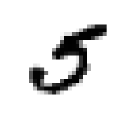

这个数字看起来很像5，我们来验证一下：
```
>>> y[36000]
5.0
```
的确是数字5。

图 3-1 展示了更多的手写数字，从中你应该能够感觉到这个分类任务还是很棘手的。

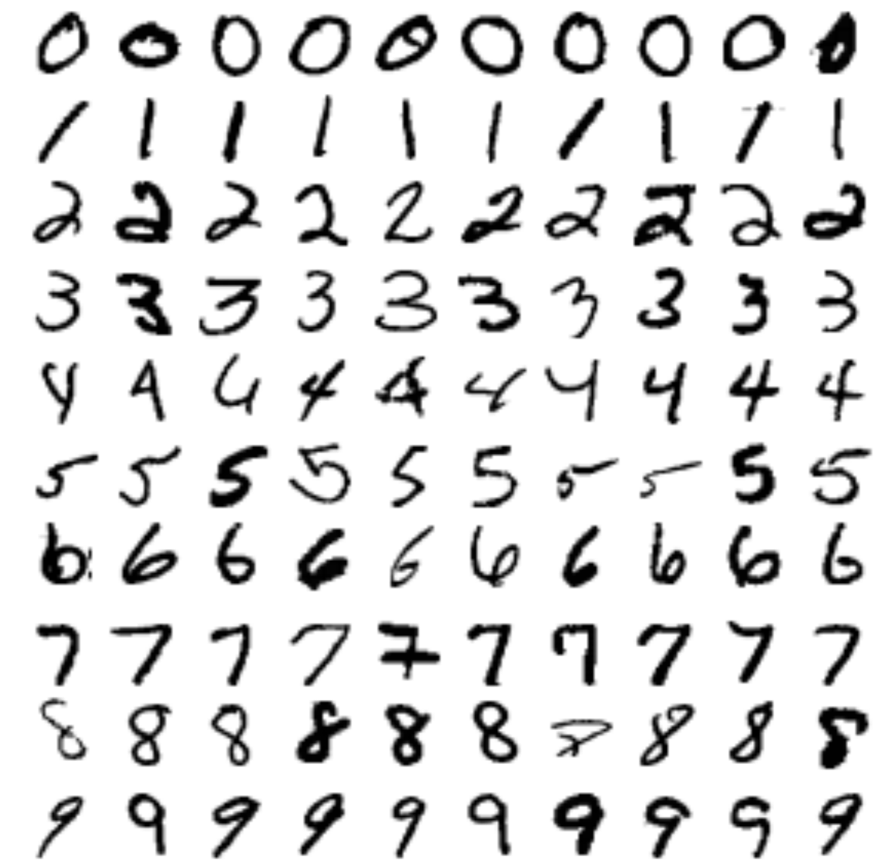
*图 3-1 MNIST中的一些手写数字*

暂停一下。在你开始数据分析之前，应该记得先从数据集中抽取出测试集。实际上，MNIST数据集已经完成了划分（其中前60000张图片是训练集，后10000张图片是测试集）：
```python
X_train, X_test, y_train, y_test = X[:60000], X[60000:], y[:60000], y[60000:]
```
我们先将训练集打乱，这保证了在交叉验证的过程中，每一折是相似的（你应该不希望看到某一折中缺失一些数字吧）。另外，有的机器学习算法对训练数据集中的数据顺序比较敏感，在连续得到相似的实例后，会导致这些算法训练出来的模型性能下降。打乱数据能够避免上述提到的问题：

```python
import numpy as np
shuffle_index = np.random.permutation(60000)
X_train, y_train = X_train[shuffle_index], y_train[shuffle_index]
```

> 注：在某些情况下，打乱数据并不是一个好主意。例如，你的数据的顺序与时间相关（如股票价格或天气状况），这种情况我们将在下一章中说明。

### 训练一个二分类器

现在，我们先将问题进行简化——让分类器能够识别出一个数字，例如5。这个 “5识别器” 就是一个二分类器的例子，能够区分两个类别：数字5 和 非数字5。实现，让我们为这一分类任务创建目标向量：

```python
y_train_5 = (y_train == 5) #所有标记为5的位置,布尔值为True;不为5的位置,布尔值为False
y_test_5 = (y_test == 5)
```
现在我们选择一个分类器模型进行训练。可以将 Stochastic Grandient Descent(随机梯度下降)分类器模型 用于该任务，涉及到 Scikit-Learn 中的  SGDClassifier 类。这个分类器模型有能力高效率处理大规模的数据，其中一个原因是 SGD 独立地对实例进行处理，每次只使用一个实例进行训练（这也使得 SGD 非常易于应用到在线学习中），这部分我们将在后面看到。让我们创建一个 SGDClassifier 实例，并对其进行训练：
```python
from sklearn.linear_model import SGDClassifier
sgd_classifier = SGDClassifier(random_state=42, max_iter=1000)
sgd_classifier.fit(X_train, y_train_5)
```

 SGDClassifier 类在训练的时候具有一定的随机性(因为在名字中就包含了 stochastic -- 随机)。如果你想对训练进行重现，就需要对参数 `random_state` 进行设置。

现在，你可以使用这个训练好的模型测试图片是否为5：
```python
>>> sgd_classifier.predict([some_digit])
array([ True], dtype=bool)
```

模型预测 `some_digit` 实例所对应的数字为5（结果为True）。在这个特殊的实例中，模型预测是正确的。接下来，我们对模型的性能进行评估。

### 性能评估

对分类模型的性能评估要比对回归模型的性能评估要复杂，所以，在本章中，我们将花大量时间讲解性能评估这一主题。当前分类模型的性能评估方式有很多，你可以来杯咖啡，准备好迎接更多的新概念及其英文缩写！

#### 通过交叉验证计算准确度

正如第二章中所提到的，评价一个模型性能的有效方法是交叉验证。

---
**如何实现交叉验证**

有的时候你需要对交叉验证的过程进行控制，而不是仅仅是对类似 `cross_val_score` 的函数进行调用，这时候，你就需要自己实现交叉验证的代码。下面的代码所实现的功能和 `cross_val_score()` 类似，并将结果打印出来：
```python
from sklearn.model_selection import StratifiedKFold
from sklearn.base import clone
skfolds = StratifiedKFold(n_splits=3, random_state=42)

for train_index, test_index in skfolds.split(X_train, y_train_5):
    clone_clf = clone(sgd_classifier)
    X_train_folds = X_train[train_index]
    y_train_folds = y_train_5[train_index]
    X_test_fold = X_train[test_index]
    y_test_fold = y_train_5[test_index]

    clone_clf.fit(X_train_folds, y_train_folds)
    y_pred = clone_clf.predict(X_test_fold)
    n_correct = sum(y_pred==y_test_fold)
    print(n_correct / len(y_pred))

# 3次结果分别为：0.962669777519、0.9625、0.96525
```
`StratifiedKFold` 类用于分层采样(第二章做过详细说明)，使得每一折中各个类型的比例相同。在每次迭代过程中，都将分类器进行复制，对复制的分类器进行训练与预测，之后计算预测正确的个数并计算预测的准确率。

---

让我们使用 `cross_val_score()` 函数对你的 SGDClassifier 模型进行3折交叉验证。记住，K折交叉验证是指将训练集分割成K折（在该例子中为3），之后，从这K折中取出一折用于预测与性能评估，其余的 K-1 折用于训练。
```python
from sklearn.model_selection import cross_val_score
cross_val_score(sgd_classifier, X_train, y_train_5,
               cv=3, scoring="accuracy")
# 输出为：array([ 0.96225,  0.9509 ,  0.95085])
```

哇，例子中每一折的预测准确率（预测准确的比例）都大于 95% 。结果看起来激动人心，真的是这样吗？在你太过兴奋之前，先来看一个非常简陋的分类器：将每一幅图片都分类为 “非数字5”：
```python
import numpy as np
from sklearn.base import BaseEstimator

class Never5Classifier(BaseEstimator):
    def fit(self, X, y=None):
        pass
    def predict(self, X):
        return np.array([False]*len(X))
```
你猜猜这个分类器的准确率。让我们通过代码来验证：
```python
cross_val_score(Never5Classifier(), X_train, y_train_5,
               cv=3, scoring="accuracy")
# 输出为：array([ 0.909  ,  0.9077 ,  0.91225])
```
你的猜测正确吗？这个分类器居然也达到了超过 90% 的准确率！这很容易解释，因为只有10%图片代表5，那么任何图片都预测为非5，自然准确率就可以有90% ，这也并没有什么神奇的。

这个例子也说明了为什么准确率并不是用于分类问题性能测试的首选指标，特别是你处理的是倾斜性的数据集的情况（例如：某个类型的数据出现的频率远高于其他类型数据出现的频率时）。

#### 混淆矩阵(Confusion Matrix)

一种评估分类器性能的更好方式是计算混淆矩阵，通常是计算将类别A误分类为类别B的数量。如下图所示：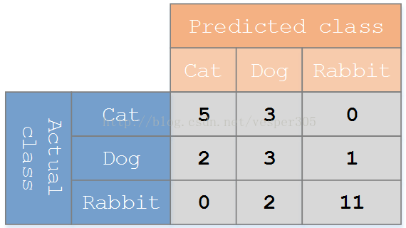

其中每一行之和表示每个类别真实的数量，每一列之和表示每个类别预测的数量。而A行B列对应的数值表示将实际类型为A的实例预测为类型B的数量。

为了计算混淆矩阵，你首先预测一组数据，这样他们才能和真实值进行对比。你可以在测试集上做预测，不过我们还是先不要动测试集（记住，在项目的最后阶段，你已经得到了一个可以加载应用的分类器以后再使用测试集）。现在，你可以使用 `cross_val_predict()` 函数：
```python
from sklearn.model_selection import cross_val_predict

y_train_pred = cross_val_predict(sgd_classifier, X_train, y_train_5, cv=3)
```
类似 `cross_val_score()` 函数，`cross_val_predict()` 也是以K-折交叉验证的方式运行。但与 `cross_val_score()` 不同，`cross_val_predict()` 并不是返回评价的分数，而是返回每一折的预测结果。这意味着你可以获得训练集中每一个实例对应的一个“干净”的预测结果（“干净”是指预测的实例在训练的过程中没有使用过）。

现在你可以使用 `confusion_matrix()` 函数计算混淆矩阵了。只需要将真实的结果和预测的结果作为两个参数传入该函数即可：
```python
from sklearn.metrics import confusion_matrix
confusion_matrix(y_train_5, y_train_pred)
```
结果为：
```python
array([[52979,  1600],
       [ 1120,  4301]])
```
正如前面所述，混淆矩阵中的每一行表示真实的类别，每一列表示预测的类别。其中第一行表示所有非数字5（结果为False，称为负例）的图片中，有 52979 张图片预测为非5，预测结果正确（称为真负例，TN）；有 1600 张图片预测为5，预测结果错误（称为假正例，FP）。第二行表示所有数字5（结果为True，称为正例）的图片中，有 1120 张图片预测为非5，预测结果错误（称为假负例，FN）；有4301 张图片预测为5，预测结果正确（称为真正例，TP）。一个完美的预测期应该只有真正例和真负例，其对应的混淆矩阵应该是一个对角阵（只有对角线上才有非零元素，其他位置的元素值都为0）：
```
confusion_matrix(y_train_5, y_train_perfect_predictions)
# 输出为：
array([[54579, 0],
      [ 0, 5421]])
```
混淆矩阵的确为我们提供了很多的信息，但有时候，你想要一个更加简明的测量结果。一个有用的指标是对所有被预测为正例的实例中有多少是正确的，这称为分类器的查准率(Precision)，如 等式 3-1 所示：
*等式 3-1. 查准率*
$$precision = \frac{TP}{TP+FP}$$

其中 *TP* 为真正例的数量，*FP* 为假正例的数量。

其实要使查准率达到100%也并不困难，只需要将一个你确定为正例的实例预测为正例，那么根据公式查准率就是100%，所以单一的查准率并没有什么意义。所以查准率通常和另一个测量指标——查全率(recall) 结合使用，有时候也成为敏感度(sensitivity)或真正例比率(true positive rate, TPR)，它表示在所有的正例中，被预测器正确预测的比例，如等式 3-2 所示：
*等式 3-2. 查全率*
$$recall=\frac{TP}{TP+FN}$$
其中的 FN 表示假负例的个数。

如果你对混淆矩阵仍有疑惑，图3-2 应该对你有所帮助。

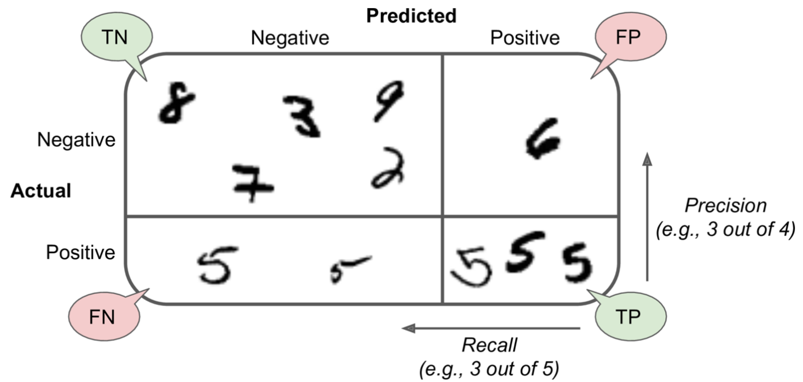
*图 3-2. 混淆矩阵的示意图*

#### 查全率和查准率

Scikit-Learn 提供了很多用于计算分类器性能指标的函数，包括计算查全率和查准率的函数：
```
>>> from sklearn.metrics import precision_score, recall_score
>>> precision_score(y_train_5, y_train_pred) # 应该等于 4301/(4301+1600)
0.72885951533638371
>>> recall_score(y_train_5, y_train_pred) # 应该等于 4301/(4301+1120)
0.79339605238885813
```
现在，你的 数字5监测器 的性能没有之前使用准确率表示时候看起来好了。因为在所有预测为5的实例中，只有72.9%是正确的；而且真正为5的实例中，只有79.3%被检测出来。

通常，如果你希望比较两个分类器的好坏，可以将查准率与查全率结合成一个称为$F_1$值的指标后进行比较。$F_1$值实际上是查准率与查全率的调和平均数（如等式3-3所示）。常规的平均数对每个值的权重都相同，而对于调和平均数而言，越小的值得权重越大。因此，只有在查准率和查全率都较高时，对应的$F_1$值才可能较高。

*等式 3-3. $F_1$值*
$$F_1=\frac{2}{\frac{1}{precision}+\frac{1}{recall}}=2\times\frac{precision\times recall}{precision+recall}=\frac{TP}{TP+\frac{FN+FP}{2}}$$

想要求$F_1$值，只需要简单调用`f1_score()`函数：
```python
>>> from sklearn.metrics import f1_score
>>> f1_score(y_train_5, y_train_pred)
0.78468208092485547
```

$F_1$指标有利于查准率和查全率的数值较为接近的分类器。但可能并不符合你的要求：在一些情况下，你非常看重查准率，而有些情况下，你更看重查全率。例如，你希望一个分类器能够区分视频对小孩子的身心健康是否有害，你宁愿将很多有益视频归类为有害视频（低查全率），以保证筛选出的视频都是对孩子有益的（高查准率），也不希望分类器拥有高查全率，但是在筛选出的视频中存在有害视频（在这种情况下，你可能还需要将人工筛查模块添加到你的流水线中）。另一方面，如果你希望一个分类器能够通过监控视频分辨出商店的窃贼：对于你来说，分类器有30%的查准率和99%的查全率，就是一个好的分类器（虽然安保系统会发出一些假的警报，但几乎确保了每个盗贼都会被捉到）。

好可惜，查准率和查全率不可兼得：查准率越高，查全率就越低，反之亦然。这称为 查准率/查全率权衡。

#### 查准率/查全率权衡

为了更好地理解这一权衡，让我们看看 `SGDClassifier`如何做出分类决策。对于每一个实例，它通过一个 *决策函数* 计算该实例对应的评分。如果评分大于阈值，将该实例就被标记为正例，否则将其标记为负例。*图 3-3* 显示了分数值从低（左边）到高（右边）对应的一些图片，假定决策阈值在箭头的正中央（在两个5之间）：将有4个真正例（真实值即为5）在阈值分割点的右边，有1个假正例（实际值为6）在阈值分割点的左边。因此，该阈值分割的查准率是80%（5个中有4个）。但实际上有正例6个，但分类器只检测出4个，所以查全率为67%（6个中有4个）。如果你将分割阈值增大（将阈值分割点像箭头右侧移动），数字6对应的图片将会由假正例变为真负例，因此，分类器的查准率提高了（在该例子中，查准率达到了100%），但同时有一个真正例变为了假负例，查全率降低为50% 。而降低分割阈值会增大查全率，但减小查准率。

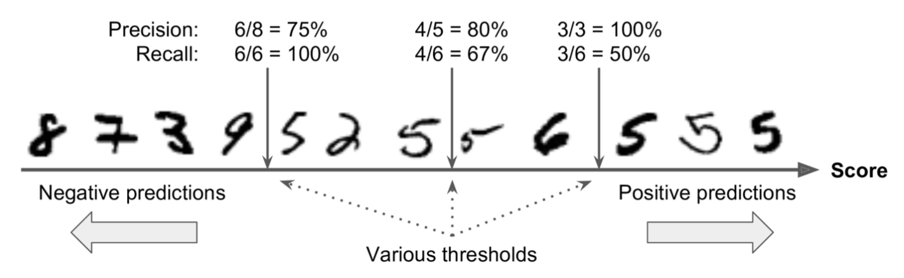
*图 3-3. 检测阈值与查准率/查全率权衡*

Scikit-Learn并没有提供函数用于直接对分割阈值进行修改，但你可以通过调用函数获得预测的评分。想要获得预测评分，可以调用 `decision_function()` 方法，它将为每个实例返回一个评分，之后你可以基于这些评分尝试你希望设置的分割阈值：
```python
y_scores = sgd_classifier.decision_function([some_digit])
y_scores # 输出为 array([ 303.18076405])
```

将分割阈值设置为0：
```python
threshold = 0
y_some_digit_pred = (y_scores > threshold)
y_some_digit_pred
```
输出为：`array([ True], dtype=bool)`

将分割阈值设置为0，得到的结果与之前通过 `predict()` 函数获得的结果相同。接下来我们提高分割阈值：
```python
threshold = 400
y_some_digit_pred = (y_scores > threshold)
y_some_digit_pred
```
输出为：`array([False], dtype=bool)`

这就验证了增大分割阈值会降低查全率。实际表示5的图片，在分割阈值为0时，被分类器正确地识别为5，而在分割阈值为400时，被分类器识别为非5。

所以，你该如何取分割阈值呢？首先，你还是需要通过 `cross_val_predict` 以K折交叉验证的方式获得训练集中每个实例对应的评分，这需要指定 `cross_val_score` 的 `method` 参数：
```python
from sklearn.model_selection import cross_val_predict
y_scores = cross_val_predict(sgd_classifier, X_train, y_train_5,
                             cv=3, method="decision_function")
```
有了这些评分之后，你可以通过 `precision_recall_curve()` 函数计算所有可能的分割阈值对应的查准率与查全率：
```python
from sklearn.metrics import precision_recall_curve
# hack to work around issue #9589 introduced in Scikit-Learn 0.19.0
if y_scores.ndim == 2:
    y_scores = y_scores[:, 1]
precisions, recalls, thresholds = precision_recall_curve(y_train_5, y_scores)
```

> 注：此处的代码与书本上的略有不同(与作者提供的源码系统)，因为 SCikit-Learn 0.19.0 版本的 `cross_val_predict()` 函数自身存在的[#9589问题](https://github.com/scikit-learn/scikit-learn/issues/9589)，故代码做了一些修改。

你可以通过 Matplotlib 提供的函数，将查准率与查全率随分割阈值变化的曲线绘制出来（如图 3-4 所示）：
```python
import matplotlib.pyplot as plt

def plot_precision_recall_vs_threshold(precisions, recalls, thresholds):
    plt.plot(thresholds, precisions[:-1], "b--", label='Precision')
    plt.plot(thresholds, recalls[:-1], "g-", label="Recall")
    plt.xlabel('Threshold')
    plt.legend(loc='center left')
    plt.ylim([0, 1.05])

plot_precision_recall_vs_threshold(precisions, recalls, thresholds)
plt.show()
```
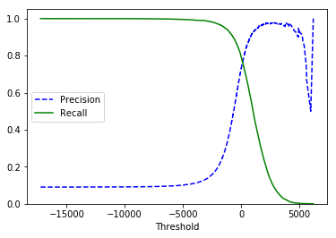
*图 3-4. 每个检测阈值对应的查准率与查全率*

你也许会奇怪，在上图中为什么查准率曲线要比查全率曲线更加“曲折”（也就是不稳定，从图中看出查准率并不是单调递增的）？这是因为查准率有时候在你增大阈值时，反而会减小（虽然总体上讲是阈值越大，查准率就越大）。要理解造成这种情况的原因，你需要回过头看看图3-3，你将分割阈值从中间位置向右移动一格（跳过一张图片），查准率从 4/5 (80%) 下降为 3/4 (75%)。另一方面，计算查全率时，其分母是所有正例的个数，对于一个给定的数据集，这个值是固定不变的，其分子是真正例的个数，而分割阈值增大后，分子不会增加，只会减少，所有查全率看起来要比查准率的曲线平滑。

现在你可以很容易地为你的任务选择一个好的分割阈值。另一种选择好的 查准率/查准率权衡 的方式是直接以查全率和查准率为横纵坐标绘制曲线（如图 3-5 所示）：

*图 3-5. 查准率-查全率曲线*

从图中你可以看到在查全率增大到 80% 以后，查准率急剧下降，你应该在急剧下降之前选择你的查准率/查全率权衡，例如选择查全率为60%左右。当然，具体的选择应该根据你的项目进行。例如，你需要的查准率为90%，你查看图 3-4（需要进行放大），发现需要将分割阈值设置在800左右，为了实现指定的查准率，你不能调用 `predict()` 方法，实现代码如下：
```python
y_train_pred_90 = (y_scores > 800)
```
让我们测试一下该分割阈值下的查准率与查全率：
```python
>>> precision_score(y_train_5, y_train_pred_90)
0.9015304649148137
>>> recall_score(y_train_5, y_train_pred_90)
0.57590850396605797
```
很好，你已经得到了一个查准率为90%的分类器（或者接近该查准率）! 正如你所见，如何查准率的分类器都非常容易创建：只需要将分割阈值设置的足够高，你就完成了。但如果查准率很高而查全率很低的分类器也没什么卵用。
如果老板叫你实现一个查准率为99%的分类器，你应该反问：“您打算查全率达到多少”。

#### ROC 曲线

ROC（receiver operating characteristic,接收者操作特征）曲线是另一种分类器常用的工具。它与查准率/查全率曲线非常相似，但并不是以查全率和查准率为横纵坐标，而是以假正例的比例和真正例的比例（也称为查全率）为横纵坐标。其中 FPR（假正例比例，false positive rate）是指在所有的负例中，被分类器误分类为正例的比例，其值等于1减去真负例比例，真负例比例就是在所有的负例中，被分类器正确分类为负例的比例。其中 TNR（真负例比例）也称为特异性（specificity）。因此，ROC曲线是以 1-specificity 为横坐标，查全率(recall) 为纵坐标绘制的曲线。

为了绘制ROC曲线，你首先需要用`roc_curve()`函数计算每一个分割阈值对应的FPR和TPR：
```python
from sklearn.metrics import roc_curve

fpr, tpr, thresholds = roc_curve(y_train_5, y_scores)
```
你可以用下面的代码绘制ROC曲线，如图 3-6 所示：
```python
def plot_roc_curve(fpr, tpr, label=None):
    plt.plot(fpr, tpr, "-b", linewidth=2, label=label)
    plt.axis([0, 1, 0, 1])
    plt.plot([0, 1], [0, 1], "--k")
    plt.xlabel('False Positive Rate', fontsize=16)
    plt.ylabel('True Postitive Rate', fontsize=16)

plt.figure(figsize=(6,4))
plot_roc_curve(fpr, tpr)
plt.show()
```
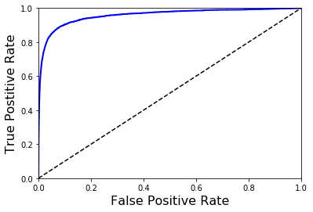
*图 3-6 ROC曲线*

这里仍旧存在一个权衡：查全率（recall/TPR）越高，则对应的 FPR 也就越高。其中虚线表示完全随机的分类器对应的ROC曲线，一个好的分类器应当尽可能地原理该虚线（向左上角的点靠近）。

一种比较两个分类器性能的指标是测量AUC（area under the curve，曲线下区域）的大小。一个完美的分类器，其ROC对应的AUC大约等于1，而完全随机的分类器对应的AUC大约为0.5。Scikit-Learn提供了一个函数用于计算ROC AUC：
```python
>>> from sklearn.metrics import roc_auc_score
>>> roc_auc_score(y_train_5, y_scores)
0.97061072797174941
```
因为ROC曲线 和 查准率/查全率(PR)曲线 非常相似，你可能难以决定使用哪一个指标。选择指标的一个原则是：如果属于正例的实例非常少，或者是相较于假负例，你更关注假正例时，你应当选择PR曲线，其他情况下你应当旋转门ROC曲线。比如，你通过图3-6的ROC曲线及其对应的ROC AUC值，你会觉得这个分类器的性能很好，但这是因为相较于负例，正例的数量本来就非常少。而通过 PR 曲线可以很容易看出该分类器具有提升的空间（曲线能够更靠近于右上角的点）。

下面，我们训练一个`RandomForestClassifier`，并将它的ROC曲线、ROC AUC值与`SGDClassifier`的进行比较。首先，你需要得到训练集中每一个实例的评分。但是由于`RandomForestClassifier`自身的工作方式（具体见[第七章](#20180201213244)）的原因，它并没有 `decision_function()` 方法。相反，它有一个`predict_proba()`方法，Scikit-Learn中的分类器通常都有这两个方法中的一个。`predict_proba()`方法返回的是一个二维数组，其中每一行代表一个实例，每一列代表一个类别，二维数组中的每一个元素表示指定的实例属于指定类别的可能性（例如：这幅图片有70%的概率表示数字5）：
```python
from sklearn.ensemble import RandomForestClassifier
forest_clf = RandomForestClassifier(random_state=42)
y_probas_forest = cross_val_predict(forest_clf, X_train, y_train_5,
                           cv=3, method="predict_proba")
```
但画ROC曲线需要的是评分而非可能性。一个简单的方式是将正例的可能性作为评分：
```python
y_scores_forest = y_probas_forest[:, 1] # score = proba of positive class
fpr_forest,tpr_forest,thresholds_forest=roc_curve(y_train_5,y_scores_forest)
```
选择，绘制ROC曲线的数据已经准备好了,将之前的ROC曲线也绘制起来以便于比较（图 3-7）：
```python
plt.figure(figsize=(8,6))
plt.plot(fpr, tpr, "b:", label="SGD")
plot_roc_curve(fpr_forest, tpr_forest, "Random Forest")
plt.legend(loc="lower right")
plt.show()
```

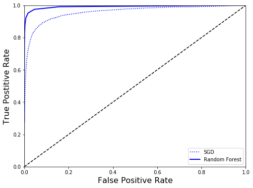
*图 3-7. 比较两个分类器的 ROC 曲线*

从上图中可以看出，`RandomForestClassifier` 的ROC曲线看起来要比 `SGDClassifier` 好得多：它更靠近于左上角，而`RandomForestClassifier`的ROC AUC值也更好：
```python
>>> roc_auc_score(y_train_5, y_scores_forest)
0.99166587519468119
```

另外，计算其查准率与查全率：
```python
>>> precision_score(y_train_5, y_scores_forest>0.5)
0.98450796421557929
>>> recall_score(y_train_5, y_scores_forest>0.5)
0.83231876037631436
```
达到了98.45%的查准率和83.23%的查全率，还是不错的。

希望你已经掌握了如何对二类分类器进行训练，为你的任务选择合适的评价指标，通过交叉验证的方法对你的分类器进行评估，根据需要做出查准率/查全率权衡，通过ROC曲线、ROC AUC值比较多个分类器的性能。接下来，让我们的分类器能够识别出更多的数字。

### 多类分类器

相较于二分类器，多分类器能够分辨出的类别多于两个。

一些分类器（例如随机森林分类器或者朴素贝叶斯分类器）可以直接分辨多个类别。而其他的（例如支持向量机或线性分类器）是严格的二分类器。但是，用于二分类器的很多优化策略都可以应用到多分类器上。

例如，可以创建10个二分类器（每个二分类器测试一个数字：0-分类器、1-分类器、2-分类器...），这样就可以将这十个二分类器组合成一个多分类器，该多分类器就可以识别0~9这些数字的图片。当你想要判别一幅图片，你可以使用这十个二分类器分别计算该图片的评分，然后选择评分最高的作为其识别的值。这也称为一对多(One-Versus-All, OvA)策略。

另一种为每一对数字训练一个二分类器：一个用于识别0和1，一个用于识别0和2，一个用于识别1和2，等等。这称为一对一(One-Versus-One)策略。如果任务中有 N 个类，你就需要训练 $N\times (N-1)/2$ 个分类器。对于 MNIST 问题，意味着需要训练45个二分类器。如果你想要判别一幅图片，这45个二分类器都需要对该图片进行判别，并查看哪个类被选出的频数最多。OvO的主要优势在与每个分类器只需要在训练集上将图片分类到两个类别。

一些算法（例如支持向量机分类器）随着数据集规模的增大，性能会变差。对于这些算法，我们偏向于使用OvO策略，因为基于小数据量训练较多的分类器要比基于大数据量训练较少的分类器要更加快。但对于大多数的二分类算法，OvA更好。

当你打算将二分类算法应用于多分类的任务，Scikit-Learn默认使用OvA策略（除了SVM，它默认是使用OvO策略）。让我们使用SGDClassifier来测试一下：
```python
>>> sgd_classifier.fit(X_train, y_train)
>>> sgd_classifier.predict([some_digit])
array([ 5.])
```
非常简单！代码中在训练集上训练 `SGDClassifier` 时，使用的是原始的目标类0~9（y_train）,而不是 5-非5（y_train_5）。之后，代码中使用训练过的分类器进行了预测。实际上，在代码底层，Scikit-Learn实际上训练了10个二分类器，并通过这10个分类器预测给定图片的评分，并选择评分最高的类作为最后的结果。

在这个例子中，你可以通过调用 `decision_function()` 方法看到确实是这样工作的。对于每一个实例返回的是10个评分，而不是仅仅一个评分：
```python
>>> some_digit_scores = sgd_classifier.decision_function([some_digit])
>>> some_digit_scores
array([[-1166.41712453, -4332.70884476, -2005.46168594, -1872.08470491,
        -2336.93108598,   303.18076405, -3569.82698882, -3599.66740136,
        -3018.13020236, -3538.2029836 ]])
```
分数最高的类确实是5：
```python
>>> np.argmax(some_digit_scores)
5
>>> sgd_classifier.classes_
array([ 0.,  1.,  2.,  3.,  4.,  5.,  6.,  7.,  8.,  9.])
>>> sgd_classifier.classes_[5]
5.0
```
在一个分类器完成训练后，所有的目标类以数组的形式存储在分类器实例的`class_`属性中，在这个例子中，数组索引刚好与对应的目标类相同，但这也仅仅是巧合而已。

如果你想要显示地规定Scikit-Learn使用OvO或OvA策略进行训练，你可以使用 `OneVsOneClassifier` 或 `OneVsAllClassifier` 类。在创建一个类的实例时，将一个二分类器传入其构造函数。例如，基于 `SGDClassifier` 构建的 OvO 策略多分类器的代码为：
```python
>>> from sklearn.multiclass import OneVsOneClassifier
>>> ovo_clf = OneVsOneClassifier(SGDClassifier(random_state=42, max_iter=5))
>>> ovo_clf.fit(X_train, y_train)
>>> ovo_clf.predict([some_digit])
array([ 5.])
>>> len(ovo_clf.estimators_)
45
```

训练 `RandomForestClassifier` 也非常简单：
```python
>>> forest_clf.fit(X_train, y_train)
>>> forest_clf.predict([some_digit])
array([ 5.])
```
这时候，Scikit-Learn不需要常用OvO或OvA策略，因为随机森林分类器能够直接判别一个实例属于多个类中的哪一个。你可以通过调用`predict_proba()` 获得该实例被判别为每个类的可能性：
```python
>>> forest_clf.predict_proba([some_digit])
array([[ 0.1, 0. , 0. , 0.1, 0. , 0.8, 0. , 0. , 0. , 0. ]])
```
你可以看到分类器对预测结果非常自信：索引5的值为0.8，表示分类器认为该图片是5的可能性为80% ，它也认为图片可能是0或者3（每个的可能性都为10%）。

你现在需要对分类器性能进行评估，通常需要使用交叉验证的方法。让我们使用 `cross_val_score()` 函数对 `sgd_classifier` 分类器的性能进行评估：
```python
>>> cross_val_score(sgd_classifier,X_train,y_train,cv=3,scoring='accuracy')
array([ 0.85977804,  0.85044252,  0.88173226])
```
在3-折测试中，准确率都达到了 85% 以上。如果你使用随机分类器，你只能得到10%的准确率，所以应该来讲这个分类器的性能还是不错的，但仍然有提升的空间。例如简单地对输入数据进行标准化（在第二章中做过介绍），就能够将准确率提升到90%以上：
```python
from sklearn.preprocessing import StandardScaler
scaler = StandardScaler()
X_train_scaled = scaler.fit_transform(X_train.astype(np.float64))
cross_val_score(sgd_classifier,X_train_scaled,y_train,cv=3,scoring='accuracy')
```
输出为：
```python
array([ 0.90361928,  0.90229511,  0.90353553])
```

### 错误分析
当然，在真实的项目中，你可以按照机器学习项目列表的步骤进行（见[附录B](#201801261106)）：选择合适的数据预处理方式，尝试多种学习算法模型并将其中最好的几个列出来，使用`GridSearchCV`函数对多组超参数进行调优，尽可能实现上述过程的自动化。现在假定你获得了一个理想的模型，你希望通过某些方式对这个模型的性能再提升，一种方式是分析这个模型产生错误的原因。

首先，你可以查看混淆矩阵：和之前讲过的一样，你需要先调用 `cross_val_predict()` 函数，然后调用 `confusion_matrix()` 函数：
```python
y_train_pred = cross_val_predict(sgd_classifier, X_train_scaled,
    y_train, cv = 3)
conf_mx = confusion_matrix(y_train, y_train_pred)
conf_mx
```
输出为：
```
array([[5607,    0,   16,    9,   10,   39,   39,    6,  195,    2],
       [   1, 6427,   43,   27,    4,   37,    4,   10,  176,   13],
       [  26,   30, 5272,   97,   74,   22,   65,   40,  321,   11],
       [  28,   23,  111, 5272,    2,  195,   27,   41,  361,   71],
       [  12,   14,   42,   12, 5261,    7,   36,   19,  270,  169],
       [  31,   20,   31,  153,   55, 4475,   78,   18,  494,   66],
       [  28,   22,   50,    3,   41,   86, 5564,    9,  115,    0],
       [  18,   17,   55,   28,   49,   13,    6, 5733,  148,  198],
       [  18,   66,   46,   94,    2,  126,   34,    9, 5412,   44],
       [  24,   21,   31,   60,  131,   30,    1,  178,  307, 5166]])
```
该混淆矩阵中有很多的数值，我们通常使用 Matplotlib 的 `matshow` 函数将混淆矩阵图形化以便于查看与分析：
```python
plt.matshow(conf_mx, cmap="gray")
plt.show()
```
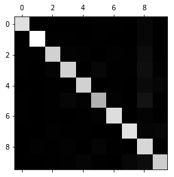
该混淆矩阵看起来不错，因为大多数的图片都位于对角线上，对角线上的数量表示正确分类的数量。数字5表示的元素看起来要比其他数字稍微暗一点，这意味着数字5在数据集中的数量比较少，或者是分类器对数字5的判别不够准确。事实上，你可以验证这两种情况都会导致这种结果。

让我们重点关注分类错误上。首先，你需要将混淆矩阵中表示数量的每一个值与其代表的数字类型相对应，这样你就可以计算分类错误率而不是仅仅得到分类错误的个数（个数会使大量的实例看起来划分得不够好）。
```python
row_sums = conf_mx.sum(axis=1, keepdims=True)
norm_conf_mx = conf_mx / row_sums
```
现在，我们将对角线上的元素都设为0，重点关注错误的元素：
```python
np.fill_diagonal(conf_mx, 0)
plt.matshow(conf_mx, cmap="gray")
plt.show()
```
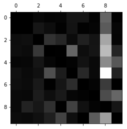

现在，你可以很清楚地看出分类器所判断错误的元素。记住，每一行代表真实的类型，每一列代表预测的类型。图中第5行第8列块特别亮，表示有很多实际上是5的图片被误认为是8。相反的，有很多的块颜色非常暗，例如第一行的块，这表示数字1基本上被分类正确了（在第8列的块有点亮，表示也只是与数字8会产生一点混淆）。可以注意到，这个矩阵并不是对称的，例如5很容易被误分类为8，但是8却不是那么容易误分类为5。

对混淆矩阵的分析通常能够为你改善分类器性能提供思路。在这个例子中，看起来你的主要工作是提升对数字8与数字9的判别准确率。例如，你可以收集更多的这些数字的图片；或者是添加帮助分类器进行分类的新属性，例如可以编写一个算法，计算图片中圆的个数（其中8有2个，6有1个，5没有）。或者是通过对图片的处理（如使用 Scikit-Image, Pillow, OpenCV 等）来发现更具代表性的数字特征，如圆的个数。

另外，分析分类错误的实例可以找到分类器错误分类的原因，针对这一原因可以有效改善分类器的性能，当然这一过程更加困难和费时。例如，我们绘制出数字5和数字8的一些图片：
```python
cl_a, cl_b = 5, 8
X_aa = X_train[(y_train == cl_a) & (y_train_pred == cl_a)]
X_ab = X_train[(y_train == cl_a) & (y_train_pred == cl_b)]
X_ba = X_train[(y_train == cl_b) & (y_train_pred == cl_a)]
X_bb = X_train[(y_train == cl_b) & (y_train_pred == cl_b)]

# EXTRA
def plot_digits(instances, images_per_row=10, **options):
    size = 28
    images_per_row = min(len(instances), images_per_row)
    images = [instance.reshape(size,size) for instance in instances]
    n_rows = (len(instances) - 1) // images_per_row + 1
    row_images = []
    n_empty = n_rows * images_per_row - len(instances)
    images.append(np.zeros((size, size * n_empty)))
    for row in range(n_rows):
        rimages = images[row * images_per_row : (row + 1) * images_per_row]
        row_images.append(np.concatenate(rimages, axis=1))
    image = np.concatenate(row_images, axis=0)
    plt.imshow(image, cmap = matplotlib.cm.binary, **options)
    plt.axis("off")

plt.figure(figsize=(8, 8))
plt.subplot(221); plot_digits(X_aa[:25], images_per_row=5)
plt.subplot(222); plot_digits(X_ab[:25], images_per_row=5)
plt.subplot(223); plot_digits(X_ba[:25], images_per_row=5)
plt.subplot(224); plot_digits(X_bb[:25], images_per_row=5)
plt.show()
```
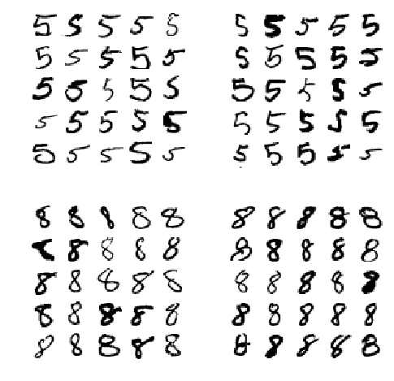

其中左边两个5×5块表示分类为5的图片，右边两个5×5块表示分类为8的图片。在左下角及右上角的错误分类的块中，有的图片上的数字是在是写的太潦草了，连人工都很难分辨出来（如第5行第10列的数字5，看起来就和8很像）。但大多数的错误分类，对于人类而言还是很容易进行区别的，很难理解分类器为什么会犯这些错误。真正的原因在于 `SGDClassifier` 模型只是一个简单的线性模型，它只是简单地为每一个类型的像素分配一个权重，在一个新图片到来时，它只是将每个像素灰度加权后求和作为一个分值进行返回，而5和8只有很少的像素是不一样的，所以分类器很容易对5和8判别错误。

### 多标签分类

到目前为止，我们所遇到的所有分类都是将一个实例分类到一个类中。在某些情况下，你也许会希望一个实例对应多个类。例如面部识别器：如果它发现在一幅图片中有多个人，那它应该怎么工作？当然对图片中的每个人都输出其对应的标签。比如说一个面部识别器可以识别3张人脸：Alice、Bob、Charlie，当输入为一张Alice和Charlie合照的图片时，它应该输出[1, 0, 1] （表示有Alice、无Bob、有Charlie）。这种输出是多个二进制标签的分类器就称为 多标签分类系统。

我们不会输入介绍人脸识别系统，为了介绍的目的，我们来看一个简单的例子：
```python
from sklearn.neighbors import KNeighborsClassifier
y_train_large = (y_train > 7)
y_train_odd = (y_train % 2 == 1)
y_multilabel = np.c_[y_train_large, y_train_odd]

knn_clf = KNeighborsClassifier()
knn_clf.fit(X_train, y_multilabel)
```
在上面的代码中，我们为每一张图片都创建了含有两个标签的数组--`y_multilabel`：第一个标签标示是否为大数（7、8或9），第二个标签标示是否为奇数。之后的一行代码创建了一个 `KNeighborsClassifier` 实例（该分类器支持多标签，但并不是所有的分类器都支持多标签），之后我们使用多标签数组对该分类器进行训练。现在你可以做出预测，并可以看到其输出也具有两个标签：
```python
>>> knn_clf.predict([some_digit])
array([[False,  True]], dtype=bool)
```
可以看到结果的确是正确的！数字5缺失不是大数字（False）并且是奇数（True）。

有很多方式可以对多分类器进行性能评价，我们需要根据实际的项目选择评价方式。一种方式是为每一个实例计算 $F_1$值（我们之前讨论的二分类器测量也是用这种方式），之后只需要计算每一实例所有标签的 $F_1$值的平均值即可。下面的代码计算所有标签的平均 $F_1$值：
```python
y_train_knn_pred = cross_val_predict(knn_clf, X_train, y_multilabel, cv=3)
f1_score(y_multilabel, y_train_knn_pred, average="macro")
```
输出为：`0.97133567841540613`

这里假定所有的标签都是同等重要的，但真实的情况可能并非如此。如果你所得到的Alice图片数量远多于Bob和Charlie的图片数量，你也许需要对Alice的图片分类评分给予更大的权重。一种简单的方式是使每个标签的权重都等于它的支持度（例如目标标签对应实例的数量）。为了实现加权，只需要在之前的代码中的参数`average="macro"` 修改为 `average=“weighted”` 即可。


### 多输出分类

最后我们要讨论的分类任务是 多输出-多类分类（或者简称为 多输出分类）。它是多标签分类的一个推广，其中的每一个标签可以属于多个类型（例如标签的类型可以多于两个）。

为了解释这点，我们创建一个系统用于去除图片中的噪声。它会将输入的图片作为含噪声的图片，输出去除了噪声的图片，表示每个点是像素强度，类似于 MNIST 图片。注意该分类器输出是多标签的（每个像素点一个标签），而每个标签有多个值（像素强度从0到255）。因此这个系统就是 多输出分类系统。

有些时候，分类和回归的界限比较模糊，例如这个例子。按理来说，计算像素的灰度值更像是回归而非分类。而且，多输出系统不仅仅用于分类任务；你的系统可以针对每个实例输出多个标签，既可以包含类型标签，也可以包含数值标签。

让我们通过 Numpy 的`randint()` 函数在MNIST图片中增添噪声，创建新的训练集和测试集。目标图片是得到原始的没有添加噪声前的图片。

```python
import numpy.random as rnd
noise = rnd.randint(0, 100, (len(X_train), 784))
X_train_mod = X_train + noise
noise = rnd.randint(0, 100, (len(X_test), 784))
X_test_mod = X_test + noise
y_train_mod = X_train
y_test_mod = X_test
```
让我们看看测试集中的图片（没错，我们“偷窥”了测试集中的数据，你应该能够意识到这是不对的）：
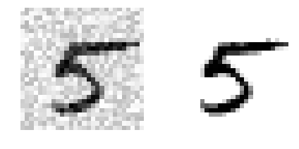

左边的是包含了噪声的图片，右边是不包含噪声的 “干净” 的图片。现在让我们训练能够使图片变得“干净”的分类器：
```python
from sklearn.neighbors import KNeighborsClassifier
knn_clf = KNeighborsClassifier()
knn_clf.fit(X_train_mod, y_train_mod)
clean_digit = knn_clf.predict([X_test_mod[some_index]])
clean_digit.shape = (28, 28)
plt.imshow(clean_digit, cmap="binary")
plt.axis("off")
plt.show()
```
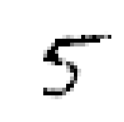

和目标图片非常相似！我们探讨分类器的旅程告一段落，希望你从中学会了如何为分类任务选择好的测量指标，采取合适的查全率/查准率权衡，分类器的比较，以及为各种各样的任务建立好的分类系统的方法。

### 练习

1. 在MNIST数据集上建立一个在测试集上准确率达到97%以上的分类器。提示：`KNeighborsClassifier` 在这个任务中的性能非常好；你只需要找到好的超参数值（测试使用网格搜索的方式测试多组 `weights` 和 `n_neighbors` 超参数）。
2. 写一个函数：能够将MNIST中的图片向任意一个方向（上、下、左、右）移动一个像素，你也可以使用`scipy.ndimage.interpolation`模块中的`shift()`函数。之后，对训练集中的每幅图片创建4个拷贝，每个拷贝向一个方向移动1个像素，并将它们添加到训练集中。之后，用这个扩展的训练集对练习一种选择的模型再度训练，并且测试训练后在测试集上的准确率。你应当发现你的模型性能变得更好了！这种人工扩展训练集的技术称为 *数据增强* 或者 *数据集扩展*。
3. 处理 *Titanic* 数据集。开始 [Kaggle](https://www.kaggle.com/c/titanic) 的一个很好的切入点。
4. 建立一个垃圾邮件分类器（一个更具挑战性的练习）：
    - 从 [Apache SpamAssassin's public datasets](http://spamassassin.apache.org/old/publiccorpus/) 下载垃圾邮件/普通邮件数据集；
    - 对数据集解压缩，并熟悉其中数据的格式；
    - 将数据集分为训练集和测试集；
    - 编写数据预处理流水线，将每一封邮件变为一个特征向量。你的预处理流水线应当将一封邮件变为是否有某些词汇的布尔数组。例如，所有的邮件只可能包含4个单词：“hello”，“how”，“are”，“you”，那么邮件“hello you hello hello you” 将被转换为一个向量[1, 0, 0, 1]（表示 [存在"hello", 不存在“how”, 不存在“are”, 存在"you"]），如果你希望在向量中体现词汇的次数，可以将其转换为[3, 0, 0, 2]；
    - 你也许需要在你的预处理流水线中添加用于控制如是否取出邮件标题、是否全部转换为小写字母、是否去除标点、是否将所有具体网址转换为字符串“URL”、是否将数字转换为字符串“NUMBER”、是否执行单词裁剪（如删除词尾）等行为的超参数；
    - 测试多种分类器，求证是否能够得到一个同时具有高查全率和查准率的垃圾邮件分类器；

这些练习的解答过程可以在 https://github.com/ageron/handson-ml 上找到。

## 第四章 训练模型

目前为止，我们只是像一个黑盒子一样使用机器学习模型及其训练算法。如果你已经做过了之前章节中介绍的练习，你有可能会惊讶地发现即使不知道算法工作的底层机制，你仍然能够完成许多的任务：优化了一个回归系统、改善了一个数字图片分类器、你甚至创建了一个能从一堆邮件中找到垃圾邮件的邮件分类器——所有这些都是在你不了解它们的底层工作机制的情况下完成的。确实，很多情况下，你的确不需要知道算法实现的细节。

然而，了解模型是任何工作的能够帮助你快速做到合适的模型、正确的训练算法、对于任务而言适合的超参数集合。理解底层工作机制还能帮助你调试系统出现的问题，解析性能提升问题。最后，在本章中我们基本上讨论的是对神经网络算法的理解、建立与训练（本书第二部分还将讨论）。

在本章中，我们将从一个线性回归模型开始讲起，这可以说是一个最简单的模型。我们将会讨论两种继而不同的训练方式：
- 使用直接求“闭式解(closed-form)”方程的方式，直接计算最符合训练集的模型参数（例如：能够使训练集上损失函数最小的模型参数）；
- 使用一种迭代优化的方式，称为梯度下降(Gradient Descent,GD)，能够通过慢慢逼近的方式求解出使训练集上损失函数最小的模型参数，求解的最终结果和第一种方式应该相同。我们将看到很多在第二部分讲解神经网络时经常使用的梯度下降方法：批量梯度下降、小批量梯度下降、随机梯度下降。

之后，我们将看到多项式回归：一种更加复杂的模型，可以训练非线性的数据。因为该模型相对于线性回归有更多的参数，它更容易在训练集上产生过拟合现象，因此我们将介绍如何通过学习曲线发现模型是否已经产生该问题，另外我们将介绍多种正规化技术来减小模型在训练集上过拟合的风险。

最后，我们将介绍两种常用的解决分类任务的模型：逻辑回归(Logistic Regression) 和 Softmax回归。

在本章中将会出现一些基本的微积分及线性代数的方程组。为了了解这些方程，你需要知道向量和矩阵是什么，如何对它们进行转置，什么是点乘，什么是矩阵的逆，什么是偏导数。如果你对这些概念不是很熟悉，建议看看相关的书籍。对于讨厌数学的同学们，你们可以简单地跳过这些方程；希望除方程以外的文字内容也能帮助你理解大多数的概念。

### 线性回归

在第一章中，我们看了一个关于生活幸福指数的简单的回归模型：$life\_satisfaction= \theta_0 + \theta_1\times GDP\_per\_capita$ 。

这个模型只是输入为 **GDP_per_capita** 的一个一次线性函数。$\theta_0$ 和 $\theta_1$是该模型的参数。

更一般地，一个线性模型通常只是简单地计算输入特征的加权和，再加上一个呗称为偏置项(也称截距项)的参数作为预测的结果，如方程4-1所示：

&nbsp;&nbsp;&nbsp;&nbsp;*方程4-1. 线性回归模型的预测*
&nbsp;&nbsp;&nbsp;&nbsp;$$\hat{y}=\theta_0+\theta_1 x_1+\cdots+\theta_n x_n$$
- $\hat{y}$ 是预测结果；
- $n$ 是特征的数量；
- $x_i$ 是第 i 个特征的值；
- $\theta_j$ 是第 j 个模型参数(包括偏置项$\theta_0$以及特征权值$\theta_1$、$\theta_2$、...、$\theta_n$)；

可以将上面的等式以更简洁的向量形式表示，如扶持4-2所示：
&nbsp;&nbsp;&nbsp;&nbsp;*等式4-2. 线性回归模型预测（向量形式）*
&nbsp;&nbsp;&nbsp;&nbsp;$\hat{y}=h_\theta(\bold x)=\theta^T\cdot\bold x$

- $\theta$ 是模型的参数向量，包括偏置项 $\theta_0$ 和特征权重 $\theta_1$ 到 $\theta_n$；
- $\theta^T$ 是 $\theta$ 的转置（$\theta$是列向量，$\theta^T$是行向量）；
- $\bold x$ 是实例的 *特征向量*，包括从 $x_0$ 到 $x_n$ ，其中 $x_0$ 通常等于1；
- $\theta^T\cdot\bold x$ 是 $\theta^T$ 和 $\bold x$ 的点乘；
- $h_\theta$ 是假设函数，其中的参数为模型参数向量$\theta$；

好了，这就是线性模型，那么我们应该如何对它进行训练？回忆一下，训练一个模型就是计算一系列的参数，使得模型更好地与训练集相匹配。为了实现这一目标，我们首先需要一个测量模型多好(或多差)的工具。在第二章中，我们看到回归模型最常见的性能测量方式是均方根误差(RMSE)。因此，为了训练一个线性回归模型，你需要找到向量 $\theta$ 的值，使RMSE最小。可以将计算RMSE最小值简化为计算MSE最小值，它将得到相同的 $\theta$ 值（因为一个变量的最小化过程和该变量平方根的最小化过程相同）。

线性回归模型的MSE计算公式如等式4-3所示：
&nbsp;&nbsp;&nbsp;&nbsp;*等式4-3. 线性回归模型的MSE损失函数*
$$MSE(\bold X, h_\theta)=\frac1m\sum^m_{i=1}(\theta^T\cdot\bold x^{(i)}-y^{(i)})^2$$

大多数的符号已经在第二章中做过讲解。唯一的不同是原来的 $h$ 变为了 $h_\theta$，这是为了强调模型是以向量 $\theta$ 为参数的模型。为了简单起见，我们将 $MSE(\bold X, h_\theta)$ 简写为 $MES(\theta)$。

### 正规方程(Normal Equation)

为了找到能够使损失函数值最小化的$\theta$值，我们需要求一个闭式解——换而言之，就是求一个能够得到解得数学方程。这就是所说的正规方程(Normal Equation, 等式4-4)：
&nbsp;&nbsp;&nbsp;&nbsp;*等式4-4. 正规方程*
$$\hat\theta=\left(\bold X^T\cdot\bold X\right)^{-1}\cdot\bold X^T\cdot\bold y$$
- $\hat\theta$ 是使损失函数最小化所满足的$\theta$值；
- $\bold y$ 是包含了目标值 $y^{(1)}$ 到 $y^{(m)}$ 的向量；

让我们创建一些看起来有线性关系的数据来测试一下该等式（图4-1）：
```python
import matplotlib
import matplotlib.pyplot as plt
import numpy as np

X = 2 * np.random.rand(100, 1)
y = 4 + 3 * X + np.random.randn(100, 1)
plt.figure(figsize=(8,6))
plt.plot(X, y, "b.")
plt.xlabel("$x_1$", fontsize=16)
plt.ylabel("y", fontsize=16)
plt.axis([0, 2, 0, 15])
plt.show()
```
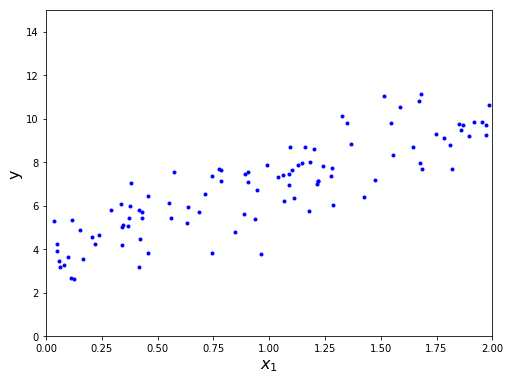
*图 4-1. 随机产生的线性数据*

现在，我们通过正规方程计算 $\hat\theta$。我们将使用 Numpy 中线性代数模块(`np.linalg`)中的 `inv()` 函数计算矩阵的逆，使用 `dot()` 函数计算矩阵的乘积：
```python
from numpy import linalg
X_b = np.c_[np.ones_like(X), X]
theta_best = linalg.inv(X_b.T.dot(X_b)).dot(X_b.T).dot(y)
```

我们实际产生数据的函数为：$y=4+3x_0+Gaussian noise$。让我们看看等式的结果：
```python
>>> theta_best
array([[ 3.88387393],
       [ 3.10070553]])
```
我们希望 $\theta_0=4$、$\theta_1=3$，而不是 $\theta_0=3.884$、$\theta_1=3.101$。两者非常接近，但是由于存在噪声，使得我们不能得到原始的函数参数。

现在，你可以使用 $\hat\theta$ 做预测：
```python
>>> X_new = np.array([[0], [2]])
>>> X_new_b = np.c_[np.ones_like(X_new), X_new]
>>> y_predict = X_new_b.dot(theta_best)
>>> y_predict
array([[  3.88387393],
       [ 10.08528499]])
```
让我们将模型预测值绘制出来（如图4-2所示）：
```python
plt.figure(figsize=(8,6))
plt.plot(X_new, y_predict, "r-")
plt.plot(X, y, "b.")
plt.axis([0, 2, 0, 15])
plt.show()
```
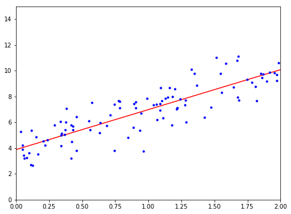
*图4-2. 线性回归模型预测*

使用 Scikit-Learn 与上面等价的代码为：
```python
>>> from sklearn.linear_model import LinearRegression
>>> lin_reg = LinearRegression()
>>> lin_reg.fit(X, y)
>>> lin_reg.intercept_, lin_reg.coef_
(array([ 3.88387393]), array([[ 3.10070553]]))
>>> lin_reg.predict(X_new)
array([[  3.88387393],
       [ 10.08528499]])
```

### 计算复杂度

使用正规方程时，计算 $\bold X^T\cdot\bold X$ 的逆时，矩阵乘法得到的是 n×n 的矩阵（n 表示特征个数），计算这种矩阵的逆时，其计算复杂度通常为 $O(n^{2.4})$ 到 $O(n^3)$ 之间（具体多少取决于算法实现的方式）。换而言之，如果特征的个数翻倍，你的计算时间大约为原来的 $2^{2.4}=5.3$倍到$2^3=8$倍。

正规方程的方法在特征数量非常大，如100000时，计算过程将变得很长。

其优点是，该方程表明算法的空间复杂度为$O(m)$，所以即使训练集的数据量大，也能够在内存中存下。

另外，一旦你完成了对线性回归模型(或者是使用正规方程求解的其他算法)的训练，预测的计算过程非常快：计算复杂度与你要预测的实例数量及特征个数呈线性相关。换而言之，预测的实例数翻倍(或者特征个数翻倍)，计算时间也翻倍。

现在，我们将来见识一下另一种非常不同的训练线性回归模型的方法，这种方法更适合于有大量特征或有大量实例的情况。

### 梯度下降

梯度下降是非常常用的用于问题最优化求解的方法。主要思想是为了实现损失函数的最小化，多次迭代求解参数。

假定你在一座有大雾的山上迷路了，你只能感受到你脚底下的斜坡方向。一种快速到达山谷底部的策略是沿着斜坡的方向下山。这也正是梯度下降的工作原理：它测试出使用当前的参数向量$\theta$时对应的损失函数的梯度，之后沿着梯度下降的方向修改$\theta$。当梯度值为0时，表明你已经达到了最小处。

更具体地说，首先，你用随机值对$\theta$进行设置（该过程称为随机初始化），之后你慢慢对其进行修正，每次都进行一小步，每一小步都得到更小的损失函数值（例如：MSE），直到算法收敛于最小处（见图 4-3）：
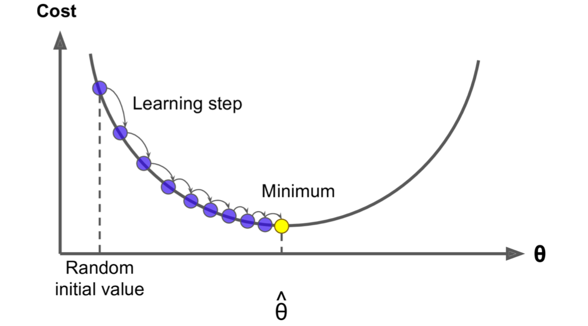
*图 4-3. 梯度下降*

梯度下降的一个参数是下降的每一步的步长，通过超参数 *learning rate* 学习率进行设置。如果学习率过小，算法需要经过许多步的迭代才能够收敛，这需要花费大量时间（见图 4-4）。
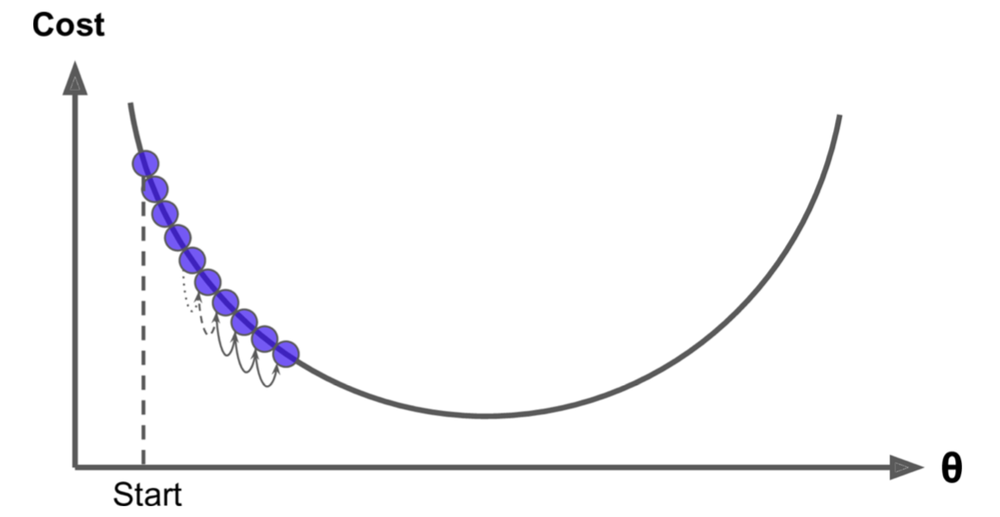
*图 4-4. 学习率过小*

另一方面，如果学习率太大，你可能会跳过谷底直接到另一边，可能会比之前所在的位置还要更高。这将会导致算法发散，损失函数值将越来越大，导致不能得到正确的参数（见图 4-5）。
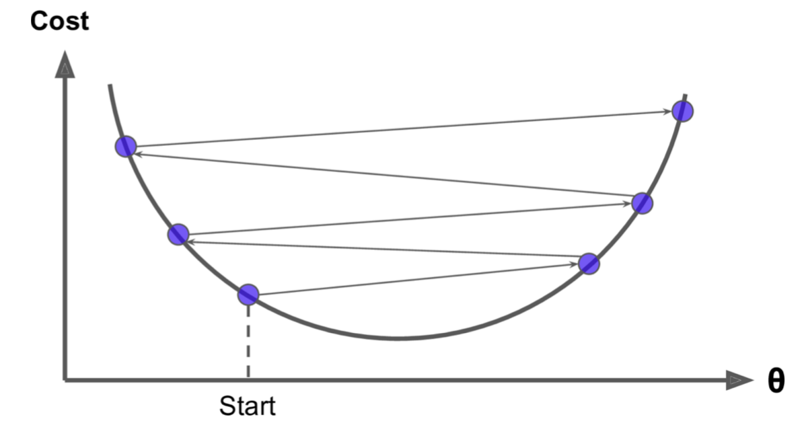
*图 4-5. 学习率过大*

最后，并不是所有的损失函数都是碗状的，其中可能有洞穴、山脊、平缓地段以及各种不规则的地形，这使得收敛于最小值这一目标非常困难。图4-6 展示了梯度下降所面临的两种主要挑战：如果随机初始化为从左侧开始，那么它将收敛于局部最小值，要比全局最小值大；如果随机初始化从右侧开始，它将花费很长时间通过平缓地带，而如果你过早停止，你也将不会到达全局最小值处。
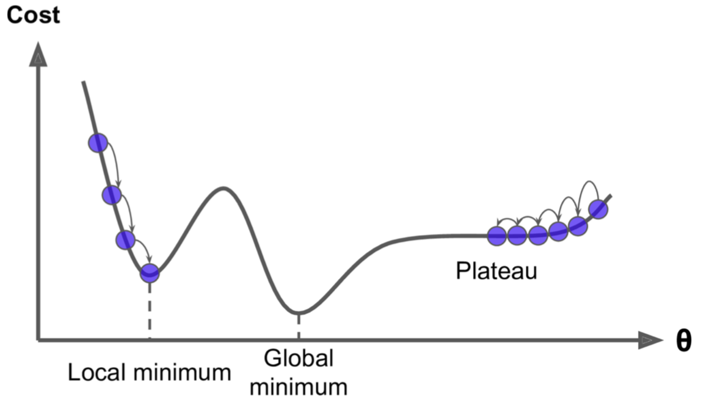
*图 4-6. 梯度下降的陷阱*

幸运的是，MSE 损失函数对于线性回归模型而言是一个凸函数，表示在曲线上任取两点进行连接，该线段不会与曲线相交于其他位置。表明这种情况下不存在局部最小值，只要全局最小值。它也是一个斜率不会突变的连续函数（专业术语称为它的导数为利普希茨连续）。由这两个性质可以得到一个结论：梯度下降必然会无限接近与全局最小值（如果你的学习率设置的不是太大，并且你愿意等足够长的时间）。

实际上，损失函数的形状为碗状时，若各属性值得取值范围不同，得到的是经过拉伸的碗状。图 4-7 左边的图显示了在特征1和特征2有相同的范围时梯度下降在训练集上的形状，右边的图表示特征1的值远小于特征2的值时梯度下降的形状（因为特征1更小，所以需要$\theta_1$的变化更大，这也就是为什么图中看起来碗状在$\theta_1$方向上拉伸的原因）：
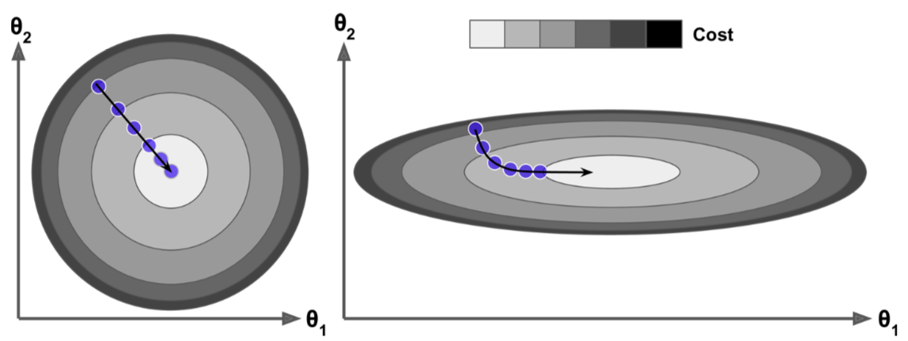
*图 4-7. 梯度下降在不同特征比例下的图形*

正如你所见，在左边的图形中，梯度下降算法直接朝着最小值处移动，因此能够快速求解出最小值，但在右边的图中，它首先沿着几乎与到最小值点方向相垂直的方向移动，并且其最小值点位于几乎是平面的谷地，这说明我们最终可以到达最小值点，但需要花费很长的时间。

在使用梯度下降时，你应当确保所有的特征都具有相似的范围（例如：使用 Scikit-Learn 的 `StandardScaler` 类），否则它将需要更长的时间进行收敛。

上图也解释了训练一个模型是指寻找一组模型参数的组合，使得损失函数值最小化（在训练集上）。它在模型的 *参数空间* 中进行寻找：模型的参数越多，参数空间的维度也就越大，寻找的难度也就越大：在300维的干草堆中找一枚针要比在3维的干草堆中找要困难得多。幸运的是，因为线性回归模型的损失函数是收敛的，所以针就在碗状的底部。

#### 批量梯度下降

为了实现梯度下降，你首先要计算损失函数关于每个模型参数$\theta_j$的梯度。换而言之，你需要计算在$\theta_j$发生一点微小的变化时，损失函数会如何变化，这称为偏导数。相当于问“如果我面朝东边，我脚下的山的斜坡方向是朝哪里？”，之后面朝北边，问相同的问题（如此下去，对所有的其他维度重复该过程，如果你能想象宇宙中多于3个维度）。等式 4-5 计算损失函数相对于参数$\theta_j$的偏导数，记为$\frac{\partial}{\partial\theta_j}MSE(\theta)$：
&nbsp;&nbsp;&nbsp;&nbsp;*等式 4-5. 损失函数的偏导数*
$$\frac{\partial}{\partial\theta_j}MSE(\theta)=\frac2m\sum^m_{i=1}(\theta^T\cdot\bold x^{(i)}-y^{(i)})x^{(i)}_j$$
不同于逐个求解每个维度上的偏导数，你可以通过 等式4-6 一次性求出所有的维度上的偏导数。梯度向量记为 $\nabla_\theta MSE(\theta)$，包含了所有损失函数的偏导数（每个参数一个）。
&nbsp;&nbsp;&nbsp;&nbsp;*等式 4-6. 损失函数的梯度向量*
$$\nabla_\theta MSN(\theta)=\left\lgroup\begin{matrix}\frac{\partial}{\partial\theta_0}MSE(\theta) \\ \\ \frac{\partial}{\partial\theta_1}MSE(\theta) \\ \\ \vdots \\ \\  \frac{\partial}{\partial\theta_n}MSE(\theta)\end{matrix}\right\rgroup = \frac{2}{m}\bold X^T\cdot(\bold X \cdot \theta-\bold y)$$

在每一步的梯度下降过程中，我们的计算过程都涉及到整个训练集$\bold X$！这就是为什么该算法被称为批量梯度下降的原因了：每一步中都需要批量地用到训练集中的所有数据。结果就是当训练集中的数据量非常大时，计算过程会非常慢（在之后我们会介绍更加快速的梯度下降算法）。但是，梯度下降的方法对特征数量不像正规方程那么敏感；当训练一个有成千上万特征的模型时，梯度下降的方法将会比正规方程的方法快得多。

一旦你得到一个梯度向量，该向量指向上升的方向，只需要沿该方向的反方向就能下降。也就是说用$\theta$减去$\nabla_\theta MSE(\theta)$，此时就需要用到学习率 $\eta$：将梯度向量乘以$\eta$来确定究竟需要沿下降的方向走多少距离（等式 4-7）。
&nbsp;&nbsp;&nbsp;&nbsp;*等式 4-7. 梯度下降的一步*
&nbsp;&nbsp;&nbsp;&nbsp;$$\theta^{(next\ step)}=\theta-\eta\nabla_\theta MSE(\theta)$$

让我们来看看该算法的一个快速实现：
```python
eta = 0.1  # learning rate
n_iterations = 1000
m = 100

theta = np.random.randn(2, 1)  # random initialization

for iteration in range(n_iterations):
    gradients = 2/m * X_b.T.dot(X_b.dot(theta)-y)
    theta = theta - gradients * eta
```
这个过程并不困难，让我们看看 `theta` 的最终结果：
```python
>>> theta
array([[ 3.88387393],
       [ 3.10070553]])
```
该结果和我们通过正规方程找到的解相同。如果你使用不同的学习率的话会怎么样呢？图4-8 显示了在使用3种不同的学习率时，前10步梯度下降算法对应的变化情况（其中的虚线表示初始时刻位置）：
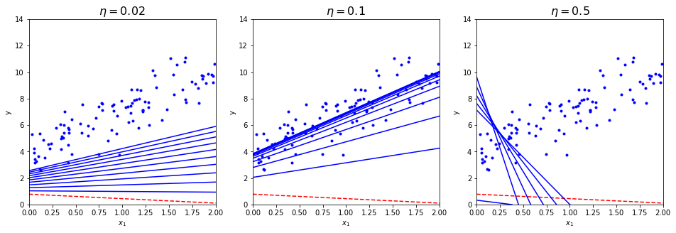
*图 4-8. 多种学习率下的梯度下降变化图*

在左边的图中可以看出学习率太小了：算法最终将会得到解，但是需要花费大量的时间。在中间的图中，学习率选得很好：只需要较少的迭代次数，它已经收敛于问题的解了。在右边的图中，学习率过大：算法发生了发散，直接跳过了正确的解，并且离正确的解越来越远。

为了找到一个好的学习率，你可以通过网格搜索的方式（见第二章）。另外，你需要限制迭代次数，这样网格搜索可以淘汰掉那些需要很长时间才能收敛的模型。

你也许会问：那迭代次数设置为多少比较合适呢？如果太小，在算法停止时，你所得到的解仍然离最优解很远，但是如果设置得太大，在模型参数已经收敛后的迭代就是在浪费时间了。一种简单的解决方案是：设置一个很大的迭代次数，但是，在梯度向量非常小的时候就自动停止——标准就是当梯度对应的范数小于一个很小的数$\varepsilon$（称为容忍度）——因为这种情况下，梯度下降（基本上）已经到达最小值处了。

---
**收敛速率**
当一个损失函数是凸函数，并且其斜率不存在突变（例如将 MSE 视为损失函数），可以证明当学习率固定时，批量梯度下降的收敛速率为 $O(\frac1{iterations})$。换而言之，如果你将容忍度变为原来的$\frac1{10}$（得到的解精度更高），那么算法的迭代次数将会增加10倍。

---

#### 随机梯度下降

批量梯度下降存在的最大问题是在每一步中使用所有的训练集数据来计算梯度，在训练集中数据非常大时，整个过程会变得非常慢。相反地，随机梯度下降仅仅是在每一步中随机地取出一个实例，计算该实例下的梯度值。很明显，这使得算法速度加快，因为每个迭代过程中只有很少量的数据需要处理。这也使得训练一个非常大数据量的训练集成为可能，因为每个迭代过程只需要一个实例保持在内存中（SGD可以被实现为一种核外算法，核外算法在第一章介绍过）。

另一方面，由于其随机性，该算法的执行过程没有批量梯度下降那么有规律：批量梯度下降总是朝着降低的方向移动，而随机梯度下降可能会上下跳动，只是整体上看是沿着下降的方向进行的。它最终将会非常接近最小值，但是即使到了最小值处仍然会不断震荡，永远不会稳定下来（见图 4-9）。所以在算法停止时，最终的参数值很好，但很可能并不是最好的。
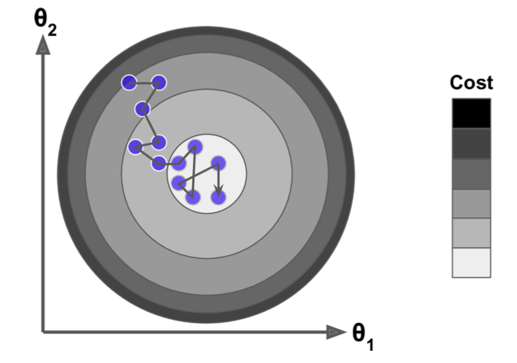
*图 4-9. 随机梯度下降*

如果损失函数非常不规则（如[图4-6](#figure4_6)所示），随机梯度下降实际上有助于跳出局部最小值，所以随机梯度下降相比于批量梯度下降有更大的几率找到全局最小值。

因此，随机化有助于脱离局部最优，但也使得结果不会再最小值处稳定。解决这种困境的一种方法是逐渐降低学习率。初始时刻设置较大的学习率（这有助于加快处理过程，逃离局部最小值），之后学习率逐渐降低，使得算法在全局最小值下稳定下来，这个过程也被称为 *模拟退火*，因为整个过程类似于冶金过程中的退火的过程——融化的金属逐渐降温。假定每次迭代过程所使用的学习率的函数称为*学习进度表 Learning Schedule*。如果学习率减少得太快，你可能陷入局部最优解中，甚至是在下降的过程中就因为学习率太低而“冻住”。如果学习率减少得太慢，你的算法可能长时间在最小值附近跳来跳去，如果你结束地太早，可能得到的只是次优解。

下面的代码通过一个简单的学习进度表实现随机梯度下降：
```python
n_epochs = 50
t0, t1 = 5, 50 # learning schedule hyperparameters

def learning_schedule(t):
    return t0/(t+t1)

theta = np.random.randn(2,1)

for epoch in range(n_epochs):
    for i in range(m):
        random_index = np.random.randint(m)
        xi = X_b[random_index:random_index+1]
        yi = y[random_index:random_index+1]
        gradients = 2 * xi.T.dot(xi.dot(theta)-yi)
        eta = learning_schedule(epoch*m+i)
        theta = theta - eta * gradients
```
通常迭代的次数为轮数乘以m：每一轮称为 期（epoch）。上面的批量随机下降的代码使用所有的训练数据迭代了1000次，这里的代码我们只使用训练集迭代了50次就得到了很好的解：
```python
>>> theta
array([[ 3.93388501],
       [ 3.08717388]])
```
图 4-10 显示了训练过程的前10步（注意每一步是如何不规律的）：
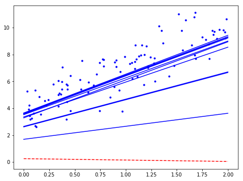
*图 4-10. 随机梯度下降的前10步*

由于实例是随机选取的，因此在每一期中有的实例被多次选择，而有的实例一次都没被选中。因此，如果你希望每期中所有的实例都被算法使用，可以对训练集打乱顺序，然后一个一个地使用训练集中的数据；之后的期又打乱顺序，如此进行下去。但是，通常这种方式使收敛速度更慢。

使用Scikit-Learn中提供的代码对线性回归使用随机梯度下降，你可以使用`SGDRegresssor` 类，该类默认使用MSE作为损失函数。下面的代码运行了50个期，初始的学习速率为0.1（eta0=0.1），使用默认的学习进度表（不同于上述的进度表），并且也没有使用如何的正规化措施（penalty=None；稍后会对这些进行更详细的介绍）：
```python
from sklearn.linear_model import SGDRegressor
sgd_reg = SGDRegressor(n_iter=50, penalty=None, eta0=0.1)
sgd_reg.fit(X, y.ravel())
```
你可以再次看到一个与正规方程求解出的结果非常相似的解：
```python
>>> sgd_reg.intercept_, sgd_reg.coef_
(array([ 3.9108839]), array([ 3.13815878]))
```

#### 小批量梯度下降

最后要看到的梯度下降算法称为小批量梯度下降。在理解了批量梯度下降和随机梯度下降之后，理解小批量梯度下降就非常简单了：在每一步中并不使用训练集中的所有数据计算梯度（批量梯度下降的方式），也不只是用一个实例计算梯度（随机梯度下降的方式），它使用随机选出的一小块实例计算梯度，这一小块的实例称为小批(mini-batch)。相比于随机梯度下降，小批量梯度下降的优势在于你可以通过硬件对矩阵的优化操作提升算法的效率，特别是在你使用GPU的时候。

该算法在参数空间中寻找最优解得过程不会像随机梯度下降算法那样不规则，特别是在小批较大的时候，因此，小批量梯度下降最终得到的结果也会比随机梯度下降更接近最小值。但另一方面，它可能更容易陷入局部最小值中。图 4-11 显示了3种梯度下降算法在相同训练集下在参数空间中的变换路径。它们都在最小值的附近结束，但随机梯度下降和小批量梯度下降在后期仍然在不断变化。不过别忘了批量梯度下降每一步都需要大量的时间进行计算，而如果你使用一个好的学习进度表，随机梯度下降和最小批梯度下降最后也能到达最小值处。
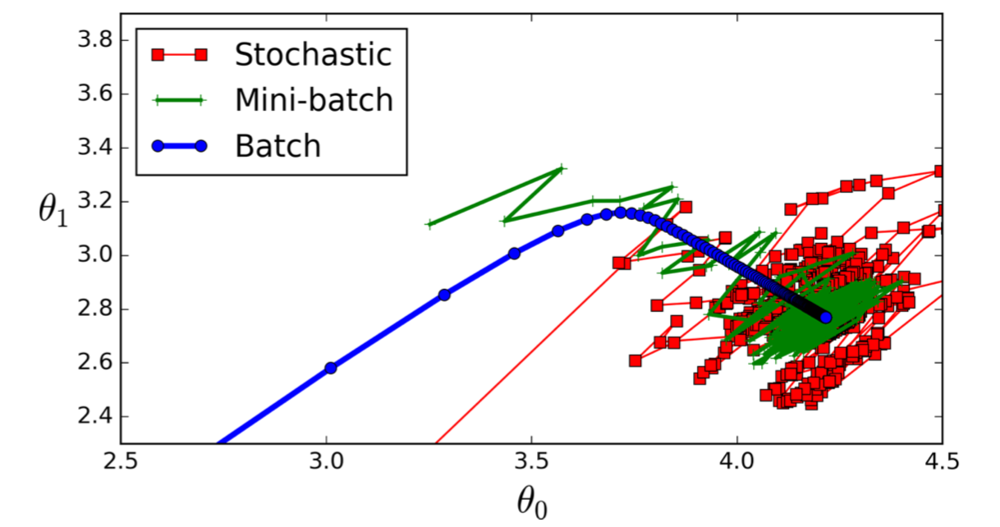
*图 4-11. 在参数空间中的梯度下降路径*

让我们比较一下到目前为止我们所讨论过的关于线性回归的算法（复习一下，其中$m$是训练实例的个数，$n$是特征的数量），见表4-1：
*表 4-1. 多种线性回归算法的比较*
|算法名|大$m$|支持核外代码|大$n$|超参数|需要缩放|Scikit-Learn|
|---|---|---|---|---|---|---|
|正规方程|快|否|慢|0|不需要|LinearRegression|
|批量GD|慢|否|快|2|需要|n/a|
|随机GD|快|是|快|≥ 2|需要|SGDRegressor|
|小批量GD|快|是|快|≥ 2|需要|n/a|

在完成训练以后，这些算法就几乎没有区别了：所有的上述算法都得到相似的模型，预测方式也完全相同。

### 多项式回归

如果你的数据实际上并不是满足简单的一条直线，而是更加复杂的公式怎么办？可能会让人感到惊讶，你可以用线性模型去拟合非线性的数据。一种简单的方式是为每一个特征添加添加一个指数运算后的值，形成新的特征，然后用这个结果扩展的特征集训练线性模型。这种技术称为 *多项式回归*。

让我们来看一个例子。实现，我们用一元二次式创建一些非线性的数据（另外添加一些噪声；见 图4-12）：
```python
m = 100
X = 6 * np.random.rand(m, 1)-3
y = 0.5 * X**2 + X + 2 + np.random.randn(m, 1)
```
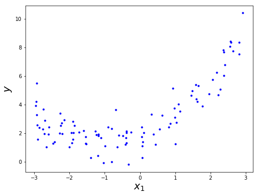
*图 4-12.创建含噪声的非线性数据集*

很明显，单单是一条直线是很难拟合这些数据的。因此，让我们使用 Scikit-Learn 的`PolynomialFeatures`类将我们的训练数据进行变换，将训练集中的每个特征加上一个平方值(二次多项式)，设为新的特征（在该例子中只有一个特征）：
```python
>>> from sklearn.preprocessing import PolynomialFeatures
>>> poly_features = PolynomialFeatures(degree=2, include_bias=False)
>>> X_poly = poly_features.fit_transform(X)
>>> X[0]
array([-1.26222784])
>>> X_poly[0]
array([-1.26222784,  1.59321912])
```
现在 `X_poly` 中既包含了原始的特征 X，已包含了原始特征平方后的值。你就可以用 `LinearRegression` 模型来拟合这一经过扩展的训练数据（图 4-13）：
```python
>>> lin_reg = LinearRegression()
>>> lin_reg.fit(X_poly, y)
>>> lin_reg.intercept_, lin_reg.coef_
(array([ 1.81236316]), array([[ 0.9606963 ,  0.49097645]]))
```
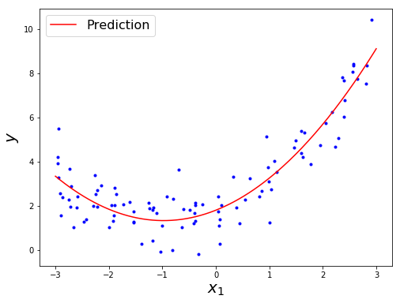
*图 4-13.多项式回归模型预测*

看起来拟合的效果还不错，模型预测为 $\hat y=0.49x^2_1 + 0.96x_1+1.81$，而实际的原始函数为$y=0.5x^2_1+1.0x_1+2.0+Gaussian\ noise$。

注意，当一个实例中含多个特征时，多项式回归能够找到特征之间的关系（这点在有的时候简单的线性回归模型不能完成）。这使得 `PolynomialFeatures` 能够添加给定次数的特征之间的所有组合。例如，现在有两个特征 $a$ 和 $b$，`PolynomialFeatures`的参数为`degree=3`，新添加的特征包括 $a^2$，$a^3$，$b^2$，$b^3$，也包括 $ab$，$a^2b$，$ab^2$。

`PolynomialFeatures(degree=d)`将一个含 $n$ 个特征的数组转换为含$\frac{(n+d)!}{d!n!}$个特征的数组，其中 $n!$ 表示 $n$ 的阶乘，等于 $1\times 2\times 3\times \cdots \times n$。注意，特征数量的组合爆炸问题。

### 学习曲线

如果你使用高次的多项式回归，那么在训练集上得到的曲线拟合程度将比简单的线性回归要好得多。例如，图 4-14 采用了300次的多项式模型拟合训练数据，并与纯线性模型及二次模型进行对比。可以看出300次的多项式的曲线为了更接近训练集中的每一个数据，波动非常大。
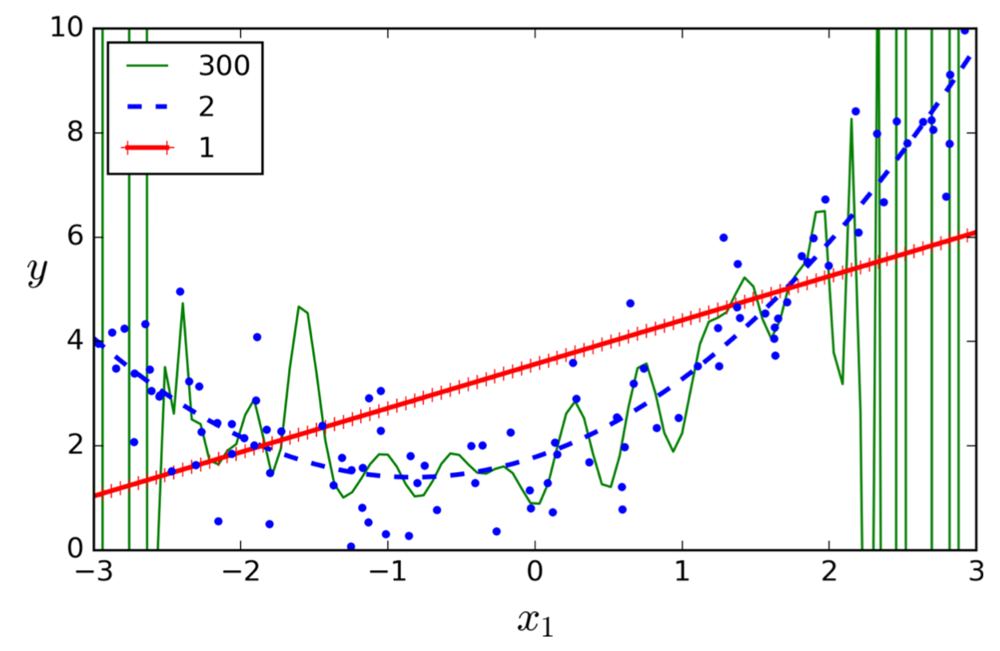
*图 4-14. 高次多项式回归*

当然，这一高次多项式回归模型产生了非常严重的过拟合，而线性模型又存在欠拟合。在该例子中，二次多项式模型的表现最好。因为我们就是用二次多项式产生的原始数据，所以二次多项式模型表现好是必然的。但实际情况是，你不知道产生数据的函数实际的复杂程度，那么如何决定你的模型的次数呢？如何认定你的模型是过拟合还是欠拟合呢？

在第二章中，你使用交叉验证的方法来评估模型的泛化性能。如果一个模型在训练数据上表现得好，但是在交叉验证测试时预测效果差，你可以认定该模型发生了过拟合；如果两者都表现得不好，可以认定为欠拟合。这是一种判定模型过于简单或过于复杂的方法。

另一种方式是看学习曲线：以训练集的大小为自变量，在训练集和测试集上的性能为因变量绘制曲线。为了构造这些曲线，只需要简单地在训练集不同大小的子集上多次训练。下面的代码定义了给定训练数据时，如何进行学习曲线的绘制：
```python
from sklearn.metrics import mean_squared_error
from sklearn.model_selection import train_test_split
def plot_learning_curves(model, X, y):
    X_train, X_val, y_train, y_val = train_test_split(X, y, test_size=0.2)
    train_errors, val_errors = [], []
    for m in range(1, len(X_train)):
        model.fit(X_train[:m], y_train[:m])
        y_train_predict = model.predict(X_train[:m])
        y_val_predict = model.predict(X_val)
        train_errors.append(mean_squared_error(y_train_predict, y_train[:m]))
        val_errors.append(mean_squared_error(y_val_predict, y_val))
    plt.plot(np.sqrt(train_errors), "r-+", linewidth=2, label="train")
    plt.plot(np.sqrt(val_errors), "b-", linewidth=3, label="val")
    plt.legend(loc="upper right", fontsize=16)
```
让我们看看线性回归模型的学习曲线，如图4-15所示：
```python
lin_reg_2 = LinearRegression()
plot_learning_curves(lin_reg_2, X, y)
```
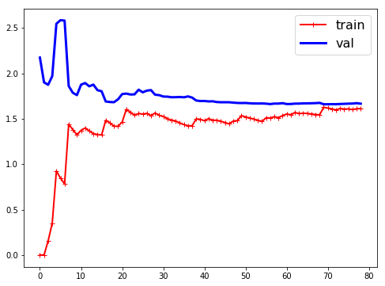
*图 4-15. 学习曲线*

这里需要作一些说明。首先，我们看看训练集数据上的模型性能：当训练集中只有1个或两个实例时，模型能够完美的对它们进行拟合，因此对应的曲线以0开始。当新实例添加到训练集中后，线性模型不再能够完美地拟合所有实例，即可能因为噪声的存在，也可能因为实际的数据就不是线性的。所以，训练集上的错误开始上升，直到到达平缓的曲线处，在该点之后向训练集添加新实例，平均的错误数不再非常明显地增加或下降。现在我们再来看看模型在确认集上的性能曲线。当模型用非常少的训练实例进行训练时，它不可能也有好的泛化性能，这也是初始时在确认集上的错误非常大的原因。随着越来越多的数据加入到训练集中，训练地越来越好，在确认集上的错误也慢慢降低。但仅仅是线性回归的一条直线对该例子来说不不足以拟合该例子中的实例，因此，最终在训练集和确认集上的错误非常接近，并且都稳定在一个值附近。

这样的学习曲线就表示典型的欠拟合模型：两条曲线都到达一段平稳的曲线处，并且对应的错误值非常大。

如果你的模型欠拟合于训练数据，添加更多的训练样本也没用。需要使用更复杂的模型或者是创建更好的特征。

现在，让我们看看相同数据下10次多项式模型的学习曲线（图 4-16）：
```python
from sklearn.pipeline import Pipeline
polynomial_regression = Pipeline([
    ('poly_features', PolynomialFeatures(degree=10, include_bias=False)),
    ('sgd_reg', LinearRegression())
])
plt.figure(figsize=(8,6))
plt.axis([0, 80, 0, 3])
plot_learning_curves(polynomial_regression, X, y)
```

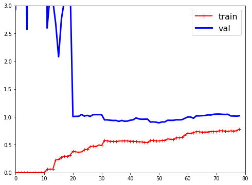
*图 4-16. 多项式模型的学习曲线*

该曲线和之前的曲线非常相似，但存在着两个非常重要的不同点：
- 在训练集上的错误比使用线性回归模型时要小；
- 在两条曲线之间存在空隙。这表明模型在训练数据上的表现明显比在确认数据上的表现要好，这是一个过拟合的典型标志。然而，如果你使用更多的训练集数据，两条曲线还是会继续靠近的。

一种改善过拟合模型的方法是为模型提供更多的训练数据，直到确认集上的错误与训练集上的错误相接近。

---
**偏差/方差权衡**
在机器学习和统计学中的一个重要假设是模型的泛化误差可以总地反映3种非常不同的错误：

- 偏差(bias)：这部分的泛化误差产生的很大原因是错误的假设。例如实际上是二次多项式产生数据，你假定模型是一次多项式。一个高偏差的模型通常欠拟合于训练数据（注意，不要将这里的偏差与线性模型中的偏差项相混淆）。
- 方差(variance)：这部分错误通常是因为模型对训练数据中的小变动太过敏感造成的。一个模型的自由度太大（例如高次多项式模型）通常会产生较大的方差，因此通常会过拟合于训练数据。
- 不可约错误(Irreducible error)：这部分是因为数据自带的噪声引起的。消除这部分错误的唯一方式是对数据进行清洗（例如：修正数据源，如一个坏的传感器，或者是发现并剔除离群异常点）

通常来说，增加模型的复杂度会增大方差，减少偏差。相反地，减少模型复杂度会增大偏差，减少方差。这就是为何称为 偏差/方差权衡 的原因了。

---

### 线性模型的正规化

正如我们在第一章和第二章中所看到的，减少过拟合的一种方式是模型的正规化：模型的自由度越少，越不容易发生过拟合现象。例如，一种简单的正规化多项式模型的方式是减小多项式的次数。

对于线性模型而言，正规化主要通过限制模型的权重值实现。我们来看看岭回归(Ridge Regression)和弹性网络(Elastic Net)，它们实现了3种不同的方式来限制权重。

#### 岭回归
岭回归也称为吉洪诺夫正则化(Tikhonov regularization)，是线性回归的一种正规化方法：正规项等于 $\alpha \sum^n_{i=1}\theta^2_i$ 被加到损失函数中。这就强制使得学习算法不仅仅要对数据进行拟合，更需要尽可能地保持模型权重尽量小。需要注意，正规项只能在训练期间添加到损失函数中。一旦模型完成训练，你如果需要评估模型的性能，那就使用非正规化的性能评价函数。

训练时候用的性能测量不同于测试时用的性能测量的情况非常常见。除了正规化外，造成这种不同的另一个原因是一个好的训练损失函数应当可导，而测试过程的损失函数没有这一要求。一个例子就是在分类器训练时使用的损失函数类似于对数损失（在之后会讨论），但是评估时使用的是查准率/查全率。

超参数 $\alpha$ 控制你希望正规化到何种程度。如果 $\alpha=0$，岭回归就退化为普通的线性回归。如果 $\alpha$ 非常大，那么所有的权重最终结果都将非常接近于0，对应的模型是经过数据平均值的一条平的线。等式 4-8 表示岭回归损失函数：
&nbsp;&nbsp;&nbsp;&nbsp;*等式 4-8. 岭回归损失函数*
$$J(\theta)=MSE(\theta)+\alpha\frac12\sum^n_{i=1}\theta_i^2$$

注意，偏置项 $\theta_0$ 并不进行正规化（从 $i=1$ 开始求和，而不是 $0$）。如果我们定义 $\bold w$ 是特征权重( $\theta_1$ 到 $\theta_n$ 的一个向量)，那么正规化项可以简化为$\frac{1}{2}(\Vert\bold w\Vert_{2})^2$ 的其中 $\Vert\cdot\Vert_2$ 表示权重向量的 $l_2$ 范式。对于梯度下降，只需要将 $\alpha\bold w$ 加到梯度向量的 MSE 值上即可。


图 4-17 显示的是使用不同 $\alpha$ 值训练的多个岭模型。在左侧的图中，仅仅使用岭模型，得到的是一个线性的预测。在右侧，数据首先通过 `PolynomialFeatures(degree=10)` 进行扩展，之后使用 `StandardScaler` 进行标准化，之后用岭模型进行训练：这称为含岭正规化的多项式回归。注意在增大 $\alpha$ 的时候，预测如何变得更加平缓（波动变小）；这减少了方差，但又增大了偏差。

和线性回归一样，我们可以通过计算闭式等式或者梯度下降的方式求解出最佳的解。它们的利弊和之前讨论的是相同的。等式 4-9 列出了使用闭式解得解决方案（其中 $\bold A$ 是将一个 $n\times n$ 的单位矩阵的左上角元素变为 0 后得到的矩阵，对应的是偏置项）。

&nbsp;&nbsp;&nbsp;&nbsp;*等式 4-9. 岭回归闭式解*
&nbsp;&nbsp;&nbsp;&nbsp;$$\hat\theta=(\bold X^T\cdot\bold X+\alpha\bold A)^{-1}\cdot\bold X^T\cdot\bold y$$

下面是使用 Scikit-Learn 中的闭式解方法实现岭回归的代码：
```python
>>> from sklearn.linear_model import Ridge
>>> ridge_reg = Ridge(alpha=1, solver="cholesky")
>>> ridge_reg.fit(X, y)
>>> ridge_reg.predict([[1.5]])
array([[ 4.60825394]])
```

使用随机梯度下降方式：
```python
>>> sgd_reg = SGDRegressor(penalty="l2", max_iter=100)
>>> sgd_reg.fit(X, y.ravel())
>>> sgd_reg.predict([[1.5]])
array([ 4.60087261])
```

其中的 `penalty` 超参数设置正规化项使用何种类型。指定为 “$l2$” 表示你需要在随机梯度下降的损失函数上添加一个 $l_2$ 范式的平方 ：这就是简单的岭回归。

#### Lasso 回归
最小绝对值收敛和选择算子回归（也可简称为 Losso 回归）是线性回归的另一种正规化方式：与岭回归类似，它在损失函数上添加一个正规项，但使用的是权重向量的 $l_1$ 范式，而不是 $l_2$ 范式平方的一半（见等式 4-10）。
&nbsp;&nbsp;&nbsp;&nbsp;*等式 4-10. Lasso 回归的损失函数*
$$J(\theta)=MSE(\theta)+\alpha\sum^n_{i=1}\vert\theta_i\vert$$

图 4-18 使用 Lasso 模型时，在 $\alpha$ 取更小的情况下与图 4-17 相对应的曲线：
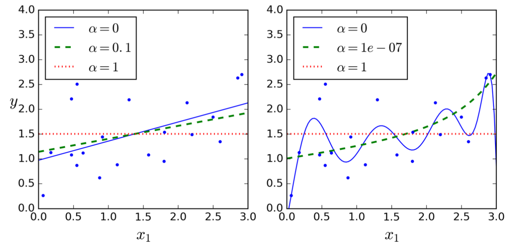
*图 4-18. Lasso 回归*

Lasso 回归的一个重要特点是其趋向于完全限制不重要的特征的权重（例如，将这些权重设置为0）。例如在右图中的红色虚线（$\alpha=10^{-7}$）看起来像一个二次函数，是准线性的：高次的特征对应的权重几乎都等于0。换而言之，Lasso 回归自动地进行特征的选择，并输出一个稀疏模型（例如，只有很少的非0特征权重）。

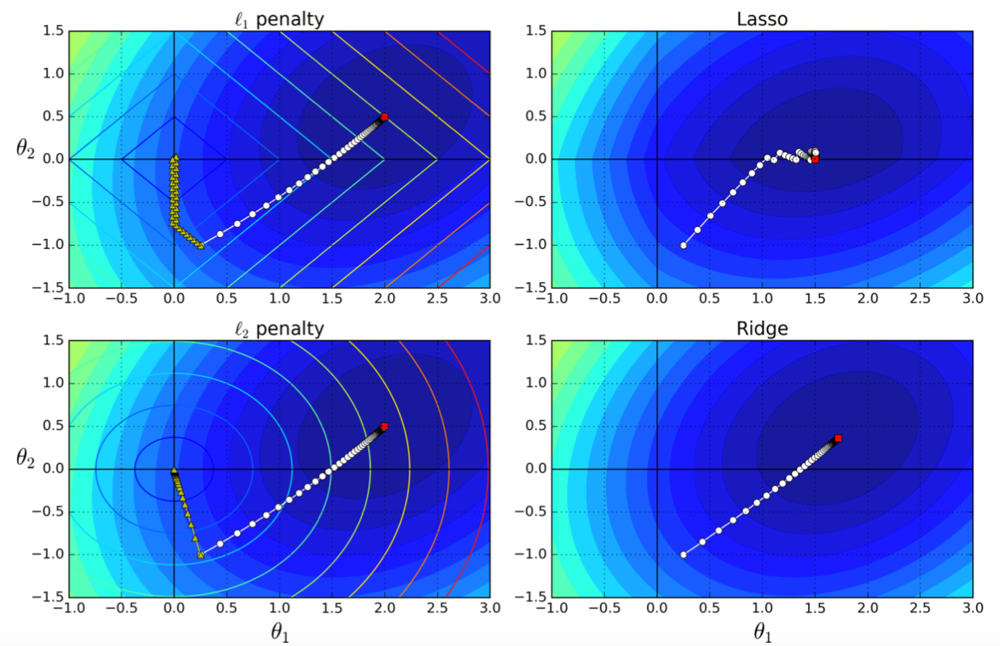
*图4-19. Lasso回归和岭回归*

你可以通过图 4-19 明白：在左上角的图中，背景图中的等高线(椭圆形状)表示一个未正规化的MSE损失函数（$\alpha=0$）,其中的白点绘制的折线就是批量梯度下降的求解过程。前景图中的等高线（菱形）表示使用了 $l_1$ 范式作为惩罚项，其中其中的三角形绘制的折线表示在这种惩罚项下，批量梯度下降的求解过程（其中$\alpha\rightarrow\infty$）。注意，该路径中，显示 $\theta_1$ 变为0，之后$\theta_2$不断减小直至为0。在右上角的图中，等高线图表示以MSE的值加上一个  $l_1\times\alpha$ 作为新的损失函数，其中$\alpha=0.5$。该批量梯度下降首先到达$\theta_2=0$处，之后到达全局最小值处。下面的两幅图显示了相同的操作，不同点在于使用了$l_2$作为惩罚项。可以看到，正规化的最小值处比非正规化最小值更加靠近于原点位置（$\theta=0$），但权重并不会完全变为0。

在Lasso损失函数中，在末端的路径不太稳定，这是因为在 $\theta_2=0$ 处斜率发生了突变。你需要逐渐减小学习率使得路径向全局最小值处收敛。

当$\theta_i=0$ (其中i=1,2,...,n)，Lasso损失函数与MSE相同。等式 4-11 显示了Lasso回归的次梯度向量的求解：
&nbsp;&nbsp;&nbsp;&nbsp;*等式 4-11. Lasso回归次梯度向量*
$$g(\theta,J)=\nabla_\theta MSE(\theta) + \alpha\left\lgroup\begin{matrix} sign(\theta_1) \\ \\ sign(\theta_2) \\ \\ \vdots \\ \\ sign(\theta_n)\end{matrix}\right\rgroup \textrm{where}\ sign(\theta_i)=\begin{cases}-1 &;\theta_i<0 \\ 0 &;\theta_i=0 \\ +1 &;\theta_i>0   \end{cases}$$

下面是用 Scikit-Learn 中的 Lasso 类的代码。你也可以用 `SGDRegressor(penalty="l1")`。
```python
>>> from sklearn.linear_model import Lasso
>>> lasso_reg = Lasso(alpha=0.1)
>>> lasso_reg.fit(X, y)
>>> lasso_reg.predict([[1.5]])
array([ 4.55514672])
```

#### 弹性网络

弹性网络处于岭回归和Lasso回归之间。正规化项是由岭回归和Lasso回归的正规化项组成的，你可以设置组成的比例 $r$。当 $r=0$ 时，弹性网络变为了岭回归，当 $r=1$ 时，弹性网络变为了 Lasso 回归，如等式（4-12所示）：
&nbsp;&nbsp;&nbsp;&nbsp;*等式 4-12.弹性网络的损失函数*
$$J(\theta)=MSE(\theta)+r\alpha\sum^n_{i=1}\vert\theta_i\vert+\frac{1-r}{2}\alpha\sum^n_{i=1}\theta_i^2$$

那么，你应该选择线性回归、岭回归、Lasso回归 还是 弹性网络呢？通常来说，我们应该加上正规化项，因此你最好不要使用纯线性回归。岭回归默认是一个好的模型，但如果你猜测只有少量的特征时真正有用的，你应当使用 Lasso 回归或者是天行网络，因为它们有能力将无用的特征降低为0。一般来讲，弹性网络要比Lasso 回归好，因为在特征数量比实力数量多时，或者有多个特征时强相关时，Lasso 会表现地不规律。

下面是使用 Scikit-Learn 中的 `ElasticNet` 的一个简单的例子（`l1_ratio` 对应组合比 $r$）:
```python
>>> from sklearn.linear_model import ElasticNet
>>> elastic_net = ElasticNet(alpha=0.1, l1_ratio=0.5)
>>> elastic_net.fit(X, y)
>>> elastic_net.predict([[1.5]])
array([ 4.5613437])
```

#### 早期终止

一种对迭代学习算法（如梯度下降）进行正规化的非同寻常的方式是当验证集上的错误达到最小值时，立刻停止训练。这称为早期终止。图 4-20 表示一个复杂的模型（在本例中就是一个高次的多项式回归模型）使用批量梯度下降的方式进行训练。随着轮数的进行，算法在训练集上的预测误差（RSME）越来越小，在确认集上的误差也是越来越小。经过一段时间之后，确认集上的误差停止减小，甚至开始上升。这表明模型开始过拟合于训练集。通过早期终止，你只需要在确认集上的误差达到最小值时就停止训练即可。这种正规化思想非常简单高效，Geoffrey Hinton 称之为 “漂亮的免费午餐(beautiful free lunch)”。
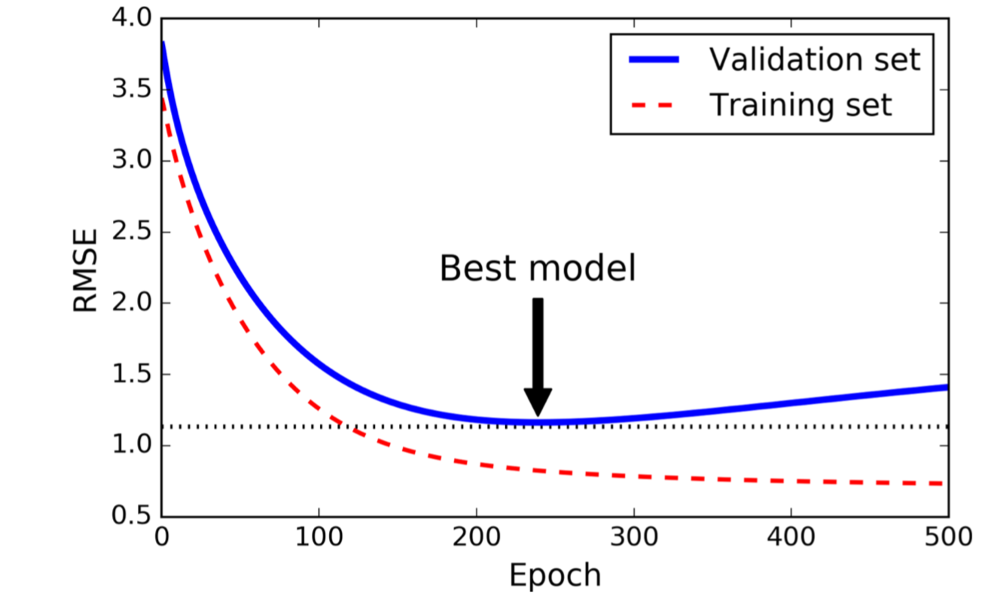
*图 4-20. 早期终止的正规化方法*

对于随机梯度下降和小批梯度下降的曲线不会如此平滑，因此你可能不知道在确认集上是否真的到达最小值处。一种解决思路是，在确认集上的误差多次高于最小值（此时，你确认模型不会变得更好了）时停止训练，或者是将参数回退到之前的在确认集上误差最小处。

下面是早期终止的一个简单实现：
```python
from sklearn.base import clone
sgd_reg = SGDRegressor(n_iter=1, warm_start=True, penalty=None,
                           learning_rate="constant", eta0=0.0005)
minimum_val_error = float("inf") best_epoch = None
best_model = None
for epoch in range(1000):
sgd_reg.fit(X_train_poly_scaled, y_train) # continues where it left off y_val_predict = sgd_reg.predict(X_val_poly_scaled)
val_error = mean_squared_error(y_val_predict, y_val)
if val_error < minimum_val_error:
            minimum_val_error = val_error
            best_epoch = epoch
            best_model = clone(sgd_reg)
```
注意，参数 `warm_start=True` 在 `fit()` 方法被调用时，在上一次的基础上进行训练而不是从原来的状态重新训练。

### 逻辑回归

我们在第一章中讨论过，一些回归算法可以用于分类任务（反之亦然）。逻辑回归通常用于评估一个实例属于特定类别的概率（例如 ，一封邮件是垃圾邮件的概率）。如果评估的概率大于50%，那么模型就预测该实例属于这一类别（称为正类，标记为“1”），或者是预测器不属于这一类（称为父类，标记为“0”）。这就创建了一个二分类器。

#### 评估可能性

那么它是如何工作的呢？类似于线性回归模型，一个逻辑回归模型计算输入特征的加权和（外加一个偏置项），但是并不像线性回归模型一样直接输出结果，而是输出结果的逻辑值（见等式 4-13）：
&nbsp;&nbsp;&nbsp;&nbsp;*等式 4-13. 逻辑回归模型计算概率（向量形式）*
$$\hat p = h_\theta(\bold x)=\sigma(\theta^T\cdot\bold x)$$

逻辑的(logistic)——也称为分对数(logit)，记为 $\sigma(\cdot)$——是sigmoid函数（类似 S 的形状），其输出是0~1之间的一个数字。其定义如等式 4-4 所示，对应的图形如 图 4-21 所示：
&nbsp;&nbsp;&nbsp;&nbsp;*等式 4-14. 逻辑函数*
$$\sigma(t)=\frac1{1+e^{-t}}$$

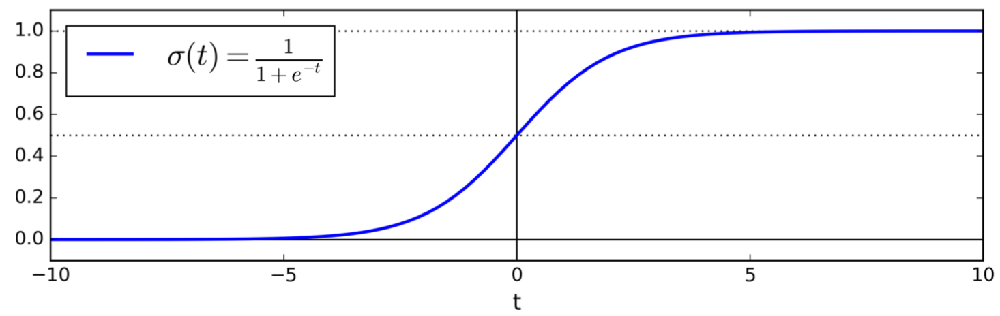
*图 4-21. 逻辑函数*

一旦逻辑回归模型已经计算出实例$\bold x$属于正类的概率 $\hat p=h_\theta(\bold x)$，就能非常简单地做出预测$\hat y$ （见等式 4-15）：
&nbsp;&nbsp;&nbsp;&nbsp;*等式 4-15. 逻辑回归模型的预测*
$$\hat y = \begin{cases} 0 &;\hat p < 0.5 \\ 1 &;\hat p \ge 0.5\end{cases}$$

注意当 $t < 0$ 时，$\sigma(t)<0.5$；当 $t\ge0$ 时，$\sigma(t)\ge0.5$。因此，如果 $\theta^T\cdot\bold x$ 为正，预测为1，为负，预测为0。

#### 训练和损失函数

好的，你现在找到了一个逻辑回归模型如何进行概率评估，并做出预测。那么它是不是就完成训练了呢？我们训练的目标是设置参数向量 $\theta$ 使得模型对正例($y=1$)能够评估出一个高概率，对负例($y=0$)能够评估出一个低概率。这一思路通过等式 4-16 的损失函数实现：
&nbsp;&nbsp;&nbsp;&nbsp;*等式 4-16. 单个训练实例的损失函数*
$$c(\theta)=\begin{cases}-log(\hat p)&;y=1 \\ -log(1-\hat p) &;y=0\end{cases}$$

这种方式的损失函数可行，因为当 $t$ 接近于 0 时，$-log(t)$ 非常大，因此预测一个正例的概率接近于0会产生很大的损失，同理，如果模型预测一个负例的概率接近于1也会产生很大的损失。另一方面，当 $t$ 接近于 1 时，$-log(t)$ 接近于 0，因此我们如果预测正例的概率接近于1或者是预测负例的概率接近于0，都会得到一个接近于0的损失，这正是我们希望得到的。

对所有训练集上的损失函数只需要简单地对训练集中的每一个实例的损失函数值求平均值即可。我们可以通过单个表达式来表示(你可以简单地验证)，称为 逻辑损失，如等式 4-17所示：
&nbsp;&nbsp;&nbsp;&nbsp;*等式 4-17. 逻辑回归损失函数(对数损失)*
$$J(\theta)=-\frac1m\sum^m_{i=1}[y^{(i)}log(\hat p^{(i)})+(1-y^{(i)})log(1-\hat p^{(i)})]$$

坏消息是我们没有能够直接求出上式最小值对应的$\theta$的公式（及不能使用正规方程的方式进行求解）。但一个好消息是，该损失函数是收敛的，因此我们使用梯度下降(或者是其他的优化算法)一定可以找到全局最小值（如果你的学习率不是过大，并且等待足够长时间）。该损失函数对模型第 $j$ 个参数 $\theta_j$ 的偏导数如等式 4-18 所示：
&nbsp;&nbsp;&nbsp;&nbsp;*等式 4-18. 逻辑回归损失函数的偏导数*
$$\frac{\partial}{\partial\theta_j}J(\theta)=\frac1m\sum^m_{i=1}(\sigma(\theta^T\cdot\bold x^{(i)})-y^{(i)})x_j^{(i)}$$

该等式与等式 4-5 非常类似：对于每个实例，它计算预测误差，然后乘以该实例的第 $j$ 个特征值，之后将所有训练实例按这种方法处理并求平均值。对于批量梯度下降，你可以用这种方法得到包含所有偏导数的梯度向量；对于随机梯度下降，你可以每次只使用一个实例进行该算法，对于小批梯度下降，你可以使用每次使用一小批量。

#### 决策边界

我们使用鸢尾花(iris)的数据集来说明逻辑回归。这是一个很有名的数据集，包含了3种不同品种，共150朵鸢尾花的花萼、花瓣的长度与宽度，这3种品种分别为：Iris-Setosa，Iris-Versicolor 和 Iris-Virginica （见图 4-22）。


我们试着建立一个分类器，基于花萼的宽度特性来判断是否属于 Iris-Virginica，我们首先需要加在数据：
```python
>>> from sklearn import datasets
>>> iris = datasets.load_iris()
>>> list(iris.keys())
['data', 'target', 'target_names', 'DESCR', 'feature_names']
>>> X = iris['data'][:, 3:] # 花萼宽度
>>> y = (iris['target']==2).astype(np.int) # 1 表示 Iris-Virginico
```
让我们来训练一个逻辑回归模型：
```python
from sklearn.linear_model import LogisticRegression

log_reg = LogisticRegression()
log_reg.fit(X, y)
```
我们来看看对于花萼长度从0到3cm的花，模型预测的概率是多少：
```python
X_new = np.linspace(0, 3, 1000).reshape(-1, 1)
y_proba = log_reg.predict_proba(X_new)
plt.figure(figsize=(8,6))
plt.plot(X_new, y_proba[:, 1], "g-", label="Iris-Virginica")
plt.plot(X_new, y_proba[:, 0], "b--", label="Not Iris-Virginica")
plt.legend(loc="center left")
plt.show()
```
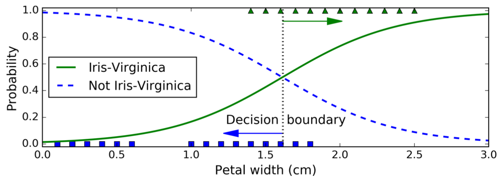
*图 4-23. 预测概率和决策边界*

Iris-Virginica（用三角形表示）的花萼宽度从1.4cm ~ 2.5cm，其他鸢尾花（用方块表示）的花萼宽度从 0.1cm ~ 1.8cm。可以看到两者存在重叠的部分。花萼宽度大于 2cm，分类器非常确信该花属于 Iris-Virginica（输出的概率较大），而小于 1cm，分类器确信该花不属于 Iris-Virginica（输出的概率较小）。在两者之间的花萼宽度，分类器并不是很确定其类别，当你对其进行类别预测时（使用`predict()` 方法，而不是使用`predict_proba()` 方法），分类器将会返回一个它认为只可能的类别。因此，在宽度为 1.6cm 处存在一个决策边界，在此处，概率为0.5：如果花萼宽度大于1.6cm，分类器预测该花为 Iris-Virginica，否则预测该花不是 Iris-Virginica（即使不是那么确信）：
```python
>>> log_reg.predict([[1.7],[1.5]])
array([1, 0])
```

图 4-24 显示了使用相同的数据集，而使用两个特征进行判断：花萼的宽度和长度。经过训练以后，逻辑回归分类器可以通过两个特征判断新的花属于 Iris-Virginica 的概率。其中虚线表示概率为50%的点：这是模型的决策边界。注意，该边界是一条线而非一个点。每一条平行的线表示相同概率的点的集合（从 左下的15%，到右上的90%）。在 90%的概率线以上的实例，其属于 Iris-Virginica 的概率大于 90%。
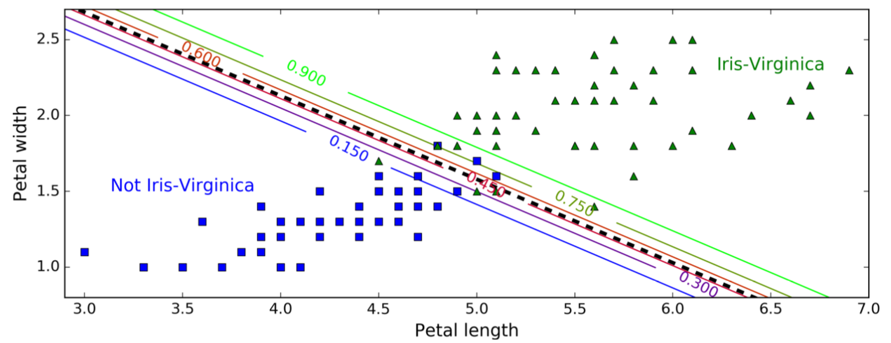
*图 4-24. 线性决策边界*

类似于其他的线性回归模型，逻辑回归模型能够通过 $l_1$ 或 $l_2$ 惩罚项进行正规化。Scikit-Learn实际上默认使用 $l_2$ 作为惩罚项。

Scikit-Learn 的 `LogisticRegression` 模型并不是使用 `alpha` 参数来控制正规化程度的，而是使用其倒数：C。C 越大，正规化程度越小。

#### Softmax 回归

逻辑回归模型可以直接泛化为支持多类型的分类器，而不需要训练、组合多个二分类器（如我们在第三章中讨论的那样）。这称为 Softmax 回归，或称为 多项逻辑回归 （Multinomial Logistic Regression）。

这种想法非常简单：给定一个实例 $\bold x$，Softmax 回归模型首先为每一个类 $k$ 计算一个评分 $s_k(\bold x)$，之后使用 softmax 函数 （归一化指数）评估对应类为相应评分的概率。计算 $s_k(\bold x)$ 的公式应该会看起来非常熟悉，与线性回归预测时的等式非常相似(见 等式 4-19)。
&nbsp;&nbsp;&nbsp;&nbsp;*等式 4-19. 类k对应的Softmax评分*
$$s_k(\bold x) = \theta_k^T\cdot\bold x$$

每一个类都有其专有的参数向量 $\theta_k$。所有这些向量通常被存放在参数矩阵 $\Theta$ 中的一行中。

在你计算每个类对于每个实例 $\bold x$ 的评分后 ，你可以将评分代入到 softmax 函数中从而计算出实例对于类 $k$ 的概率 $\hat p_k$ （等式 4-20 所示）：以评分为指数，$e$ 为底数计算一个值，之后对他们进行归一化（除以计算出的值的和）。

&nbsp;&nbsp;&nbsp;&nbsp;*等式 4-20. Softmax function*
$$\hat p_k = \sigma(\bold s(\bold x))_k=\frac{exp(s_k(\bold x))}{\sum^K_{j=1}exp(s_j(\bold x))}$$

- K 是类的数量
- $\bold s(\bold x)$ 是包含了每一个类对于实例$\bold x$评分的一个向量
- $\sigma(\bold s(\bold x)_ k)$ 是对实例 $\bold x$ 属于给定的类 $k$ 的概率值

类似于逻辑回归分类器，Softmax 回归分类器将概率最大的类作为预测类，如等式 4-21 所示：
&nbsp;&nbsp;&nbsp;&nbsp;*等式 4-21。 Softmax回归分类器预测*
$$\hat y = \underset{k}{argmax}\ \sigma(\bold s(\bold x))_ k=\underset{k}{argmax}\ s_k(\bold x) = \underset{k}{argmax}\ (\theta_k^T\cdot \bold x) $$

- $argmax$ 操作返回传入参数中变量最大的值。在等式中，返回的是概率最大的 $\sigma(\bold s(\bold x))_ k$ 对应的 $k$ 。
Softmax 回归分类器每次返回一个类（注意是多类型而不是多输出），所以各类型之间应该是互斥的，如不同种类的植物。你不能使用它来识别一张图片中的多个人。

现在，你知道了如何计算模型的概率并进行预测，让我们看看如何进行训练。我们的目标是得到一个能够计算出概率最高目标类的模型(当然其他的类概率相对较低)。最小化损失函数如等式 4-22 所示，称为交叉熵，应该能够实现这一目标，因为当一个模型预测了一个低可能性的目标类时，它将受到惩罚。交叉熵常用于评估多个类的概率评估的质量（我们将在后面的章节中多次使用）：
&nbsp;&nbsp;&nbsp;&nbsp;*等式 4-22. 交叉熵代价函数*
$$J(\Theta)=-\frac1m\sum^m_{i=1}\sum^K_{k=1}y_k^{(i)}log(\hat p_k^{(i)})$$

- $y_k^{(i)}$ 表示在对于第 $i$ 个实例而言目标类等于 $k$ 时该值是1；否则等于0。

注意，当只有两个类(K=2)时，该损失函数等于逻辑回归的损失函数（逻辑损失，见等式4-17）。

---
**交叉熵**
交叉熵的概念起源于信息论。假定你需要高效的传送每天的天气信息。如果一共有8种不同的天气（晴、雨 等等），你可以对每种天气都用3个比特进行编码，因为 $2^3=8$。然而，如果你认为天气主要以晴天为主，那么将晴天编码为1个比特（0），而其他天气编码为4个比特（以1开始）。交叉熵实际测量的是每次发送的平均比特数。如果天气状况像你预料的那样，交叉熵将等于天气自身的熵。如果你的假定是错误的（例如天气以雨天为主），那么交叉熵将增大一个 KL-散度。

两个概率 $p$ 和 $q$ 之间的交叉熵定义为：$H(p,q)=-\sum_xp(x)log\ q(x)$，这是在概率离散分布的情况下。

---

上面的损失函数关于 $\theta_k$ 的梯度向量由等式 4-23给出：
&nbsp;&nbsp;&nbsp;&nbsp;*关于类型k的交叉熵梯度向量*
$$\nabla_{\theta_k}J(\Theta)=\frac1m\sum^m_{i=1}(\hat p_k^{(i)} - y_k^{(i)})\bold x^{(i)}$$


## <h2 id="20180201164000">第六章 决策树</h2>

## <h2 id="20180201213244">第七章 集成学习与随机深林</h2>

# 附录A 练习的答案

## <h2 id="Chapter1Answer">第一章 机器学习纵览</h2>

1. 机器学习是建立一个能够从数据中进行学习的系统。学习的意思是让机器能够获得更好的性能。
1. 目前来说没有算法可以解决的复杂问题；需要手动编写并维护大量规则的问题；需要能够根据环境变化及时作出调整的问题；辅助人类进行学习；
1. 一个被标记了的训练集是指每一个实例都包含正确的解决方案（也称为标记）。
1. 最常见的监督学习任务是：分类 和 回归。
1. 最常见的非监督学习算法：聚类、可视化、数据降维 和 关联规则学习。
1. 增强学习。
1. 如果你不知道该如何定义组，你可以使用聚类算法（非监督学习）将你的顾客分成对个组。如果你知道要将这些数据分成哪几组，你可以将属于每个组的实例取出一些，打上标记，用分类（监督学习）对它们进行学习，之后模型就能将你的所有顾客划分到这些组中。
1. 垃圾邮件检测是典型的监督学习问题，需要为算法提供很多带标记（垃圾邮件/普通邮件）的邮件。
1. 相对于批量学习，在线学习系统能够进行增量式的学习。这使它有能力自动适应变化的数据，也能够训练非常大量的数据。
1. 在海量的数据不能同时装载到内存时，可以使用核外学习算法。核外学习算法将训练数据切分成许多的小批量数据，通过在线学习的方法对这些小批量数据集进行训练。
1. 基于实例的学习系统。
1. 一个模型有一个或多个模型参数，这些模型参数确定了当新实例到来时所输出的结果（例如线性模型中的斜率），学习算法就是要找出这些参数的最优值以使得模型具有好的泛化性能。超参数是学习算法的参数，不是模型的参数（例如用于实现正规化的参数）。
1. 基于模型的学习算法是寻找一组能够使模型具有好的泛化能力的参数。我们通常通过最小化在训练集上的代价来训练这种系统，当有正规化时，如果模型太过复杂，代价函数也会变大。在做预测时，我们将新实例的特征向量代入到模型函数中即可，模型函数中参数就是训练得到的。
1. 缺少数据；数据质量不高；非典型性数据；无意义的特征属性；模型太简单造成的欠拟合；模型太复杂造成的过拟合。
1. 可能是由于过拟合造成。解决方法有：获得更多的数据，简化模型(选择更简单的模型、减少模型中的参数个数、对模型正规化)，对数据进行预处理以减少训练集中的噪声。
1. 测试集用于在模型装载到生产环境之前，测试其泛化误差。
1. 确认集用于对模型的比较。用它可以选出最佳的模型和超参数。
1. 如果你用测试集来调整超参数，你可能会过拟合测试集，这会使泛化误差非常大（也许你最终加载的模型性能比你的预计要差）
1. 交叉验证是一种挑选模型的技术（用于选择超参数和模型），但不需要从训练集中特意划分出一部分数据作为确认集，这也节约了训练数据。

# 附录B

## <h2 id="201801261106">机器学习项目清单</h2>

该清单能够指导你开展你的机器学习项目，一共有8个主要的步骤：

1. 构造问题，观察大局。
1. 获取数据。
1. 探索数据，获得一些直觉(领悟)。
1. 对数据进行预处理，以使机器学习算法能够更好地发现数据中的潜在规律。
1. 尝试不同的模型，选出表现好的若干个。
1. 对选出的模型进行调优，最后将它们集成成为一个高效的解决方案。
1. 给出你的解决方案。
1. 加载、监视、维护你的系统

显然，你可以根据实际需要修改上述列表。

### 构造问题-观察大局

1. 定义商业项目的目标
1. 你将如何使用你的解决方案？
1. 目前有哪些解决方法/变通的方案(如果有的话)？
1. 如何构造这个问题 (监督/非监督，在线/离线 等)？
1. 如何进行性能度量？
1. 性能度量是否与商业目标相一致？
1. 为了达到商业目标，所需要的性能下限是多少？
1. 有没有可对比的问题？你能复用其中的经验或工具吗？
1. 能否将该领域的专业知识用上？
1. 你该如何手动解决这个问题？
1. 列出你（或其他人）所做的假设。
1. 如果可能的话，对假定进行核实。

### <h3 id="201801261112">获取数据</h3>

**注意：** 尽可能地实现采集数据的自动化，以便于更容易地获得最新数据。

1. 列出你需要什么数据，以及需要多少这样的数据。
1. 找到、记录从哪里你可以获得这些数据。
1. 计算这些数据需要多大的空间进行存储。
1. 遵守法律义务，如果需要，最好能够获得相关的授权。
1. 获得对数据使用的授权。
1. 创建工作区（有足够的存储空间）。
1. 获得数据。
1. 将数据变换为容易操作的格式（而不改变数据本身所携带的信息）。
1. 对数据脱敏，确保敏感信息被删除或被保护（如匿名化）。
1. 查看数据的类型和大小（时间序列、采样值、地理信息 等）。
1. 从数据集中抽取出测试集，把它放在一边，先不要使用它

### 数据探索

**注意：** 从该领域的专家那里获得对以下步骤的具体实施的一些建议。

1. 对数据做一个拷贝用于数据探索（若数据量过大，从中采样一个易处理的数据规模）。
1. 创建一个 Jupyter notebook，用于记录你数据探索的过程。
1. 研究每个属性以及它的特性：
    - 名称
    - 类型（枚举、整数/小数、有界/无界、文本、结构体 等）
    - 数据缺失的比例
    - 噪声及其类型（随机误差、异常点、四舍五入误差 等）
    - 属性对完成任务是否有用
    - 分布类型（高斯分布、均匀分布、对数分布）
1. 对于监督学习任务，确定目标属性(一个或多个)。
1. 数据可视化。
1. 研究属性之间的相关性。
1. 思考如果人工解决应该如果操作。
1. 确定什么格式是你想要得到的理想数据格式。
1. 确定额外的有用数据（回顾 [获取数据](#201801261112)）
1. 记录你的研究成果

### 数据预处理

---
**注意：**
- 在数据拷贝上工作（保证原始数据集不受影响）
- 对于你要应用的数据变换操作编写函数，原因有以下5条：
    - 便于你下次得到新数据时能够更简单快捷地进行预处理
    - 这些函数可以被应用到你未来的项目中
    - 可用于对测试集中的数据的清洗和预处理
    - 一旦你的应用上线，可以用于清洗和处理新的实例
    - 更容易将你的预处理选择与一个超参数对应
---

1. 数据清洗
    - 修正或删除异常值（可选）
    - 填充数据中的缺失值（用0、平均值、中位数 等）或者直接删除它们所在的行（或列）
2. 特征选择（可选）
    - 删除对于任务而言没有意义的属性
3. 特征工程，需要完成：
    - 连续特征值得离散化
    - 分解特征（如 类别，日期/时间 等）
    - 对特征进行有效变换（如 log(x)、sqrt(x), x^2 等）
    - 将特征聚合成更有用的新特征
4. 特征缩放：标准化或归一化特征值

### 得到理想模型的列表

**注意：**
- 如果数据量非常大，你可以只采样较小的训练数据集，这样你就能在有限的时间内测试多种不同的模型（注意：这不利于复杂的模型如神经网络或随机深林）
- 再一次强调，尽量实现这些步骤的自动化

1. 使用标准参数训练许多简单快速的不同模型（比如说，线性模型、朴素贝叶斯、支持向量机、随机森林、神经网络等）
1. 测量、比较它们的性能
    - 对于每种模型，使用 N-折交叉验证，并计算在N折上性能测量的平均值和标准差
1. 分别分析对每一种算法来说，哪些是其最有用的变量
1. 分析模型产生的错误类型
    - 我们应该使用何种数据来避免这些错误
1. 快速进行特征选择和建立工程
1. 对上面5步进行1~2次的快速迭代
1. 列出3到5个性能最好的模型，根据不同的错误类型选择模型

### 系统调优

**注意：**
- 在这一阶段，你应当使用尽可能多的数据，特别是在调优的最后阶段。
- 尽量实现整个过程的自动化

1. 通过交叉验证调优超参数
    - 将如何对数据进行变换视为超参数，特别是你不知道它们孰优孰劣（比如说，对于缺损数据，是应该置0，还是用中位数替代，或者直接删除掉）
    - 在超参数的可取值非常少时，可以按顺序一个一个去尝试，而如果超参数非常大，用随机地方式尝试选出较好的超参数。如果训练的过程非常长，你可以试试用贝叶斯最优化方法（例如，使用高斯过程先验，由Jasper Snoek, Hugo Larochelle 和 Adams [论述过](https://arxiv.org/pdf/1206.2944.pdf)）
1. 模型集成。通常来说，将多个你认为最好的模型合并到一起，会比它们单独运行的性能要好。
1. 在你对自己的模型有了足够的信心后，在测试集上测试其性能，估计泛化误差。

在计算了泛化误差之后，就不要再试图调整你的模型了，这样只是让你的模型开始对测试数据过拟合。

### 给出你的解决方案
1. 记录你做了哪些工作
1. 准备一个漂亮的演示文稿
    - 首先要强调问题的大局
1. 解释为什么你的解决方案能够实现商业目标
1. 不要忘了展示在整个过程中你所注意到的值得关注的点
    - 描述起作用的和不起作用的东西
    - 列出你所作出的假定，以及你的系统存在的缺陷
1. 确保你的重要发现能够通过漂亮的可视化图或者是容易记忆的话向别人传递（比如说：收入的中位数对房屋价格的影响最大）

### 载入

1. 使你的系统能够运用到生产中（将生产中的输出与你系统的输入进行对接，编写单元测试，等等）
1. 编写监视程序，用于在规定的时间间隔检查系统的性能，当其性能下降或系统崩溃时，发出警报：
    - 也要注意性能的慢性下降：随着数据的不断到来，模型会慢慢“生锈”
    - 测量性能可能需要一个人类管道（比如通过众包服务）
    - 监视输入到系统中的数据质量（例如：一个出故障的传感器将随机的值发送过来，或者是其他工作组的数据是陈旧的）。这对于在线学习系统来说非常重要
1. 定期的使用新数据重新训练你的模型（还是那句老话，尽可能实现自动化）
