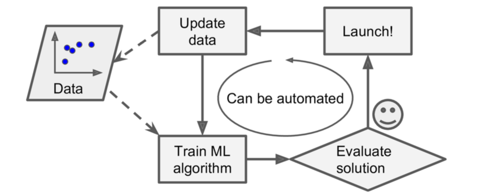
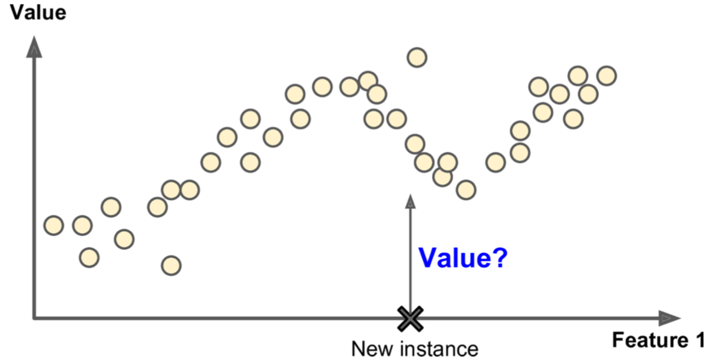
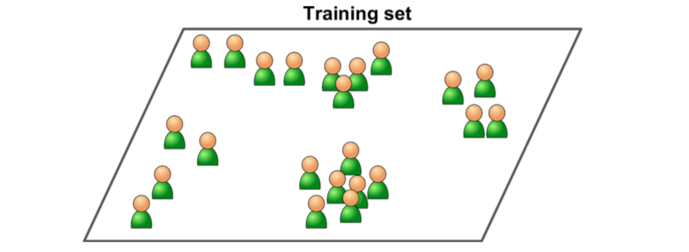
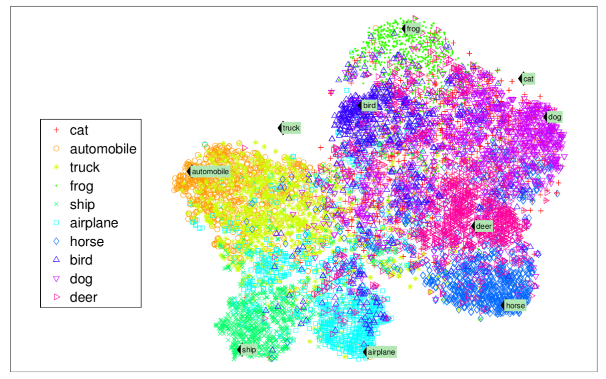
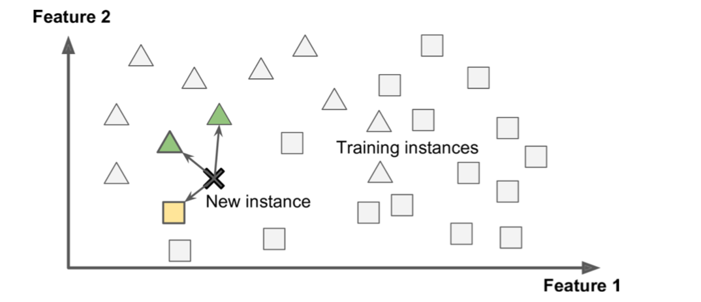
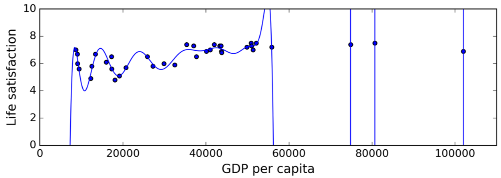

---
export_on_save:
 html: true
 pdf: true
---

# 用Scikit-Learn和TensorFlow实践机器学习
@(Python)[python库, 机器学习, Scikit-learn, TensorFlow]

> 观点、工具和技术，建立一个智能系统

**译者所用的Python版本号为3.6.2，原书中的很多代码已经在该版本的Python下不能正常运行，故在翻译的同时做了少量修改**

[TOC]

## 前言

### 机器学习的海啸

2006年，Geoffrey Hinton 等人发表了一篇文章，说明了如何通过训练一个深度神经网络的能力来识别手写数字，正确率达到了惊人的98% 。他们称这种技术为 **深度学习**。在当时，训练一个深度神经网络被广泛认为是不可能的，因此，大多数的也就是从19世纪90年代就放弃了这种想法。这篇论文重新勾起了科学社区对深度学习的兴趣。新论文的不断涌现，展示了深度学习不仅可能用于应用，而且其令人兴奋的成绩是其他的机器学习(ML)技术所不能比拟的（主要得益于现今海量的数据的超大的计算能力）。这种热情很快扩展到机器学习的其他领域。

10年时间匆匆而逝，机器学习也已经征服了很多的产业：现在很多的高科技产品的核心就是机器学习，比如网络搜索结果的排序，智能手机的语音识别、电影的推荐系统、alpha狗的围棋大战，还有汽车的自动驾驶领域。

### 你项目中的机器学习

我想，你应该会对机器学习感兴趣，并且会享受加入到这场盛宴的过程中！

也许你希望赋予自己DIY的机器人一个大脑，使它能够识别人脸，或者学着在四周走来走去。

或者，也许你的公司有着海量的数据（用户的日志，财务数据，生产数据，机器传感器的数据，热线统计数据，HR的报表等等），你要你知道如何去找，你就能从这一大堆的数据中挖掘出隐藏的 “宝石”，比如：
- 将所有消费者划分成多个组，对每个组制定最佳的营销策略
- 根据消费者的消费记录，推荐其相似类型的产品
- 自动检测存在欺诈行为的交易
- 预测下一年的收入
- ... ...

不过你是基于以上的什么原因，你应该已经决定去学机器学习，并且在你的项目中实现它。嗯，很好的想法！

### 目标和方法

该书假定你几乎对机器学习毫无了解，它的目标是为你 *从数据中学习* 的编程中提供必需的概念、直觉和工具。

我们将涉及大量的技术，从最简单、最常用的技术（比如线性回归）到一些经常能赢得比赛的深度学习技术。

与其自己通过动手实现一个简陋的机器学习模型，我们更多的是使用现成的Python框架：

- `Scikit-Learn` 非常容易使用，而且它非常高效地实现了许多的机器学习算法，可以说该库大大降低了机器学习的准入门槛。

- `TensorFlow` 是一个更加复杂的库，该库通过数据流图的方式实现分布式数值计算。它通过分布式计算将计算量分配到成千上万的多GPU服务端，使得高效地训练非常大型的神经网络称为了可能。TensorFlow由Google公司创建，并且支持他们的很多大规模机器学习的应用。该库于2015年11月开源。

本书采用实践的方式，通过具体的可以工作的例子和少量的理论来使读者对机器学习产生直觉上的理解。如果你在阅读该书时没有带上你的笔记本，我们强烈建议通过在线的 Jupyter notebooks （网址为：https://github.com/ageron/handson-ml）上实验例子中的代码。

### 前提

本书假定你有一些 Python 的编程经验，并且也熟悉 Python 中的一些主要的科学库 `NumPy`，`Pandas` 和 `Matplotlib` 。

另外，你也需要一些大学级别的数学知识，比如微积分、线性代数、概率论和统计学。

如果你现在还不知道Python，http://learnpython.org 是一个不错的学习网站。官方教程 https://www.python.org 也是一个非常好的选择。

如果你从来没有用过 Jupyter， 第二章将会引导你安装和基本的使用方法，这是一个你值得拥有的工具。

如果你不熟悉 Python 的科学库，在 Jupyter notebooks 中包含了一些教程，是一些关于线性代数的快速教程。

### 路标

该书组织成两个部分。

第一部分：**机器学习的基础**，包括以下内容：

- 什么是机器学习？它解决的是什么问题？机器学习系统分为哪些类？有哪些基本的概念？
- 一个经典的机器学习项目需要哪些主要的步骤？
- 学习如何让模型逼近数据
- 最优化损失函数
- 处理、清洗和预处理数据
- 选择和设计特征
- 选择一个训练模型，通过交叉验证来调节超参数
- 机器学习的主要挑战，特别是欠拟合和过拟合（偏差和方差的权衡）
- 对训练数据进行降维，尽量减少维度灾难的风险
- 最常用的学习算法：多项式线性回归模型、逻辑回归模型、k近邻模型、支持向量机模型、决策树模型、随机森林和集成方法

第二部分：**神经网络和深度学习**，包括如下主题：

- 什么是神经网络？它们有什么优点？
- 用TensorFlow建立并训练神经网络
- 最重要的神经网络结构：前馈神经网络（FNN）、卷积神经网络（CNN）、循环神经网络（RNN）、长短期记忆网络（LSTM）和 自编码（auto-encoders）
- 训练深度神经网络的技术
- 大数据集的大规模神经网络
- 增强学习

第一部分更多的使用Scikit-Learn库，第二部分重要使用Tensor-Flow。

**注意：**各位同志不要着急入坑：深度学习毫无疑问是在所有的机器学习方法中最令人兴奋的，但首先你应该掌握基础的原理。而且，多数的问题能够通过使用更简单的技术，例如：随机森林、集成方法（将会在第一部分进行讨论）进行很好的解决。深度学习更适合于复杂的问题，例如图像识别、语音识别或者是自然语言处理，对于这些问题，你必须提供足够的数据、计算能力以及耐心。

### 其他资源

学习机器学习的资源有很多，例如吴恩达教授在[Coursera 上的机器学习课程](https://www.coursera.org/learn/machine-learning/)，Geoffrey Hinton 等人的[神经网络与机器学习](https://www.coursera.org/learn/neural-networks)都非常棒，尽管这些课程都需要投入大量的时间去消化（大概够你想几个月吧）。

关于机器学习，还有许多有趣的网站，包括Scikit-Learn官网上的[用户指南](http://scikit-learn.org/stable/user_guide.html)。你也许还会喜欢 [Dataquest](https://www.dataquest.io/) 网站，它提供了优雅的交互式教程，想看更多关于机器学习的博客的话，可以查看[Quora](https://www.quora.com/What-are-the-best-regularly-updated-machine-learning-blogs-or-resources-available)上的这个列表。最后，[Deep Learning website](http://deeplearning.net/)列出了很多优质的资源供你更深入地学习。

当然，还有许多介绍机器学习的书籍，特别需要列出的有：

- Joel Grus, [Data Science from Scratch](http://shop.oreilly.com/product/0636920033400.do)，O'Reilly出版社出版，中文名为《数据科学入门》，该书介绍了机器学习的基本原理，**并用纯Python语言实现了其中主要的算法**（正如书名所说的，从零开始）
- Stephen Marsland, [Machine Learning: An Algorithmic Perspective](https://book.douban.com/subject/3887824/)，英国的CRC（Chapman and Hall）出版社出版。该书对机器学习的介绍还是很有深度的，也提供了Python 的代码实现（也是从零开始，不过是用Numpy库）
- Sebastian Raschka，[Python Machine Learning](https://book.douban.com/subject/26629312/)，Packt出版社出版，该书对机器学习的介绍也非常棒，其中的代码实现主要借助了开源的库：Pylearn 2 和 Theano
- Yaser S. Abu-Mostafa, Malik Magdon-Ismail, 和 Hsuan-Tien Lin，[Learning from Data](https://book.douban.com/subject/11026330/)  AMLBook 出版社出版。该书是对机器学习进行了理论化的介绍，具有非常深刻的见解，特别是第四章的*偏差-方差权衡*
- Stuart Russell, Peter Norvig, [Artificial Intelligence: A Modern Approach, 3rd Edition](https://book.douban.com/subject/5378558/)。该书真的是一本关于人工智能的大部头的书，而且其中涉及的论题数量也非常惊人，其中包括了机器学习，它能带你从整个人工智能的角度来审视机器学习的位置

最后，一种 "速成" 的方式是注册一个机器学习比赛网站的账号，比如 [Kaggle.com](https://www.kaggle.com/)，它将为你提供解决一个真实世界问题的实践平台，同时也可以得到很多机器学习顶级专家的帮助。

### 本书中使用的惯例

以下是本书中的使用的印刷规范：

斜体（*Italic*）
&nbsp; &nbsp; &nbsp; &nbsp; 表示新的术语、URLs、email地址、文件名和文件扩展。

等宽 （`Constant width`）
&nbsp; &nbsp; &nbsp; &nbsp;用于程序列表的现实，也可能是出现在段落内的程序元素，比如变量、函数名、数据库、数据类型、环境变量、声明及关键字。

等宽加粗（**`Constant width`**）
&nbsp; &nbsp; &nbsp; &nbsp; 用于显示命令或者是其他的用户需要手动逐字输入的文本。

等宽斜体（*`Content width`*）
&nbsp; &nbsp; &nbsp; &nbsp;用于显示可替换的文本，这些文本需要用户提供或者是需要根据具体的语境生成。

 该图案表示 **提示** 或 **建议**


 该图案表示通常的 **注释**


 该图案表示一个 **警告** 或 **注意点**


### 使用代码示例

本书所提供所有材料（包括代码示例、练习等），都可以从https://github.com/ageron/handson-ml 下载下来。

本书是为了帮助你刚好地完成工作。所以，如果你需要在你的代码或文档中使用本书提供的案例代码，通常不需要联系我们以获取许可。除非你需要非常大量的代码。例如，如果你仅仅是需要使用几个代码块，自然不需要获取许可。回答问题是引用了示例代码也不需要获得许可。但是，如果需要将大量的实例代码组织起来合并到你的产品文件中，就需要获得我们的许可了。

在使用代码时，我们感激但并不强制注明出处。出处通常应该包括书名，作者，出版社和 ISBN。例如：“*Hands-on Machine Learning with Scikit-Learn and TensorFlow* by Aurelien Geron (O'Reilly)，Copyright 2017, Aurelien Geron, 978-1-491-96229-9”

如果你感觉自己将其中的代码超过了合理利用的范围，或者是超过了上述的使用权限，敬请联系我们：[*permissions@oreilly.com*](permissions@oreilly.com)

### O'Reilly Safari


[Safari](http://oreilly.com/safari)（原先是Safari Books Online）是一个针对企业、政府机关、教育机构以及个人的基于会员制的培训和参考平台。

会员能够获得上千的书籍、培训视频、学习途径、交互教程以及超过250家出版社的出版清单，包括 O'Reilly Media, Harvard Business Review, Prentice Hall Professional, Addison-Wesley Profes‐ sional, Microsoft Press, Sams, Que, Peachpit Press, Adobe, Focal Press, Cisco Press,ohn Wiley & Sons, Syngress, Morgan Kaufmann, IBM Redbooks, Packt, Adobe Press, FT Press, Apress, Manning, New Riders, McGraw-Hill, Jones & Bartlett 和 Course Technology 等等。

详情请访问：http://oreilly.com/safari。

### 如何联系我们

请将关于本书的评论和问题发送到出版社，地址为：

&nbsp; &nbsp; &nbsp; &nbsp; O’Reilly Media, Inc.
&nbsp; &nbsp; &nbsp; &nbsp; 1005 Gravenstein Highway North
&nbsp; &nbsp; &nbsp; &nbsp; Sebastopol, CA 95472
&nbsp; &nbsp; &nbsp; &nbsp; 800-998-9938 (in the United States or Canada)
&nbsp; &nbsp; &nbsp; &nbsp; 707-829-0515 (international or local)
&nbsp; &nbsp; &nbsp; &nbsp; 707-829-0104 (fax)

关于本书的勘误表、例子以及如何附加的信息都会放在我们的网站上，地址为：https://bit.ly/hands-on-machine-learning-with-scikit-learn-and-tensorow。

如果想咨询关于本书的技术问题，请发邮件至：[bookques‐ tions@oreilly.com](bookques‐ tions@oreilly.com)。

更多的有关我们的出版物、课程、讨论会、新闻的内容，请访问我们的网站：http://www.oreilly.com。

在facebook上找到我们：http://facebook.com/oreilly

订阅我们的Twitter：http://twitter.com/oreillymedia

在YouTube上找到我们：http://www.youtube.com/oreillymedia

### 鸣谢

我要感谢我在Google公司的同事，特别是YouTube视频分类小组的小伙伴们，你们教会了我那么多关于机器学习的知识，如果没有你们，我将不可能写成这本书。特别的感谢留给我的机器学习导师：Clement Courbet，Julien Dubois，Mathias Kende，Daniel Kitachewsky，James Pack，Alexander Pak，Anosh Raj，Vitor Sessak，Wiktor Tomczak，Ingrid von Glehn，Rich Washington	在 YouTube Pairs 中的每一位。

我也非常感激所有能够在百忙之中抽出时间仔细校对这本书的人。感谢 Pete Warden ，他作为 TensorFlow团队中的核心成员，回答了我所有关于TensorFlow的问题，校对了第二部分，并提供了许多有趣的想法。你一定得去访问一下他的[博客](https://petewarden.com/)。感谢Lukas Biewald，他非常彻底的校对了第二部分：测试了所有的代码，提出了许多的建议，他的热情深深感染了我。你应该访问他的[博客](https://lukasbiewald.com/) 和他[库库的机器人](https://www.oreilly.com/learning/how-to-build-a-robot-that-sees-with-100-and-tensorflow)。感谢 Justin Francis，他完全地校对了第二部分，找出了许多的错误并提供了许多想法，特别是在16章中，可以查看他关于TensorFlow的[帖子](https://www.oreilly.com/people/justin-francis)。

非常感谢 David Andrzejewski，他校对了第一部分，并提供了大量有用反馈，指出了其中写得含糊不清的部分，并建议如何进行改进。查看他的[网站](http://www.david-andrzejewski.com/)。感谢 Gregoire Mesnil，校对了第二部分，在关于训练神经网络方面贡献了非常有趣和实用的建议。也感谢Eddy Hung，Salim Semaoune，Karim Matrah，Ingrid von Glehn，Iain Smears 和 Vincent Guilbeau，他们校对了第一部分，并提出了许多有用的建议。我也必须感谢我的岳父 Michel Tessier，以及之前是我数学老师现在是优秀的翻译者的 Anton Chekhov，帮助我解决了许多数学以及符号方面的问题，并校验了关于Jupyter notebook线性代数部分的内容。

当然，万分感谢我亲爱的兄弟Sylvain，他校对了每一个章节，并测试了其中的每一行代码，并几乎在每个章节都提供了反馈，并从写书之初到之后都一直支持我。爱你，哥！

非常感谢 O'Reilly 非常棒的工作人员，特别是Nicole Tache，给了我许多富有洞察力的反馈。同时也感谢Marie Beaugureau，Bea Lorica，Mike Loukides 和 Laurel Ruma，一直相信这个项目，并未为本书明确了着眼点。感谢 Matt Hacker 和所有 Atlas 组的成员，回答了我关于格式、asciidoc 和 LaTeX 的问题。感谢Rachel Monaghan，Nick Adams 和所有产品组的成员，帮我完成了最终的审稿并做了许多的改正。

最后但同样重要的，我非常非常感谢我亲爱的妻子，Emmanuelle 和我们3个可爱的孩子，Alexandre，Aemi 和 Gabrielle，鼓励我努力完成这本书，问了我许多的问题（谁说不能教7岁小孩学习神经网络），为我提供饼干和咖啡，有此待遇，夫复何求？

# 第一部分 机器学习基础

## 第一章 机器学习纵览

大多数人听到 “机器学习” 时，大脑中应该会浮现出一个机器人：可信赖的管家或者是致命的终结者，都随你怎么称呼。但是机器学习并仅仅是未来的一个奇迹。事实上，它已经在某些特殊的应用场景中存在了几十年，例如光学字符识别（Optical Character Recognition, OCR）。但是机器学习的应用第一次成为主流，改善千万人的生活需要追溯到上世纪的90年代：垃圾邮件过滤器。它并不是一个有自我意识的天网，但是在技术层面的确是一个合格的机器学习应用（它实际上已经几乎不需要你标出垃圾邮件了）。它被许多的机器学习应用所效仿，并默默影响着成百上千的你所经常使用的功能，从更好的推荐系统到语义检索。

机器学习从何而来，又将归于何处？机器学习到底学的是什么东西？如果我把维基百科下载下来，那是不是我的电脑就称为学到了一些东西？它是突变的智能吗？在本章，我们将阐明什么是机器学习以及为什么你可能要学习它？

在我们开始探索机器学习这块未知的大陆之前，我们先了解一下它主要的划分和最显著的“路标”：监督学习 vs 非监督学习，在线学习 vs 批量学习。之后，我们将会看到一个典型的机器学习项目的工作流程，讨论你可能需要面对的主要挑战，包括如何去评价和微调一个机器学习系统。

本章将介绍每个数据科学家需要真正理解的许多基本概念（和行话），本章只是一个高度概述（不涉及很多代码），所有的内容都非常简单，但是你应当确保在阅读其他章节之前，对本章的所有内容都非常明白。来杯咖啡，让我们开干吧！

> 如果你已经对机器学习的基本概念都了解清楚了，你可以跳到第二章继续阅读。如果你不是非常确定，就在跳转之前先尝试回答在本章最后所列出的所有问题。


### 什么是机器学习？

机器学习是计算机编程的科学（和艺术），程序能从数据中进行学习。

以下是一个常见的定义：

> 机器学习是不通过显式地编程而让计算机获得某种能力的领域。
> ------ Arthur Samuel，1959

而更加工程化的描述为：

> 对于某类任务T和性能度量P，如果一个计算机程序在T上以P衡量的性能随着经验E而自我完善，那么我们称这个计算机程序在从经验E学习
> ------ Tom Mitchell，1997

比如说，你的垃圾邮件过滤器就是一个机器学习的程序，它能够学着去标记一封邮件是不是垃圾邮件，而最初由用户给这些邮件打上标记供机器学习。供系统使用的所有训练案例称为训练集，每个单独的训练案例称为训练实例（或称为采样）。在这个例子中，任务T就是为一封新邮件打上标记，经验E是训练集中的数据，性能衡量P需要被定义；比如，你可以用邮件分类正确的比率来作为P，这种特殊的性能衡量指标称为正确率，它常常被用于分类的任务中。

如果你只是将维基百科的一个拷贝下载下来，你的电脑有很多的数据，但是它不会立即具备测试某个实例的能力。因此，这种行为并不是机器学习。

### 为什么要用机器学习

想象一下，如何用传统的方法来编写邮件过滤器（如图1-1所示）：

1. 第一步，你需要确定垃圾邮件的典型特征。你也许会注意到包含一些特定的单词或短语（例如 “4U”，“信用卡”，“免费”，“惊人的”）会在某一主题中被多次提到。也许你也会注意到在发送人的名字中、邮件格式中的一些其他模式等等。
2. 你需要为你所留意到的每一种模式写检测代码，之后你的程序根据检测到这些模式的数量来决策该邮件是否是垃圾邮件。
3. 你需要测试你的程序，然后重复1~2步骤直到结果足够好。


*图1-1. 传统的方法*

因为这个问题不是微不足道，因此你的程序看起来就像一张有许多复杂规则的长表------非常难以维护。

相反的，基于机器学习的垃圾邮件分类器能够通过检测垃圾邮件中经常出现而正常邮件中不常见的单词模式，自动地学会什么单词和短语能很好地用于垃圾邮件的预测（图1-2所示）。这个程序更加简短，也更容易维护，而且很有可能预测结果更加准确。


*图1-2 机器学习的方式*

此外，如果垃圾邮件发送者如果发现所有含 “4U” 的邮件都被拦截了，他们可能会开始用“For U” 来替代。用传统方法构建的邮件过滤器将不得不添加一条规则来过滤含 “For U” 的email。如果垃圾邮件发送者针对你的邮件过滤器继续修改，你也必须保证能随之添加新的过滤规则。

相反的，基于机器学习的邮件过滤器自动探测出含 “For U” 的邮件被用户标记为垃圾邮件的频率特别高，之后该过滤器不需要人工介入，就能开始对 “For U” 进行标记（图 1-3）。


*图 1-3 自适应变化*

另一个机器学习能够“发光发热”的领域是某些问题对于传统编程来说太过复杂或者根本没有已知的算法。比如说，语音识别：你要写一个简单的程序，能够根据你说的 “One” 或 “Two” 来将他们区分开来。你也许注意到单词 “Two” 是以高音开头（“T”），因此你可以写一个算法用于测试高音的强度，用这种方法来“One” 和 “Two” 。显然，这种方法并不能推广到成千上万的单词中，而每个人说话的口音也不一样，人们说话的时的环境可能有很多噪音，这些都使得用传统方式做语音识别变得不可能。最好的解决方案（就当前而言）是写一个能自我学习的算法，并提供大量的单词录音供其学习。

最后要说，其实机器学习还能够辅助人类进行学习（图 1-4）：我们可以检查机器学习算法来观察它们到底学到了什么（虽然对于一些算法来说不是很容易）。比如说，邮件分类器在训练了足够多的垃圾邮件之后，能够简单地获取它所认为的有利于预测垃圾邮件的单词列表。有时候，它能够揭示出未知的关联或者新趋势，由此更好地对问题进行理解。


*图 1-4 机器学习能够辅助学习某些规律*

总结来说，机器学习能够用于以下场景：

- 解决某一问题需要花大量时间手动调整代码，或者是该问题有大量的规则：机器学习算法通常代码更简单，效果更好
- 某些复杂的问题如果使用传统编程方式的话，根本没有好的解决方案：最好的机器学习技术能够找到解决方案
- 变动的环境：机器学习系统能够根据新来采集的数据进行自我调整
- 某个复杂的问题有大量的数据，我们需要找到其中的某些规律


### 机器学习系统的种类

机器学习系统的种类非常多，我们需要根据以下的几点将它们分成几个大类：

- 它们是不是在有人监督的情况下进行学习（分为监督学习、非监督学习、半监督学习、增强学习）
- 它们是不是能够在应用的同时逐渐地优化自身（分为在线学习和批量学习）
- 它们是简单地将新数据和原有数据进行比较来预测，还是像科学家一样从原有数据中发现某些特定的模式，并通过构建一个预测模型来对新数据进行预测（分为实例依赖和模型依赖）

这些分类标准并不是绝对的，你可以用如何你喜欢的方式来组织它们。比如说，一个最先进的邮件分类器也许能够在应用的同时，将新的标有垃圾邮件或普通邮件的案例输入到一个神经网络模型中进行训练；这个系统就称为在线的、基于模型的监督学习系统。

让我们具体看看这些分类标准是什么。

### 监督/非监督学习

机器学习系统能够根据在训练的过程中是否需要监督进行分类。主要可以分为4个类：监督学习，非监督学习，半监督学习和增强学习。

#### 监督学习

在监督学习中，你 “喂” 给机器学习算法的训练数据中包括了你希望得到的结果，称为标记（图 1-5）


*图 1-5 监督学习的带标签训练集*

一种典型的监督学习任务是 *分类*。邮件分类器就是分类的一个很好的例子：它通过很多带有类型信息（垃圾或者普通）的邮件来学习，之后用于新邮件的分类。

另一种典型的监督学习任务是预测一个数值，比如说一辆车的价格，提供的是大量的特征向量（将里程数、车龄、品牌等不同属性组合在一起成为一个特征向量），这种任务称为 *回归*（图 1-6）。在训练时，你需要给算法提供很多同时包含特征向量和标记（车的价格）的车的例子。


*图 1-6 回归*


> 一个有趣事实是，*回归* 这个奇怪的名字原本是统计学的一个术语，最开始是Francis Galton 在研究孩子身高时引入，他发现如果一个孩子的父母都是高个子，孩子趋向于比他的父母都要矮，所以他称这种现象为 *回归于平均水平*。这个名词后来被他用于分析两个相关变量的方法中。


在机器学习中，一个 *属性* 通常是指一种类型的数据（例如里程数），而 *特征* 需要根据上下文来确定其具体的含义，但通常来说是指一个属性和它的值（例如：“里程数=15,000”）。很多人会将 *属性* 和 *特征* 混用。


**注意：**有的回归算法也会被用于分类，反之亦然。比如说，逻辑回归算法就是一种常见的将回归应用于分类的算法，其输出值为属于相应类的概率大小（例如：20%的可能是垃圾邮件）。

下面是一些最重要的监督学习算法（本书中涵盖的）：

- k-近邻
- 线性回归
- 逻辑回归
- 支持向量机
- 决策树和随机森林
- 神经网络

> 注意：有的神经网络可能是非监督学习，比如说自编码 (autoencoders)和 受限玻尔兹曼机。有的神经网络也可能是半监督的，比如 深度信念网络（Deep Belief Networks）和 非监督预训练（unsupervised pre-training）

#### 非监督学习

正如你所料，非监督学习的训练数据不提供标记（图 1-7）。系统在没有 “老师” 的情况下进行学习。

*图 1-7 一个用于非监督学习的无标记训练集*

下面是一些最重要的非监督学习算法（在第8章，我们将会讲解数据降维）：

- 聚类
	- k-均值（k-Means）
	- 层次聚类分析（Hierarchical Cluster Analysis，HCA）
	- 最大期望算法（Expectation Maximization）
- 数据降维和可视化
	- 主成分分析（Principle Component Analysis，PCA）
	- 核主成分分析（Kernel PCA）
	- 局部线性嵌入（Locally-Linear Embedding，LLE）
	- t分布随机近邻嵌入（t-distribution stochastic neighbor embedding，t-SNE）
- 关联规则学习
	- Apriori算法
	- Eclat算法

比如说，你有很多浏览你博客的访问者的数据，你可能希望运行一个聚类算法将相似的访问者划分为同一个组（图 1-8）。你没有对算法说明某个访问者应该属于哪个类，它完全自动地找到他们之间的关联。再比如，你发现访问者中40%是喜欢看连环画的男性，他们通常在晚上读你的博客，而20%是喜欢读科幻小说的年轻人，他们通常在周末浏览你的博客，等等。如果你使用层次聚类算法，还可能将每个组再细分为更小的组。这些信息可以帮助你针对每一个组推送他们喜欢的博文。


*图 1-8 聚类*

可视化算法也是非监督学习算法的一个很好的例子：你提供了大量复杂且无标记的数据，算法输出能够在2维或3维图像中非常容易显示的数据（图1-9）。这些算法尽可能多地保留数据原有的结构关系（例如：试图在可视化操作中保持分离的集群尽可能不重叠），让你能理解数据是如何组织的，并发现其中潜在的规律。

*图 1-9 t-SNE 语义集群的高亮可视化显示*

> 从图中你可以看到，动物和交通工具有非常明显的分界，而 “horse” 与 “deer” 的距离要比其与 “bird” 的距离近，等等信息。图片来自于 Socher，Ganjoo，Manning 和 Ng (2013), "T-SNE visualization of the semantic word space"，已通过授权。

与聚类相关的一个任务是 *数据降维*，目的是在简化数据的同时尽可能减少信息量的损失。一种实现方式是将多个相关的特征合并为一个特征。比如，车的里程数和车龄非常相关，因此可以把这两个特征合并成一个特征，表示车的磨损程度。这就称为 *特征提取* 。

**通常来说，在将数据交个某个机器学习算法（比如监督学习算法）进行训练之前，先用数据降维算法减小原始数据的维度是一个很好的想法。而且也能让训练的时间更短，数据占用的磁盘和内存资源更少，而且有时候能够获得更好的训练结果**

还有一个非监督学习的任务是 *异态检测*，例如：发现信用卡的非正常交易以预防诈骗，发现生产中的次品，在将数据集交个学习算法进行训练之前先删除其中的异常值。这个系统使用正常的实例进行训练，当一个新的实例到来，它能判断该实例是正常的还是异常的（见图 1-10）。

*图 1-10 异态检测*

最后一个常见的非监督学习任务是 *关联规则学习*，主要用于挖掘数据，发现各属性之间的有价值的关系。比如说，假设你开了一家超市，将你每一天的销售记录交给关联规则学习算法处理，可能会发现买了烧烤调料和薯片的人很可能同时买牛排。因此，你可以将这些商品放在一起，可能就会提高营业收入。

#### 半监督学习

有的算法能够处理部分标记的训练数据，通常是大多数未标记，只有少量做了标记。这总算法就是半监督算法（图 1-11）。


*图 1-11 半监督学习*

某些图片托管服务，如 Google Photos，就是这种算法的一个例子。如果你向服务器上传了一张你的全家福照片，它就能自动识别其中的人，并指出某人A出现在第1、5、11张图片中，另一个人B出现在第2、5、7张图片中。这部分工作属于非监督学习算法（聚类）。现在，这个系统的工作是，在这张全家福的照片中指出他们分别是谁，即仅仅是对一个样本打上标签，它就能说出每一张照片上每个人的名字，这对照片的检索非常有用。

> 注：上述情况只有在系统工作得非常完美时才会出现。但实际情况是，系统经常会给同一个人创建多个类别，或者有的时候在同一个类别中会有两个或多个看起来长得像的人，所以，你需要一些个人单独的照片，并且手动清除一些类别。

大多数的半监督学习算法同时结合了非监督学习和监督学习算法。比如 *深度信念网络 (DBNS)* 就是在非监督算法 *受限玻尔兹曼机(RBMs)* 的基础上再加一层或多层的 RBMs，以非监督的方式按顺序用RBMs进行训练，之后，整个系统使用监督学习的方法进行调优。

####增强学习

和之前的机器学习算法相比，增强学习绝对是一个异类。在该学习系统中，有一个称为 *代理* 的模块，能够对当前的环境进行 “观察”，选择并执行某个动作，并返回一个奖励（或者是返回一个惩罚作为消极的反馈，如图 1-12）。系统必须能够自动地学会什么是最佳的动作，称为策略，即获得奖励最多的那个动作。一个策略指定了在某种给定的情形下，代理应该如何选择。


*图 1-12 增强学习*

举例来说，许多的机器人都实现了增强学习算法用于学会走路。DeepMind项目的AlphaGo程序就是增强学习的一个很好的例子：它在2016年3月的时候，凭借着战胜世界围棋冠军的李世石而一举成名。它通过分析上百万的围棋对弈过程，学到了赢棋的策略，之后开始与自身进行对弈。在真正的对弈开始时，系统并不进行学习，而是将其已经学到的策略进行应用。

### 批量学习和在线学习

另一种用于对机器学习进行分类的标准是：随着在数据流的不断到来，系统能否循序渐进地改善自身的性能。

#### 批量学习

*批量学习* 并不具备循序渐进改善自身的能力：它在训练时，必须一次性输入所有当前可得到的数据。通常来说，这需要花费大量的时间和计算资源，因此它通常是离线进行的。首先，完成对系统的训练，接下来讲系统安装到生产环境中，并且在应用的过程中不再进行学习；它只是简单地将学到的 “知识” 进行应用，这也叫做 *离线学习*。

如果你希望批量学习系统能够正确处理 “变种” 的数据（比如出现了新的垃圾邮件模式），你需要从头开始用所有的数据重新训练一个新版本的系统（不仅仅是新的数据，而且也要包括原有数据），之后，用新训练的系统替换掉老系统。

幸运的是，整个过程包括训练、性能评估、系统的更换都能非常简单地自动化进行（如图 1-3 所示），所以批量学习也能够适应不断变化的数据。只要根据需求，定期地更新训练数据并从头开始训练一个新版本的系统即可。

这种解决方案通常来说简单并且有效，但是用所有的数据进行训练很可能需要花费数个小时，所以你通常只是每24小时或者是每个星期训练一个新的系统。如果你的系统需要快速适应不断变化的数据（比如预测股票价格），那你就需要一个使系统进化更快的解决方案。

另外，训练所有的数据需要大量的计算资源（CPU、内存空间、磁盘空间、网络资源等等）。如果训练集中的数据量非常大，而你的系统需要每天都从头开始进行自动训练，它最终将消耗你大量的资金。如果数据的量超级巨大，那使用批量学习根本就是不现实的。

最后，如果你的批量学习系统安装在一个资源有限的设备上（如智能手机或火星探测器），每天带着大量的训练数据，占用大量资源训练训练多个小时，那么这个设备估计其他什么事情都干不了了。

幸运的是，在上述那些尴尬的情况下，我们可以使用接下来介绍的算法实现循环渐进的学习。

#### 在线学习

在线学习系统中，你可以将数据一个一个，或者一小组一小组地 “喂” 给你的系统（每一小组称为 *小批* ），你系统的性能也在你喂食的过程中渐渐得到优化。这样学习的每一步都非常快速，代价也小，因此系统能够在运行的同时，对新来的数据进行学习（见图 1-13）。


*图 1-13 在线学习*

在线学习算法非常适合于数据以流的方式连续不断到来的系统（如股票的价格）和需要快速适应改变的系统。当然，如果你只有为数不多的计算资源，那么在线学习也是一个很好的选择：一旦在线学习系统学过了新的实例，它就不需要再次学习该实例，你可以直接将该实例丢弃（除非你想要将系统回退到之前的某个状态，并对数据进行重现）。这将节约大量的系统空间。

当训练数据量非常大时，也许我们设备的存储空间不能容纳下全部的训练数据，那么我们也可以使用在线学习算法（这也称为 *核外学习*）。算法只将部分的数据进行加载，先针对这些数据进行训练，之后重复这一过程，直到所有的数据都被训练过（见图 1-14）。


*图 1-14 以在线学习的方式处理超大的数据集*


**特别注意：上述的所有过程通常是离线进行的（系统并不处于运行状态），所以 *在线学习* 这个名字总感觉令人困惑，你就认为它是 *增量式学习* 好了。**

在线学习系统中一个重要的参数是，在线学习应该以多快来适应新数据：这称为学习速率。如果你设置了一个高学习率，你的系统将能够快速适应新数据，但它也将很快 “忘记” 旧数据（你应该不会想要一个只能将与最新接收到的邮件类型相同的邮件标注出来的系统吧）。相反地，如果你设置了一个低学习率，系统将有更大的惯性，也就是说：它学得更慢，但同时对新数据中的噪声、非典型的数据点序列不敏感。

在线学习的一大挑战是：如果坏的数据被输入到系统中，系统的性能将会渐渐地下降。如果是在线运行的系统，这种变化将会被你的客户注意到。例如，坏的数据可能来自于机器人上出故障的传感器，或者是某人对搜索引擎进行狂轰滥炸地输入某个搜索词以提高该词在搜索结果中的排名。为了减少这些风险，你需要密切监视你的系统，在你发现系统的性能下降时及时停止学习（如果可能的话，最好将系统回退到之前的某个工作状态）。你最好也能够对输入数据进行监视，剔除其中的异常数据（例如使用异常检测算法）。

### 基于实例 VS 基于模型

另一种区分机器学习系统的方法是根据问题------它们是怎么被构建起来的。绝大多数的机器学习任务都是关于预测的，这就意味着在给了一些训练数据进行训练之后，系统能够对它之前从未见过的实例进行归纳。对训练数据表现出不错的性能是很好，但这还不够，我们真正的目标是对新到来的实例能够有好的性能。

归纳的方式主要有两种：基于实例学习 和 基于模型学习。

#### 基于实例学习

也许，最平常的学习方式是仅仅通过 “死记硬背” 的方式来学习。如果你构建的是这样的一个邮件过滤器，它将只能标记出那些与被用户标记过的邮件相同的邮件，不是最坏的模型，但绝对不会是最好的模型。

除了能够标记出与已知的垃圾文件完全相同的邮件外，你的邮件分类器还应该能够标记出与已知垃圾邮件非常相似的邮件。这就要求系统能够测试出两封邮件之间的相似度。一种非常基本的测试方案是计算两封邮件之间相同的单词的数量。如果新邮件中有大量的单词与已知垃圾邮件中的单词相同，就可以将该新邮件打上标记。

这就是 *基于实例的学习* ：系统记下所有的实例，之后用相似度对新的实例进行归纳（图 1-15）


*图1-15 基于实例的学习*

#### 基于模型学习

另一种方式是，从一个实例集中归纳出一般的规律，针对这些实例构建出一个模型，之后用这个模型进行预测，这就称为 *基于模型的学习*（图 1-16）

*图 1-16 基于模型的学习*

比方说你想要知道是否金钱真的能够使人开心，你可以从 [OECD's website](https://goo.gl/0Eht9W) 上面下载 *更好生活指数*，同时从 [IMF's websit](http://goo.gl/j1MSKe) 下载对应国家的国内人均GDP。之后，你将这两个数据合并到同一个表中，并以人均GDP从高到底进行排列，表1-1 摘录了你所得到的表的一部分：

*表 1-1 金钱真的使人更快乐吗？*


让我们随机地取一部分数据以散点图的形式进行显示（图 1-17）：

*图 1-17 你看到某种趋势了吗？*

上图看起来确实有某种趋势。虽然数据有一些噪声（比如局部数据是随机分布的），不过整体上看，似乎人们的生活满意度随着各自国家人均GDP的上升而线性增长。所以，你决定建立一个生活满意度和人均GDP间呈线性函数关系的模型，这一步就成为 *模型选择*：你只选择人均GDP这一属性为生活满意度建立线性模型（等式 1-1）

&nbsp; &nbsp; &nbsp; &nbsp; *等式 1-1. 一个简单的线性模型*

&nbsp; &nbsp; &nbsp; &nbsp; $life\_satisfacation=\theta_0+\theta_1\times GDP\_per\_capita$

这个模型有两个模型参数，$\theta_0$ 和 $\theta_1$。通过调整这些参数，你可以得到任何你想表示的线性函数，如图 1-18 所示。

*图 1-18 若干可能的线性模型*

在你使用你的模型前，必须先确定参数 $\theta_0$ 和 $\theta_1$ 的值。那你确定你所取得参数值能够使模型的性能最好呢？为了回答这个问题，你需要先明确性能测量的方式。你既可以定义一个 *效用函数*（或称为 *适配函数*）来测量你的模型有多好，也可以定义一个 *代价函数* 来测量你的模型有差。就线性回归问题而言，通常使用线性模型的预测值和训练样本的实际值之间的欧式距离作为代价函数。训练的目标就是最小化这个距离。

线性回归算法的工作原理是：你将训练数据交给它，它负责找出一组模型的参数，这组参数能够使你的线性模型与数据吻合得最好，这个过程就称为 *训练*模型。在我们这个例子中，算法发现最佳的参数值是 $\theta_0=4.85$，$\theta_1=4.91\times10^{-5}$。

现在，这个模型与训练数据吻合得最好（对线性模型而言），如图 1-19所示：

*图 1-19 与给定数据最吻合的线性模型*

你可以使用该模型进行数据预测了：你想要知道塞浦路斯人的幸福指数，但在 OECD网站上并没有给出答案。幸运的是，你可以使用你训练好的模型进行预测：先获取塞浦路斯的人均GDP，为 22587美元 ，将这个值代入你的模型就可以得到他们的生活满意度应该大致为 $4.85+22587\times4.91\times10^{-5}=5.96$ 。

为了满足你的好奇心，例1-1 中的Python代码实现了数据的加载，预处理，将数据以散点图的形式进行可视化，之后进行线性模型的训练，最后将完成训练的模型用于预测。

> 注：如果你不理解其中的代码也没有关系，在接下来的章节我们就会介绍Scikit-Learn库。

*例 1-1. 用Scikit-Learn训练并运行一个线性模型*

``` python
import matplotlib
import matplotlib.pyplot as plt
import numpy as np
import pandas as pd
from sklearn import linear_model
from sklearn import neighbors

# 数据加载
oecd_bli = pd.read_csv("oecd_bli_2015.csv", thousands=",")
gdp_per_capita = pd.read_csv("gdp_per_capita.csv", thousands=",",
    delimiter="\t", encoding='latin1', na_values="n/a")
# 数据的预处理 假定函数 perpare_country_stats已经完成定义
# 用于将 GDP和生活满意度合并到同一个Pandas dataframe
country_stats = prepare_country_stats(oecd_bli, gdp_per_capita)
X = np.c_[country_stats["GDP per capita"]]
y = np.c_[country_stats["Life satisfaction"]]

# 数据的可视化
country_stats.plot(kind="scatter", x="GDP per capita",
    y="Life satisfaction")
plt.show()

# 选择一个线性模型
clf = linear_model.LinearRegression()

# 训练模型
clf.fit(X, y)

# 对塞浦路斯进行预测
X_new = [[22587]] # 塞浦路斯的人均GDP
print(clf.predict(X_new)) # 输出为 [[ 5.96242338]]
```


如果你使用基于实例的学习算法就会发现，斯洛文尼亚和塞浦路斯的人均GDP最接近，而斯洛文尼亚在OECD上显示的生活幸福指数是5.7，因此，你的算法也许会预测塞浦路斯的生活幸福指数也是5.7。如果你把观察的范围扩大到最接近的3个国家，你将发现葡萄牙和西班牙的幸福指数分别为5.1 和 6.5。求这3个国家的幸福指数的平均值，可以得到5.77，已经非常接近使用基于模型算法得到的预测值。这种简单的算法被称为 *k-近邻* 回归（在这个例子中，k=3）。
如果用k-近邻实现代码也非常简单，只需要将之前的代码：
`clf = linear_model.LinearRegression()`
替换为：
`clf = neighbors.KNeighborsRegressor(n_neighbors=3)`
即可。

如果顺利的话，你的模型可以做出很好的预测。否则，你可能需要更多的属性（如就业率、健康、空气污染等），也可以是选择更多或质量更好的训练数据，或者是更加强大的模型（比如说是多项式回归模型）。

总结来说：
- 你需要数据进行分析
- 你需要选择一个学习模型
- 你需要使用训练数据对其进行训练（比如说，学习算法需要找到使代价函数最小的一组模型参数）
- 最后，你将这个训练好的模型应用到对新实例的预测中（这个过程称为推断），并期望得到好的结果

这就是典型的基于模型学习算法的工作流程。在第二章中，通过实践一个端到端的项目，你将会有更加直接的体验。

到目前为止，我们介绍了很多的机器学习分类，你应该找到了：机器学习到底是什么？它为什么非常有用？机器学习系统最常见的分类有哪些？典型的项目工作流程是怎样的？那么，让我们看看哪些因素会导致训练失败，预测结果不准确。

### 机器学习的主要挑战

简而言之，你的主要工作是选择一个学习算法和将数据给这个算法训练，因此训练失败的元素也分为两类：“选了不合适的算法” 和 “数据不好”。让我们先来看看坏数据的一个例子。

#### 训练数据不充足

对于一个三岁小孩来说，要让他认识什么是苹果，只需要手指指着一个苹果说 “苹果” 就可以了（也许需要多次重复这个过程）。之后，小孩就能分辨出任何颜色、任何形状的苹果了。真是天才！

机器学习就不是这样了，几乎所有的机器学习要能正常工作都需要大量的数据。即使是非常简单的问题，你也需要提供上千个实例，而对于复杂的问题，如图像或语音识别，你可能需要上百万个实例（除非你能找到一个已经存在的，和你问题相似的模型）。

##### 数据不可思议的能力

2001年，微软的研究员Michele Banko 和 Eric Brill 发表了一篇著名的论文，在这篇论文中展示了一些非比寻常的机器学习算法，其中包括一个非常简单，只需要足够的数据量，就能解决复杂的自然语言歧义问题（例如：是单词“to”，还是“two”，还是“too” 需要根据上下文确定），如图 1-20所示：

*图 1-20 数据和算法的重要性*

作者提出：这些结果让我们重新思考，是应该花大量的时间和金钱来改进发展算法还是将这些时间和金钱用于语料库的开发。

2009年，Peter Norvig 等人发表了一篇标题为 《数据不可思议的有效性》的论文，他们都认为对于复杂的问题而言，数据远比算法来的重要。但需要注意的是，小型或者中型的数据集仍然非常普遍，而且并不总是能够简单地获得额外的训练数据，所以，抛弃算法还为时过早。

#### 非典型训练数据

为了得到较好的泛化性能（预测结果），你的训练数据对你想要预测的实例具有代表性就显得非常重要，这不管是对基于模型的训练还是基于实例的训练都成立。

比如说之前预测满意度的那个例子，如果我们使用的数据集并不是具有代表性的（之前我们把一些国家的数据去掉了，现在把它们补回来），散点图如 1-21：

*图 1-21 一个更具有代表性的训练数据样本*

如果你使用这些数据进行训练，你将得到一个如实线所示的函数模型。如果你用先前的数据进行训练，得到的模型如图中虚线所示。正如你所见，，增加几个点不仅仅是改变了训练模型，而且也意味着这种简单的线性模型可能改变就不适合用于解决该问题。可以看到，非常富裕国家的人民不会比中等富裕国家的人民更快乐（实际上看起来更不快乐），相反的，一些贫穷国家的人民看起来比富裕国家的人民更快乐。

通过使用一组非典型的训练集，我们所训练的模型不太可能在应用时做出准确的预测，特别是当我们的训练集是非常穷或非常富的国家时。

选取的训练集相对于你要预测的实例来说是典型的，这一点非常重要。但真正做到这一点并没有它听起来的那么简单，如果采样的样本太小，你的采样中会存在大量的噪声（例如：非典型样本就是一种可能），但即使是非常大的样本，如果采样方式存在缺陷，也会导致采集到的数据是非典型的，这称为采样偏差。

#### 一个著名的采样偏差的例子

也许，最著名的采样偏差的例子发生在1936年美国总统的竞选期间，竞选双方分别是罗斯福和兰登，*文学文摘* 做了一个非常大型的民意调查，它发送了大约1000万份的问卷调查，其中收到240万份回答，之后，它高度自信的预测兰登将会得到57%的选票。但事实是，罗斯福得到62%的选票。问题出在 *文学文摘* 的采样方式上：

- 首先，为了发送问卷调查，他们从杂志订阅名单、俱乐部成员名单和其他相似的途径获得通信地址。这些名单上面的通常是较为富裕的人，他们更倾向于把选票投给共和党（也就是兰登）
- 其次，收到的回复少于25%，这也是一种采样偏差，排除了那些不关心政治、或者不喜欢 *文学文摘*，以及其他的一些人。这种特别的采样偏差也称为 *无回复偏差*。

还有一个例子，比如你打算建立一个系统来识别 *放克音乐*。一种建立训练集的方式是：在YouTube上搜索 “放克音乐” 关键字，并将搜索结果作为训练集。但是，这种方式的一个前提假定是，YouTube搜索引擎所列出的音乐都是典型的放克音乐。实际上，搜索结果是偏向于流行音乐的类型的（如果你生活在巴西，你会听到很多 “funk carioca” 的音乐，这些听起来与 布朗.詹姆斯 的完全不同）。那么，我们应该如何获取大量的训练数据集呢？

### 低质量的数据

显然，如果你的训练数据中充满了错误的、异常的、有噪声的（比如说测量水平低），那对系统来说发现其中潜在的规律/模式就非常困难，那也就不要指望你的系统能够有好的性能，因此，花时间和精力来进行数据清理通常都是非常必要的。实际情况就是：大多数的数据科学家将他们大部分的时间花费在数据清理上面，比如说：

- 如果在训练集中存在明显的异常值，只需要简单地忽略它们或者是手动修改它们的值。
- 如果某些实例缺少一个或多个属性（例如：5% 的顾客没有提供他们的年龄信息），你要么选择忽略这些属性，要么选择忽略这些实例，或者是将这些缺失的属性补上（比如可以用平均年龄来替代），或者是一个模型使用这些属性，而另一个模型不使用这些属性，等等。

### 无关特征

正所谓，废料进，废品出（garbage in,garbage out）。只有在你的训练数据中有足够的相关特征和不是太多的无关特征，你的系统才能被训练。成功实现机器学习项目的关键要素之一是提取出好的特征进行训练。这个过程我们称之为 *特征工程*，包括：
- 特征选择：从现有的所有特征中选择最有用的特征用于训练
- 特征提取：将多个特征组合在一起形成一个更有用的特征（例如之前所说的数据降维）
- 通过收集新数据，创建新特征

到目前为止，我们见识了很多“坏数据”的例子，接下来让我们看看什么是“坏算法”。

### 训练数据的过拟合

如果你去国外的某个国家旅游，不幸地被出租车司机打劫。你也许会说这个国家的所有出租车司机都是强盗。偏激地妄下结论是我们人类经常干的事，而一不小心，机器学习也会掉入这个陷阱中，称为 *过拟合*，表示模型在训练数据集上表现得很好，但它对于新数据不具备好的性能。

图 1-22 展示了一个高次多项式模型对训练数据的过拟合。即使它对训练数据的性能表现得比简单线性模型要好，，但你是否真的相信它对新数据的预测结果？


*图 1-22. 对训练数据的过拟合*

像深度神经网络这种复杂的模型能够发现数据中微小的规律(模式)，但如果训练数据中有很多的噪声，或者数据规模太小（这也就引入了采样噪声），那么模型就会把噪声也当做一种“规律”。当然，这些 “规律” 不会有助于对新实例的预测。比如说，你给预测生活满意度的那个模型提供了更多的属性，也包括对训练来说无意义的属性，例如国家的名称，在这种情况下，一个复杂的模型可能会得出下列荒诞的结论：所有名字中有 'w' 的国家，幸福指数都大于7，比如说新西兰(New Zealand)的7.3，挪威(Norway)的7.4，瑞典(Sweden)的7.2，瑞士(Switzerland)的7.5。那你有多少信心说这个 “W-满意理论” 同样适用于卢旺达(Rwanda) 和 津巴布韦(Zimbabwe)？显然，在训练数据中这种所谓的规律纯属巧合，但是模型不能分辨出哪些规律是真实存在的，哪些仅仅是巧合。

过拟合主要发生在相对于训练数据量和噪声，模型太过复杂的情况下。解决方案可以是：

- 通过选择参数更少的模型来对训练模型进行简化（比如选择一个线性模型而不是高次多项式模型），减少特征属性的数量或者对模型进行约束
- 获取更多的训练数据
- 减少训练数据中的噪声（修正错误的数据，删除异常数据）

约束模型的复杂度以避免过拟合称为 **正规化**。比如说，之前的线性模型中我们定义了两个参数 $\theta_0$ 和 $\theta_1$。这使得学习算法有两个自由度来调节模型逼近训练数据：它能够调整直线的高度($\theta_0$) 或者是斜率($\theta_1$)。如果我们强制$\theta_1=0$,学习算法可调节的自由度只有1，这使得要让模型匹配训练数据变得非常困难：它只能将直线进行上下移动，尽量使之靠近训练数据，最终的结果是直线停在训练数据的均值附近。确实是非常简单的模型！而如果我们允许学习算法调节$\theta_1$，要求是$\theta_1$必须取较小，则实际上，学习算法的自由度在1~2之间，它将产生一个比2自由度更简单的，但比1自由度更复杂的模型。你需要在保持对训练数据匹配的同时，使训练模型足够简单，以确保其具有较好的泛化能力。

图 1-23 展示了3种模型：虚线表示只使用部分国家进行训练的第一个的模型，短画线表示用所有国家进行训练的第二个模型，实线表示使用与第一个模型相同的训练数据，但是有正规化约束所训练出来的模型。从图中可以看出，常用正规化约束得到的模型具有较小的斜率，虽然对训练数据(蓝色点)的匹配程度不如普通模型(虚线)，但是对新案例(红色点)的预测效果更好。


*图 1-23 正规化降低了过拟合的风险*

这些在训练过程中的应用的正规化行为，可以通过一个 *超参数* 进行控制。一个超参数是学习算法的一个参数(注意：不是模型的参数)，因此，学习算法训练的过程中并不会改变这个超参数的值，它必须在训练开始前就设置好。如果你将超参数设置得非常大，你得到的将是“平”的一条线（斜率几乎等于0）；学习算法几乎可以肯定不会发生过拟合现象，但也绝不会是一个好的模型。调节超参数是建立机器学习系统中非常重要的部分（你将会在下一章中看到具体的例子）。

### 训练数据的欠拟合

如你所料，*欠拟合* 正好与过拟合相反：当你的模型太过简单，没有能力表现数据中潜在的规律，欠拟合就发生了。比如说，生活幸福指数的线性模型就有些欠拟合，实际上，只需要模型复杂一点，它在训练集和预测上的结果就会更加精确。

解决欠拟合问题的思路：

- 选择一个有更多参数的更强大的模型
- 选择更好的特征用于学习算法（特征工程）
- 降低对模型的约束（例如减小正规化的超参数）

### 回顾

到目前为止，你已经对机器学习有了一些了解。其中的概念有很多，其中一些你可能有点忘记了，让我们对之前的内容来一个整体的回归：

- 机器学习是通过对数据的学习使得机器(也可以是一个程序)对某些任务来说有更好的性能，而不是对这些任务进行手动地编码。
- 存在很多种机器学习系统：监督的和非监督的，批量的和在线的，基于实例的和基于模型的 等等。
- 在机器学习项目中，你将数据组成一个训练集，并将训练集提供给学习算法。如果算法是基于模型的，学习算法就会通过调节模型中的参数使模型逼近于训练数据（例如，对训练集自身能够有好的预测结果），那么这个模型很可能对新实例也有好的预测结果。如果算法是基于实例的，学习算法只是将所有训练集中的数据记录下来，当新数据到来时，通过相似度测量的方法对其进行预测。
- 如果你的训练集太小，或者训练数据不具有代表性，或者包含很多噪声，或者被非相关的特征所污染(废料进、废品出)，你的系统将不会得到好的性能。最后，你的模型及不能太简单(会引起欠拟合)，也不能太复杂(会引起过拟合)。

还有最后一个重要的话题：如果你完成了一个模型的训练，你不会只是希望将它应用于对新数据的预测中。你想要评估这个模型的好坏，如果必要的话，对它进行调整。让我们看看这一步怎么完成。

### 测试和验证

想要知道一个模型好坏的唯一方式是用它对新实例进行测试。一种方式是将你的模型放在生产环境中，观察它表现的如何。这种方式能过对模型进行评估，但是如果你的模型非常糟糕，用户将会抱怨--不是最好的途径。

一个更好的选择是：将你的数据分成两个部分，*训练集* 和 *测试集*，顾名思义，你使用训练集对你的模型进行训练，用测试集测试训练后模型的好坏。在新数据上的错误率称为*泛化误差*（或者称为*样本外误差*），将测试集用于对模型的评估，你可以估计泛化误差。这个值告诉你，对于一个从来没有见过的实例，你的模型会表现得怎么样。

如果训练误差小（比如说，你的模型对训练数据很少产生错误），但是泛化误差很大，这表示你的模型已经过拟合了。

通常来说，取 “训练数据 : 测试数据 = 8 : 2”

对模型的评估也就变得足够简单：一个测试集就够了。假如你正在纠结于两个模型之间（比如说一个是线性模型，另一个是多项式模型），你该如何做决定？一种方法是对这两个模型都进行训练，最后通过测试集评估它们的泛化能力。

假设线性模型的泛化性能更好，而你想要设置某些正规化规则以避免过拟合。问题是：你应该如何选择用于正规化的超参数？一种方法是你用100个不同的值作为超参数，训练出100个不同的模型，假定你找到的最好的超参数能够使模型的泛化误差只有5%，你将这个模型应用到生产中，但不幸地是，在生产中你模型的泛化误差可能达到了15%，这又是为什么呢？

问题在于，你测量泛化误差时使用的都是同一个测试集，因此，你所选出来的最好的模型、超参数都是针对测试集而言最好的，这也就意味着，针对新数据而言，模型不会表现得同样好。

一个常用的解决方案是，再从数据中划分出一部分数据，作为 *确认集*。你用很多的超参数训练出很多模型，之后选出一个在确认集上泛化性能最好的模型及其超参数，最后将这个模型通过测试集进行一次测试，如果得到了令人满意的泛化误差，训练才算完成。

为了避免 “浪费” 过多的训练数据用于确认集，一种通用的技术是 *交叉验证*：将训练集分成互斥的多个子集，通过随机选择部分子集进行组合对不同模型进行训练，通过用剩余部分子集对模型进行确认。在模型类型和超参数确定以后，最终的模型使用使用这些超参数以及整个训练集进行训练，而泛化误差通过测试集进行测算。

#### 没有免费午餐理论

一个模型是观测结果一个简化版本。简化版本就意味着忽略那些对在新实例上泛化没有帮助的多余细节。但是，要决定什么数据需要保持，什么数据需要忽略，你必须先做出一个假定。比如说，选择一个线性模型就表示做了一个假定：数据基本上是线性的，而实例与实线的距离是由噪声引起的，这些距离可以忽略。

在1996年一篇著名的论文中（“The Lack of A Priori Distinctions Between Learning Algorithm”），David Wolpert证明了，在对数据没有任何假定的情况下，没有理由认为某个模型好于另一个,这一理论称为 *没有免费午餐*(No Free Lunch,NFL)理论。对于某些数据集而言，线性模型最合适，而对于另一些数据集，可能神经网络更合适。谁也不能预测哪个模型可以工作得更好，确定哪个模型最好的唯一方式是对所有模型都进行评估，显然这是不可能的，在实际中，你会对给定的数据做出一些合理的假设，然后选出你认为合理的模型。比如说，对于一个简单的任务，你可能会选择线性模型和多种方式的正规化，而对于一个复杂问题，你也许会选择多种神经网络模型。

### 练习
